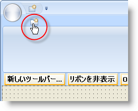

////

|metadata|
{
    "name": "wintoolbarsmanager-add-a-tab-to-the-ribbon",
    "controlName": ["WinToolbarsManager"],
    "tags": [],
    "guid": "{336B5150-7AB2-4E9E-ADFB-831484399FDE}",  
    "buildFlags": [],
    "createdOn": "0001-01-01T00:00:00Z"
}
|metadata|
////

= リボンにタブを追加

[NOTE]
====
注：{ProductName} の一部として提供されている Microsoft Office 2007 UI 機能を使用する場合、本ライセンスが、ユーザーに MICROSOFT OFFICE 2007 UI に対する権利を付与するものではないことに注意してください。詳細は、 officeui@microsoft.comにお問い合わせください。
====

リボンの構造はタブを作成することで構築され、それらのタブ内にグループを配置し、そしてグループ内にツールを配置します。以下の図は、この構造的な関係を示しています。

image::images/WinToolbarsManager_Add_a_Tab_to_a_Ribbon_01.png[リボン オブジェクト関係の画像]

このトピックは、[リボン] タブにひとつのタブを追加する方法を説明します。タブを追加後、 link:wintoolbarsmanager-add-a-group-to-a-ribbon-tab.html[リボン タブにグループを追加]でき、次に link:wintoolbarsmanager-add-a-tool-to-a-ribbon-group.html[リボン グループにツールを追加]します。

デザイン タイムまたはラン タイムにリボンにタブを追加できます。デザイン タイムには、WinToolbarsManager コンポーネントがコンポーネント トレイで選択され、[リボンを表示] ボタンがクリックされていることを確認してください。リボンが表示されれば、[タブを追加] アイコンが表示されます。[タブを追加] アイコンをクリックすると、タブがリボンに追加されます。ラン タイムでは、FormLoad イベントにコードの以下の行を追加する必要があります。

 ボタンの画像]

*Visual Basic の場合：*

----
Imports Infragistics.Win.UltraWinToolbars
...
Dim homeTab As New RibbonTab("Home")
Me.UltraToolbarsManager1.Ribbon.Tabs.Add(homeTab)
----

*C# の場合：*

----
using Infragistics.Win.UltraWinToolbars;
...
RibbonTab homeTab = new RibbonTab("Home");
this.ultraToolbarsManager1.Ribbon.Tabs.Add(homeTab);
----