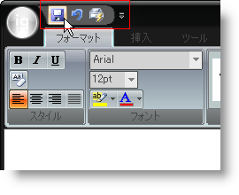

////

|metadata|
{
    "name": "wintoolbarsmanager-add-a-tool-to-the-quick-access-toolbar",
    "controlName": ["WinToolbarsManager"],
    "tags": [],
    "guid": "{689A2C2E-699F-48FC-888E-6ACD66AE3BEB}",  
    "buildFlags": [],
    "createdOn": "0001-01-01T00:00:00Z"
}
|metadata|
////

= クイック アクセス ツールバーにツールを追加

[NOTE]
====
注：{ProductName} の一部として提供されている Microsoft Office 2007 UI 機能を使用する場合、本ライセンスが、ユーザーに MICROSOFT OFFICE 2007 UI に対する権利を付与するものではないことに注意してください。詳細は、 officeui@microsoft.comにお問い合わせください。
====

リボンはエンド ユーザーの作業を素早くかつ効率的にする支援を提供します。Quick Access Toolbar (QAT) を使用することで、ひとつの便利な場所で最も頻繁に使用するツールを収集することができます。QAT は追加コードなしでラン タイムに完全にカスタマイズできます。リボンのツールを左クリックすることで、エンド ユーザーは QAT にそれを追加できます。デザイン タイムに QAT にツールを追加することは、ツールをリボンまたは標準のツールバーに追加するように実行されます。

以下のコードは、ラン タイムにツールを作成してそれを QAT に追加する方法を示します。

*Visual Basic の場合：*

----
' QAT の [QuickSave] ボタンを作成します。
Dim quickSave As New Infragistics.Win.UltraWinToolbars.ButtonTool("QuickSave")
' [QuickSave] ボタンを Tools コレクションに追加します。
Me.UltraToolbarsManager1.Tools.Add(quickSave)
' [QuickSave] ボタンを QAT Tools コレクションに追加します。
Me.UltraToolbarsManager1.Ribbon.QuickAccessToolbar.Tools.AddTool("QuickSave")
----

*C# の場合：*

----
// QAT の [QuickSave] ボタンを作成します。
Infragistics.Win.UltraWinToolbars.ButtonTool quickSave = new
  Infragistics.Win.UltraWinToolbars.ButtonTool("QuickSave");
// [QuickSave] ボタンを Tools コレクションに追加します。
this.ultraToolbarsManager1.Tools.Add(quickSave);
// [QuickSave] ボタンを QAT Tools コレクションに追加します。
this.ultraToolbarsManager1.Ribbon.QuickAccessToolbar.Tools.AddTool("QuickSave");
----