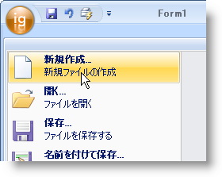

////

|metadata|
{
    "name": "wintoolbarsmanager-add-a-tool-to-the-tool-area-of-the-ribbons-application-menu",
    "controlName": ["WinToolbarsManager"],
    "tags": [],
    "guid": "{C732C1FA-D169-4BFE-BFFD-3F16FA12F278}",  
    "buildFlags": [],
    "createdOn": "0001-01-01T00:00:00Z"
}
|metadata|
////

= リボンのアプリケーション メニューのツール領域にツールを追加

{注意}

リボンには、リボンの左上角の大きな丸いボタンをクリックして開くユニークなメニュー領域があります。ドロップダウン アプリケーション メニューには、すべてのタイプのツールが配置できる 3 つの領域があります。これらの 3 つの領域は、pick:[win-forms="link:{ApiPlatform}win.ultrawintoolbars{ApiVersion}~infragistics.win.ultrawintoolbars.applicationmenu~toolarealeft.html[ToolAreaLeft]"] 、pick:[win-forms="link:{ApiPlatform}win.ultrawintoolbars{ApiVersion}~infragistics.win.ultrawintoolbars.applicationmenu~toolarearight.html[ToolAreaRight]"] 、および pick:[win-forms="link:{ApiPlatform}win.ultrawintoolbars{ApiVersion}~infragistics.win.ultrawintoolbars.applicationmenu~footertoolbar.html[FooterToolbar]"]  です。これらの領域のひとつにツールを追加する手順は、標準のツールバーにツールを追加する手順と非常に類似しています。

以下のコードは、pick:[win-forms="link:{ApiPlatform}win.ultrawintoolbars{ApiVersion}~infragistics.win.ultrawintoolbars.buttontool.html[ButtonTool]"]  を作成し、Tools コレクションに追加して、次に左のツール領域に追加する方法を示します。

[NOTE]
====
注*:* この例は、ツールボックスからフォームに WinToolbarsManager™ コンポーネントを既にドロップしていることを想定しています。
====

*Visual Basic の場合:*

----
Imports Infragistics.Win.UltraWinToolbars
...
Dim NewMenuItem As New ButtonTool("NewMenuItem")
NewMenuItem.SharedProps.Caption = "New..."
Me.UltraToolbarsManager1.Tools.Add(newMenuItem)
Me.UltraToolbarsManager1.Ribbon.ApplicationMenu.ToolAreaLeft.Tools.AddTool( _
  "NewMenuItem")
----

*C# の場合:*

----
using Infragistics.Win.UltraWinToolbars;
...
ButtonTool newMenuItem = new ButtonTool("NewMenuItem");
newMenuItem.SharedProps.Caption = "New...";
this.ultraToolbarsManager1.Tools.Add(newMenuItem);
this.ultraToolbarsManager1.Ribbon.ApplicationMenu.ToolAreaLeft.Tools.AddTool(
  "NewMenuItem");
----

[NOTE]
====
*注:* Ribbon オブジェクトの ApplicationMenu.Visible プロパティは現在廃止されています。代わりに、FileMenuStyle プロパティを使用して None に設定します。
====