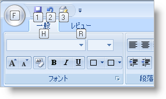
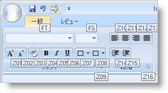

////

|metadata|
{
    "name": "wintoolbarsmanager-add-keytips-to-the-ribbon",
    "controlName": ["WinToolbarsManager"],
    "tags": [],
    "guid": "{E59B95E9-50AA-4699-B508-A17554FE718A}",  
    "buildFlags": [],
    "createdOn": "2006-09-10T11:30:53Z"
}
|metadata|
////

= リボンに KeyTips を追加

[NOTE]
====
注：{ProductName} の一部として提供されている Microsoft Office 2007 UI 機能を使用する場合、本ライセンスが、ユーザーに MICROSOFT OFFICE 2007 UI に対する権利を付与するものではないことに注意してください。詳細は、 officeui@microsoft.comにお問い合わせください。
====

ほとんどの Windows Forms アプリケーションには何らかのメイン メニューが含まれます。このメイン メニューには、ファイル、編集、表示などの項目を含むことができます。マウスで実際にポイントしてクリックすることなくメニューからエンド ユーザーが項目を選択するために、ニーモニックを使用することができます。リボンには本来はメイン メニューがありません。リボンには、代わりにアプリケーション メニュー、クイック アクセス ツールバー、および複数のタブがあります。キーボードを使用してこれらの項目を使用するため、KeyTips はニーモニックを置き換えるために導入されました。

KeyTips はニーモニックと同じ方法で機能します。Alt キーを押すと、 link:wintoolbarsmanager-the-ribbon-application-menu.html[Application Menu]、 link:wintoolbarsmanager-quick-access-toolbar.html[Quick Access Toolbar]、およびタブの KeyTips が表示します。KeyTip タブをクリックすると、すべての現在表示されている KeyTips が消えて、その特定のタブ内の KeyTips が表示します。アプリケーション メニュー KeyTips は同じ方法で機能します。アプリケーション メニュー の KeyTip を入力すると、すべての現在表示されている KeyTips は消えて、アプリケーション メニューが表示し、アプリケーション メニューのすべての項目は KeyTips を表示します。

KeyTips の設定はひとつのプロパティに関係します。KeyTip をリボンのタグまたはグループに設定するには、pick:[win-forms="link:{ApiPlatform}win.ultrawintoolbars{ApiVersion}~infragistics.win.ultrawintoolbars.ribbontab.html[RibbonTab]"]  または pick:[win-forms="link:{ApiPlatform}win.ultrawintoolbars{ApiVersion}~infragistics.win.ultrawintoolbars.ribbongroup.html[RibbonGroup]"]  オブジェクトの KeyTip プロパティを設定します。ツール用に KeyTip を設定するには、そのツールの SharedProps オブジェクトの TeyTip プロパティを設定します。

デフォルトでは、リボンは KeyTips を常に生成します。Office 2007 UI の互換性が有効である限り、pick:[win-forms="link:{ApiPlatform}win.ultrawintoolbars{ApiVersion}~infragistics.win.ultrawintoolbars.ultratoolbarsmanager~autogeneratekeytips.html[AutoGenerateKeyTips]"]  プロパティは無視されます。したがって、リボンに KeyTip を自動的に生成させたくない場合は、手動で KeyTip プロパティをリボンの各項目に設定する必要があります。

[NOTE]
====
*注：* クイック アクセス ツールバーの KeyTips は常に自動生成されます。QAT KeyTips を設定することはできません。ツールがラン タイムに QAT に追加されると、KeyTip は新しい KeyTip で置き換えられます。QAT ツール コレクションの最初のツールは、1 の KeyTip を持ちます。コレクションの次のツールは 2 ・・・となります。
====

以下のコードは、アプリケーション メニューに KeyTip、2 つのリボン タブ、およびひとつのタブ内に 2 つのツール を設定します。

*Visual Basic の場合：*

----
' アプリケーション メニューの KeyTip を設定します。
Me.UltraToolbarsManager1.Ribbon.ApplicationMenu.KeyTip = "F"
' タブ KeyTips を設定します。
Me.UltraToolbarsManager1.Ribbon.Tabs(0).KeyTip = "H"
Me.UltraToolbarsManager1.Ribbon.Tabs(1).KeyTip = "R"
' いくつかのツール KeyTips を設定します。
Me.UltraToolbarsManager1.Ribbon.Tabs(0).Groups(0).Tools(0).SharedProps.KeyTip = "FT"
Me.UltraToolbarsManager1.Ribbon.Tabs(0).Groups(0).Tools(1).SharedProps.KeyTip = "FS"
----

*C# の場合：*

----
// アプリケーション メニューの KeyTip を設定します。
this.ultraToolbarsManager1.Ribbon.ApplicationMenu.KeyTip = "F";
// タブ KeyTips を設定します。
this.ultraToolbarsManager1.Ribbon.Tabs[0].KeyTip = "H";
this.ultraToolbarsManager1.Ribbon.Tabs[1].KeyTip = "R";
// いくつかのツール KeyTips を設定します。
this.ultraToolbarsManager1.Ribbon.Tabs[0].Groups[0].Tools[0].SharedProps.KeyTip = "FT";
this.ultraToolbarsManager1.Ribbon.Tabs[0].Groups[0].Tools[1].SharedProps.KeyTip = "FS";
----