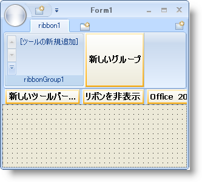
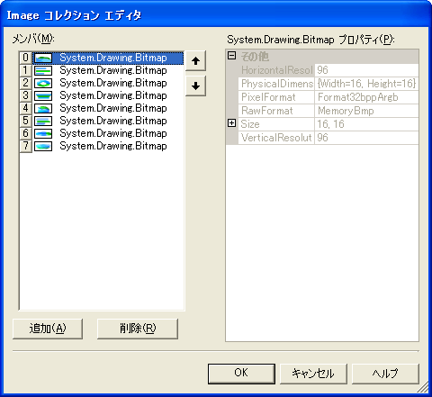

////

|metadata|
{
    "name": "wintoolbarsmanager-adding-groups-and-items-to-the-popupgallerytool",
    "controlName": ["WinToolbarsManager"],
    "tags": ["Charting"],
    "guid": "{1F267AA1-C164-40B9-BF70-914351893CCE}",  
    "buildFlags": [],
    "createdOn": "2006-06-10T10:51:29Z"
}
|metadata|
////

= グループと項目を PopupGallery Tool に追加

[NOTE]
====
注：{ProductName} の一部として提供されている Microsoft Office 2007 UI 機能を使用する場合、本ライセンスが、ユーザーに MICROSOFT OFFICE 2007 UI に対する権利を付与するものではないことに注意してください。詳細は、 officeui@microsoft.comにお問い合わせください。
====

== 始める前に

pick:[win-forms="link:{ApiPlatform}win.ultrawintoolbars{ApiVersion}~infragistics.win.ultrawintoolbars.popupgallerytool.html[PopupGalleryTool]"]  はユーザー インターフェイスに新しいレイヤーを追加します。PopupGalleryTool を使用すれば、ユーザーに視覚的なオプション選択を表示できます。PopupGalleryTool はプレビュー領域とドロップダウン領域をサポートします。ユーザーはプレビュー領域で画像だけを見ますが、ドロップダウン ボタンをクリックすると、PopupGalleryTool 内に複数の項目が表示されます。PopupGalleryTool は項目の視覚的な手掛かりをエンド ユーザーに与えます。

== 達成すること

インプレース デザイナを使用してリボンにタブ、グループ、および PopupGalleryTool を追加します。次に、8 つの項目を PopupGalleryTool に追加します。これらの項目は 2 つのグループに分割され、それぞれに 4 つの項目があります。この詳細なガイドを完了後、 link:wintoolbarsmanager-filtering-a-group-in-the-popupgallerytool.html[PopupGalleryTool でグループをフィルター]する方法を継続して学習することができます。

== 次の手順を実行します

[start=1]
. *リボンにタブ、グループ、および PopupGalleryTool を設定します。*

.. ツールバーで UltraToolbarsManager コンポーネントを検索してダブルクリックします。以下のダイアログ ボックスで [はい] をクリックし、ultraToolbarsManager1 コンポーネントがコンポーネント トレイに追加します。
.. ultraToolbarsManager1 コンポーネントを選択して、フォームの上の [リボンを表示] ボタンをクリックします。リボンが表示され、フォームは Office 2007 のルック アンド フィールを適用します。
.. [タブを追加] ボタンをクリックします。ribbon1 という名前のタブがリボンに作成されます。
.. 新しいタブ内に [新しいグループ] ボタンをクリックします。ribbonGroup1 という名前の新しいグループが ribbon1 タブ内に作成されます。
.. ribbonGroup1 内に [新しいツールを挿入] をクリックします。
.. ポップアップ メニューから [新しいツールを挿入] をクリックします。[新しいツール] ダイアログ ボックスが表示します。
.. [ツール タイプ] を [ポップアップ ギャラリー] に変更します。
.. [追加] をクリックします。新しい PopupGalleryTool が ribbonGroup1 に追加されます。
.. [閉じる] をクリックします。[新しいツール] ダイアログ ボックスが閉じます。

フォームは次のようになります。

[start=2]
. *8 つの GalleryToolItems の画像を含む ImageList を作成します。*

.. ツールバーで in-box ImageList コンポーネントを検索してダブルクリックします。imageList1 コンポーネントがコンポーネント トレイに追加されます。
.. imageList1 コンポーネントを選択して、プロパティ ウィンドウで Images コレクションを検索し、コレクションの右の省略記号をクリックします。[画像コレクション エディタ] ダイアログ ボックスが表示します。
.. [追加] をクリックします。[開く] ダイアログ ボックスが表示します。
.. 以下の手順で imageList1 に以下の画像を追加します。

[cols="a,a,a,a"]
|====
|image::images/2D_Area_Chart.png[]
|image::images/2D_Bar_Chart.png[]
|image::images/2D_Doughnut_Chart.png[]
|image::images/2D_Funnel_Chart.png[]

|1. 2 番目のエリア グラフ
|2. 2 番目の棒グラフ
|3. 平面ドーナツ型グラフ
|4. 平面ファンネル チャート

|image::images/3D_Area_Chart.png[]
|image::images/3D_Bar_Chart.png[]
|image::images/3D_Doughnut_Chart.png[]
|image::images/3D_Funnel_Chart.png[]

|5. 立体エリア グラフ
|6. 立体棒グラフ
|7. 立体ドーナツ型グラフ
|8. 立体ファンネル チャート

|====

[NOTE]
====
*注：* 上記の画像を右クリックし、[新規保存] を選択します。ファイル名として画像のタイトルを使用できます。
====

画像コレクション エディタは次のようになります。

.. imageList1 に 8 つすべての画像を追加すれば、[OK] をクリックします。画像コレクション エディタが閉じます。
.. プロパティ ウィンドウで、ImageSize プロパティを検索し、幅と高さの両方を 48 に変更します。

[start=3]
. *GalleryToolItems を作成し、PopupGalleryTool に追加します。*

ビジネスの最初の注文は、8 つの pick:[win-forms="link:{ApiPlatform}win.ultrawintoolbars{ApiVersion}~infragistics.win.ultrawintoolbars.gallerytoolitem.html[GalleryToolItems]"]  の事例を示すことです。これらの項目の 4 つは平面チャート グループで、他の 4 つは立体チャート グループです。作成後、PopupGalleryTool のインスタンスを例示化する必要があり、そうすればアプリケーションは PopupGalleryTool としてラン タイムでこれを認識します。PopupGalleryTool のインスタンスを持てば、AddRange メソッドを使用して pick:[win-forms="link:{ApiPlatform}win.ultrawintoolbars{ApiVersion}~infragistics.win.ultrawintoolbars.gallerytoolitemcollection.html[Items]"]  コレクションにすべての項目を追加できます。次のコードを FormLoad イベントに配置します。デザイン ビューでフォームのヘッダをダブルクリックして FormLoad イベントを生成できます。

*Visual Basic の場合：*

----
Dim galleryItems() As GalleryToolItem = {_
New GalleryToolItem("2D Area Chart", "2D Area Chart"),_
New GalleryToolItem("2D Bar Chart", "2D Bar Chart"),_
New GalleryToolItem("2D Doughnut Chart", "2D Doughnut Chart"),_
New GalleryToolItem("2D Funnel Chart", "2D Funnel Chart"),_
New GalleryToolItem("3D Area Chart", "3D Area Chart"),_
New GalleryToolItem("3D Bar Chart", "3D Bar Chart"),_
New GalleryToolItem("3D Doughnut Chart", "3D Doughnut Chart"),_
New GalleryToolItem("3D Funnel Chart", "3D Funnel Chart")}
Dim chartGallery As PopupGalleryTool =_
  Me.UltraToolbarsManager1.Tools(0) As PopupGalleryTool
' GalleryToolItems を PopupGalleryTool に追加します。
chartGallery.Items.AddRange(galleryItems)
----

*C# の場合：*

----
// PopupGalleryTool に配置するために 8 の GalleryToolItems を作成します。
// 項目の配列を使用すれば簡単にループを作成でき、
// 後で修正できます。
GalleryToolItem[] galleryItems = new GalleryToolItem[] {
  //2D chart items
  new GalleryToolItem("2D Area Chart", "2D Area Chart"),
  new GalleryToolItem("2D Bar Chart", "2D Bar Chart"),
  new GalleryToolItem("2D Doughnut Chart", "2D Doughnut Chart"),
  new GalleryToolItem("2D Funnel Chart", "2D Funnel Chart"),
// 立法チャート項目
  new GalleryToolItem("3D Area Chart", "3D Area Chart"),
  new GalleryToolItem("3D Bar Chart", "3D Bar Chart"),
  new GalleryToolItem("3D Doughnut Chart", "3D Doughnut Chart"),
  new GalleryToolItem("3D Funnel Chart", "3D Funnel Chart")};
PopupGalleryTool chartGallery = 
  this.ultraToolbarsManager1.Tools[0] as PopupGalleryTool;
// GalleryToolItems を PopupGalleryTool に追加します。
chartGallery.Items.AddRange(galleryItems);
----

[start=4]
. *GalleryToolItems のそれぞれに画像を設定します。*

各 GalleryToolItem には pick:[win-forms="link:{ApiPlatform}win.ultrawintoolbars{ApiVersion}~infragistics.win.ultrawintoolbars.gallerytoolitemsettings.html[Settings]"]  があり、これによって外観、画像、およびテキストに関連する複数のプロパティを設定できます。GalleryToolItem で画像を表示するために、[設定] オブジェクトにある pick:[win-forms="link:{ApiPlatform}win.ultrawintoolbars{ApiVersion}~infragistics.win.ultrawintoolbars.gallerytoolitemsettings~appearance.html[Appearance]"]  オブジェクトの pick:[win-forms="link:{ApiPlatform}win{ApiVersion}~infragistics.win.appearance~image.html[Image]"]  プロパティを設定する必要があります。GalleryToolItems の配列をループして、ImageList に対応する画像に画像を設定することによってこれを行うことができます（正しい順序で画像を追加することが重要である理由です）。

*Visual Basic の場合：*

----
' GalleryToolItems の画像を設定します。
Dim i As Integer
For i = 0 To galleryItems.Length - 1
   galleryItems(i).Settings.Appearance.Image = Me.imageList1.Images(i)
Next i
----

*C# の場合：*

----
// GalleryToolItems の画像を設定します。
for(int i=0; i<galleryItems.Length; i++)
{
	galleryItems[i].Settings.Appearance.Image = this.imageList1.Images[i];
}
----

[start=5]
. *GalleryToolItems のそれぞれに説明を設定します。*

各 GalleryToolItem は pick:[win-forms="link:{ApiPlatform}win.ultrawintoolbars{ApiVersion}~infragistics.win.ultrawintoolbars.gallerytoolitem~description.html[Description]"]  プロパティも持ちます。このプロパティを項目が何を表すかを説明する文字列に設定します。この詳細なガイドでは、キャプションとして同じテキストに設定しました。説明でフォーマットされたテキストを使用するオプションも持ちます。フォーマットされたテキストの詳細は、 link:winformattedlinklabel-formatting-text-and-hyperlinks.html[「テキストとハイパーリンクのフォーマッティング」]を参照してください。以下のコードは、各 GalleryToolItem をループし、その説明テキストをキャプション テキストに設定します。

*Visual Basic の場合：*

----
' GalleryToolItems の説明を設定します。
Dim i As Integer
For i = 0 To galleryItems.Length - 1
   galleryItems(i).Description = galleryItems(i).Title
Next i
----

*C# の場合：*

----
// GalleryToolItems の説明を設定します。
for(int i=0; i<galleryItems.Length; i++)
{
	galleryItems[i].Description = galleryItems[i].Title;
}
----

[start=6]
. *平面チャートと立体チャートを含む 2 つのグループを作成します。* 

*Visual Basic の場合：*

----
'  GalleryToolItems の 2 つの新しいグループを作成し、ひとつは
' 平面チャート、もうひとつは立体チャートです。
Dim group1 As New GalleryToolItemGroup("2D Charts", "2D Charts", New String() {_
"2D Area Chart", "2D Bar Chart", "2D Doughnut Chart", "2D Funnel Chart"})
Dim group2 As New GalleryToolItemGroup("3D Charts", "3D Charts", New String() {_
"3D Area Chart", "3D Bar Chart", "3D Doughnut Chart", "3D Funnel Chart"})
' PopupGalleryTools Groups コレクションにグループを追加します。
chartGallery.Groups.AddRange(New GalleryToolItemGroup() {group1, group2})
----

*C# の場合：*

----
// GalleryToolItems の 2 つの新しいグループを作成し、ひとつは
// 平面チャート、もうひとつは立体チャートです。
GalleryToolItemGroup group1 = 
  new GalleryToolItemGroup("2D Charts", "2D Charts", new string[]
  {"2D Area Chart", "2D Bar Chart", "2D Doughnut Chart", "2D Funnel Chart"});
GalleryToolItemGroup group2 = 
  new GalleryToolItemGroup("3D Charts", "3D Charts", new string[] 
  {"3D Area Chart", "3D Bar Chart", "3D Doughnut Chart", "3D Funnel Chart"});
// PopupGalleryTools Groups コレクションにグループを追加します。
chartGallery.Groups.AddRange(new GalleryToolItemGroup[] {group1, group2});
----

[start=7]
. *アプリケーションを実行します。*

アプリケーションを実行すると、リボン内に PopupGalleryTool が見えます。プレビュー領域に 4 つの項目が表示できます。

image::images/WinToolbarsManager_Adding_Groups_and_Items_to_the_PopupGalleryTool_03.png[]

ドロップダウン ボタンをクリックすると、PopupGalleryTool にすべての項目が表示されます。項目が平面チャートと立体チャートで分割されることも確認します。

image::images/WinToolbarsManager_Adding_Groups_and_Items_to_the_PopupGalleryTool_04.png[]