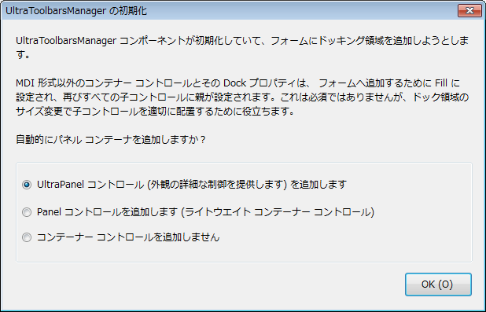

////
|metadata|
{
    "name": "wintoolbarsmanager-adding-wintoolbarsmanager-to-a-form",
    "controlName": ["WinToolbarsManager"],
    "tags": ["Getting Started"],
    "guid": "{3B2FCFF7-C596-41F8-992A-38FD80FEE21E}",
    "buildFlags": [],
    "createdOn": "2005-07-07T00:00:00Z"
}
|metadata|
////

= WinToolbarsManager をフォームに追加

ここではユーザーができるだけ早く操作に慣れることができるよう、WinToolbarsManagerの ToolbarManager コンポーネントを Visual Studio.NET のフォームに追加するために最低限必要な基本手順について説明します。この演習では、ToolbarsManager を Visual Basic.NET プロジェクトに追加して、デザインタイムに簡単なツールバーを作成する方法を示します。また、ランタイムにユーザーが使用できるコントロールの機能についていくつか示し、コントロールの設定がこれらの機能にどのように作用するのかについて説明します。

[start=1]
. Visual Basic または C# Windows Application を新しく作成します。 
[start=2]
. ツールボックスの UltraToolbarsManager エレメントを選択して、フォームにエレメントをドラッグします。

フォームにエレメントを追加すると、以下のダイアログが表示されます。

ドックされたツールバーを保持するために各フォームのエッジにドック領域をエレメントが作成するので、このダイアログが表示します。これらのドック領域はドックされたり配置されるツールバーの数によって拡大および縮小します。コントロールがドック領域の近くのフォームに直接配置されると、領域がコントロールをオーバーラップして描画されてアクセスできなくなる可能性があります。メッセージが示すように、この警告は SDI フォームだけに適用され、ツールバーを含む MDI フォームはこれらの問題を自動的に処理します。
[start=3]
. [はい] をクリックして、エレメントがフォームのドック領域以外をなくすためにパネル コンテナ コントロールを自動的に追加します。フォームに置かれるコントロールは実際にはパネル コンテナ内に配置されます。

ToolbarsManager は非表示のエレメントであるため、フォーム上に描画する必要はありません。このエレメントは、フォームのすぐ下にあるコンポーネント トレイに表示されます。この時点で、ソリューション エクスプローラ ウィンドウの [参照設定] セクションに Infragistics.Shared、 Infragistics.Win、および Infragistics.Win.UltraWinToolbars への参照が追加されていることを確認してください。
[start=4]
. プロパティ シートで [ユーザー設定] リンクをクリックするか、エレメントのコンテキスト メニューで [ユーザー設定] を選択して、コンポーネント トレイの UltraToolbarsManager エレメントを選択します。[ユーザー設定] ダイアログが表示されます。これは、アプリケーションで表示されるツールバー コントロールを設定するために使用するダイアログです。このダイアログの [ツールバー] タブが選択されます。このタブを使用して、アプリケーションで求められる数のメニューとツールバーを作成します。

image::Images/WinToolbarsManager_Adding_WinToolbarsManager_to_a_Form_02.png[]

[start=5]
. [新規ツールバー...] ボタンをクリックします。[名前と位置] ダイアログが表示されます。[OK] ボタンをクリックしてこれらのデフォルト値を了承します。[ユーザー設定] ダイアログが配置され Form1 が表示される場合、Form1 のトップに新しいツールバーの表示を確認できます。
[start=6]
. [ツール] タブをクリックします。ツールを作成するためのインタフェースが表示されます。これは、ツールバーおよびメニューに表示される個々のツールおよびメニュー項目を作成する場所です。タブの左下にある [新規] をクリックします。[新しいツール] ダイアログが表示されます。このダイアログを使用して、作成するツールの設定を指定します。最初に、[新しいファイルの作成] ボタンを作成します。一連のデフォルト設定は、新しいツールを作成する際に使用するために指定されます。
[start=7]
. [キー値] フィールドを選択し、テキストを "

[source]
----
FileNew
----

" に変更します。これはコードのツールを参照するために使用する一意の識別子になります。次に [キャプション] ボックスのテキストを "New" に変更します。これはツールに表示されるテキストです。ランタイム カスタマイザでこのテキストが表示され、これはボタンのツールチップで使用されますが、デフォルトのボタン スタイルはテキストなしでイメージを表示するので、このテキストは現在の設定を使用してツールバーに表示されません。最後に、カテゴリー コンボを選択し、"File" と入力してこのツールの新しいカテゴリーを入力します。
[start=8]
. [新規] ボタンをクリックします。これにより、複数の動作が発生します。最初に、[新しいツール] ダイアログが開いたままですが、カテゴリー コンボ ボックスを除いてダイアログの設定はデフォルト値にリセットされていることに注意してください。新しいツールが追加されれば、ダイアログは同じカテゴリーで他のツールを追加する準備ができています。追加したツールが [ユーザー設定] ダイアログにリストされ、[ファイル] カテゴリーにそのダイアログが選択されていることにも注意してください。最後に、フォームが表示される場合、ツールバーにツールが表示されます。
[start=9]
. [新しいツール] ダイアログを使用して 2 番目のツールを追加します。"

[source]
----
FileOpen
----

" のキー値と "

[source]
----
Open
----

" のキャプション値を指定します。カテゴリーを "File" に設定したままにします。[追加] をクリックしてツールを作成します。
[start=10]
. "

[source]
----
FileSave
----

" のキーと "

[source]
----
Save
----

" のキャプションで 3 番目のボタン ツールを追加します。[追加] をクリックしてツールを作成後、[閉じる] をクリックしてダイアログを閉じます。[ユーザー設定] ダイアログは以下のようになります。

[start=11]
. [ユーザー設定] ダイアログからドラッグ アンド ドロップしてツールがツールバーに追加されます。Form1 のツールバーが現在表示されていない場合、[ユーザー設定] ダイアログを再配置すると見ることができます。
[start=12]
. FileNew ツールを [ユーザー設定] ダイアログから Form1 のトップに表示されるツールバーの左端にドラッグします。マウス ポインタはツールがドロップされた領域上にあれば、マウス ポインタが削除ツール カーソルからドロップ ツール カーソルに変更されるのが確認できます。位置インジケータもツールバーに表示されます。
[start=13]
. FileOpen ツールをツールバーにドラッグ アンド ドロップします。FileNew ツールの前後に配置できることに注意してください。
[start=14]
. FileSave ツールをツールバーにドラッグ アンド ドロップします。[閉じる] をクリックして [ユーザー設定] ダイアログを閉じます。
[start=15]
. ToolbarsManager エレメントをダブルクリックします。コード ウィンドウが表示される ToolClick イベントとともに開き、コードの入力の準備ができています。以下の Select Case 文を入力します。

*Visual Basic の場合：*

----
Private Sub UltraToolbarsManager1_ToolClick(ByVal sender As Object, _
  ByVal e As Infragistics.Win.UltraWinToolbars.ToolClickEventArgs) _
  Handles UltraToolbarsManager1.ToolClick
	Select Case e.Tool.Key
	Case "FileNew"
		MessageBox.Show("Create New File!")
	Case "FileOpen"
		MessageBox.Show("Open Existing File!")
	Case "FileSave"
		MessageBox.Show("Save Current File!")
	End Select
End Sub
----

*C# の場合：*

----
private void ultraToolbarsManager1_ToolClick(object sender, 
  Infragistics.Win.UltraWinToolbars.ToolClickEventArgs e)
{
	switch(e.Tool.Key)
	{
		case "FileNew":
			MessageBox.Show("Create New File!");
			break;
		case "FileOpen":
			MessageBox.Show("Open Existing File!");
			break;
		case "FileSave":
			MessageBox.Show("Save Current File!");
			break;
	}
}
----

[start=16]
. プロジェクトを実行します。フォームが表示されたら、[新規] ボタンをクリックします。メッセージ ボックスが表示されます。他のボタンをテストすることもできます。