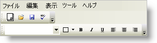

////

|metadata|
{
    "name": "wintoolbarsmanager-change-the-style-of-wintoolbarsmanager",
    "controlName": ["WinToolbarsManager"],
    "tags": ["Styling"],
    "guid": "{61179972-1994-487E-BE26-33F7DA8BDA6B}",  
    "buildFlags": [],
    "createdOn": "2005-07-07T00:00:00Z"
}
|metadata|
////

= WinToolbarsManager のスタイルの変更

WinToolbarsManager™ には、要素の外観を変更するために使用できる 6 つのスタイルがあります。

* Office 2000
* Office XP
* Office 2003
* Visual Studio 2005
* Office 2007
* Windows Vista
* Scenic Ribbon
* Office2010

UltraToolBarsManager のスタイルは、デザイン タイムおよびランタイムの両方で設定できます。 デザイン タイムでは、Properties ウィンドウに置かれている pick:[win-forms="link:{ApiPlatform}win.ultrawintoolbars{ApiVersion}~infragistics.win.ultrawintoolbars.ultratoolbarsmanager~style.html[Style]"]  プロパティから設定できます。また、コードで UltraToolbarsManager の Style を 4 つのスタイルのいずれかに設定して、スタイルを変更することもできます。

スタイルをランタイムで変更するには、次のコードを使用します。

*Visual Basic の場合：*

----
Imports Infragistics.Win.UltraWinToolbars
...
Private Sub Change_the_Style_of_WinToolbarsManager_Load( _
  ByVal sender As System.Object, _
  ByVal e As System.EventArgs) Handles MyBase.Load
        Me.UltraToolbarsManager1.Style = ToolbarStyle.VisualStudio2005
End Sub
----

*C# の場合：*

----
using Infragistics.Win.UltraWinToolbars;
...
private void Change_the_Style_of_WinToolbarsManager_Load( 
  object sender, EventArgs e)
{
        this.ultraToolbarsManager1.Style = ToolbarStyle.VisualStudio2005;
}
----

