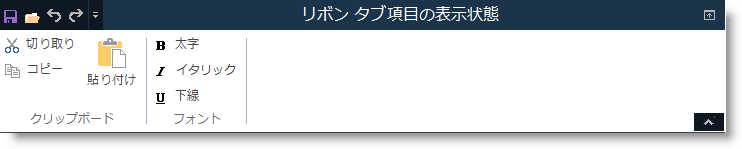
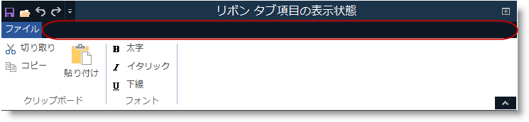

////

|metadata|
{
    "name": "wintoolbarsmanager-configuring-ribbon-tab-item-visibility",
    "controlName": [],
    "tags": [],
    "guid": "3ecb93ec-8a43-4322-b442-107ddf5b8b20",  
    "buildFlags": [],
    "createdOn": "2014-01-29T16:27:08.7883852Z"
}
|metadata|
////

= リボンのタブ項目の表示状態の構成

== トピックの概要

=== 目的

このトピックでは、リボンのタブ項目の表示状態を構成すると、タブ項目のために割り当てられた空き領域を使用します。

=== このトピックの内容

このトピックは、以下のセクションで構成されます。

* <<_Ref376430810,タブ項目の表示状態の概要>>

** <<_Ref370929747,はじめに>>
** <<_Ref376430820,タブ項目の表示状態の構成>>

* <<_Ref370929790,関連コンテンツ>>

[[_Ref376430810]]
== タブ項目の表示状態の概要

[[_Ref370929747]]

=== はじめに

この機能は、 _UltraToolbarsManager_   のリボンで link:{ApiPlatform}win.ultrawintoolbars{ApiVersion}~infragistics.win.ultrawintoolbars.ribbon~tabitemareadisplaystyle.html[TabItemAreaDisplayStyle] プロパティを使用すると、タブ項目の表示状態の構成を可能にします。

[[_Ref376430820]]

=== タブ項目の表示状態の構成

タブ項目領域の表示状態はタブ項目を非表示/表示するために構成できます。タブ項目を非表示すると、リボン領域の高さを減らします。構成可能な link:{ApiPlatform}win.ultrawintoolbars{ApiVersion}~infragistics.win.ultrawintoolbars.ribbon~tabitemareadisplaystyle.html[TabItemAreaDisplayStyle] プロパティの利用可能なオプションは以下の表で表示されます。

[options="header", cols="a,a"]
|====
|値|説明

|Visible
|すべてのタブ項目を表示します (デフォルト値)。

|Hidden
|アプリケーション メニュー ボタン、タブ項目のツールバー、およびすべてのリボン タブ項目を非表示にします。タブ領域を減らします。

|HideTabs
|コンテキスト タブおよびリボンのタブ項目を非表示にします。

|====

.注:
[NOTE]
====
コンテキスト タブを含むリボンがある場合、 _Hidden_   または  _HideTabs_   オプションを使用すると、コンテキスト タブのグループを非表示にします。
====

リボンのタブ項目領域 –  *Visible* 。

image::images/Configuring_Ribbon_Tabitem_Visibility_1.png[]

リボンのタブ項目領域 –  *Hidden*  (タブ領域の縮小)。

リボンのタブ項目領域 –  *HideTabs* 。

[[_Ref370929790]]
== 関連コンテンツ

=== トピック

以下のトピックでは、このトピックに関連する追加情報を提供しています。

[options="header", cols="a,a"]
|====
|トピック|目的

| link:wintoolbarsmanager-add-a-tab-to-the-ribbon.html[リボンにタブを追加]
|このトピックは、リボンに 1 つのタブを追加する方法を説明します。タブを追加した後、リボン タブにグループを追加し、リボン グループにツールを追加します。

|====