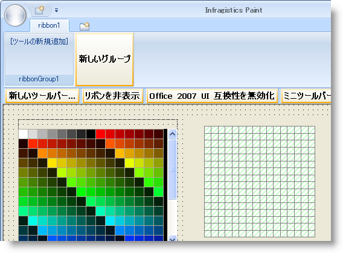
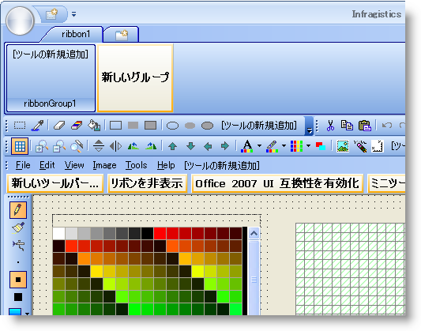
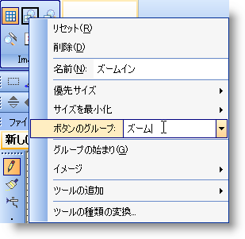
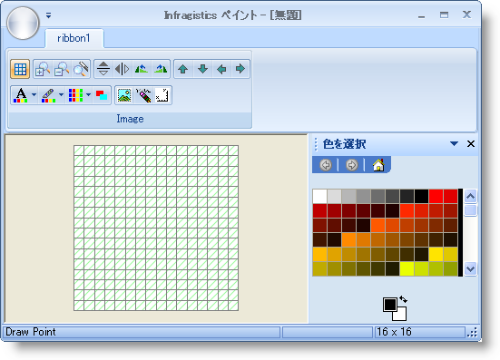

////

|metadata|
{
    "name": "wintoolbarsmanager-converting-a-standard-toolbar-to-a-ribbon",
    "controlName": ["WinToolbarsManager"],
    "tags": ["Application Scenarios"],
    "guid": "{0AA0DB3F-68DC-472E-BCE2-6D601CEFAA33}",  
    "buildFlags": [],
    "createdOn": "2006-06-10T10:45:29Z"
}
|metadata|
////

= 標準のツールバーをリボンに変換

[NOTE]
====
注：{ProductName} の一部として提供されている Microsoft Office 2007 UI 機能を使用する場合、本ライセンスが、ユーザーに MICROSOFT OFFICE 2007 UI に対する権利を付与するものではないことに注意してください。詳細は、 officeui@microsoft.com にお問い合わせください。
====

== 始める前に

ユニークなオブジェクト モデルのため、リボンおよび標準ツールバーは実際は非常に似ています。ツールバーとリボンの両方は同じツールを使用します。これらの 2 つのオブジェクトにツールを追加することは驚くほど似ています。WinToolbarsManager には pick:[win-forms="link:{ApiPlatform}win.ultrawintoolbars{ApiVersion}~infragistics.win.ultrawintoolbars.toolbarscollection.html[Toolbars]"]  コレクションとメイン クラスの pick:[win-forms="link:{ApiPlatform}win.ultrawintoolbars{ApiVersion}~infragistics.win.ultrawintoolbars.ribbon.html[Ribbon]"]  が含まれます。各ツールバーには、pick:[win-forms="link:{ApiPlatform}win.ultrawintoolbars{ApiVersion}~infragistics.win.ultrawintoolbars.toolscollection.html[Tools]"]  コレクションが含まれます。リボンには Groups コレクション、そして Tools コレクションが含まれます。標準ツールバーで複数のツールを追加および操作する方法が分かれば、リボンを同じ方法で変更できます。

デザイン タイムおよびランタイム オブジェクト モデルの両方で、標準ツールバーと同じようにリボンにツールを追加できます。デザイン タイムでは、WinToolbarsManager コンポーネントがコンポーネント トレイで選択されると、リボン表示というボタンが表示されます。このボタンをクリックしてリボンを表示します。[タブを追加] ボタンに続き [グループを追加] ボタンをクリックできます。これらのボタンの詳細は、 link:wintoolbarsmanager-add-a-tab-to-the-ribbon.html[「リボンにタブを追加」]および link:wintoolbarsmanager-add-a-group-to-a-ribbon-tab.html[「リボン タブにグループを追加」]を参照してください。リボンにグループがあれば、[ツールを追加] ボタンが表示されます。このボタンをクリックすれば、新しいツールを追加または既存のツールを追加するかの選択があります。これはツールバー変更プロセスが開始する場所です。

標準ツールバーをリボンに変更するには、以前に存在していたすべてのツールをリボンに追加する必要があります。実際は、ツールバーをリボンに変更するのではなく、すべてのツールに再追加するだけです。標準ツールバーとリボンは、Office2007UICompatibility が False に設定されている場合に限って存在できます。これを実行する必要があります。そうすれば、標準ツールバーからツールをリボンにドラッグするためにリボンと標準ツールバーの両方を表示できます。

== 達成すること

標準ツールバーに基づきリボンを作成するシンプルなプロセスを通して説明します。Infragistics SDK インストールの一部として出荷する IGPaint サンプルを開きます。既存のツールバーからツールをリボンにドラッグします。そうすれば、これらのツールの外観を調整して、まとまった感覚が得られます。

== 次の手順を実行します

[start=1]
. *Visual Studio Projects\2005 フォルダに IGPaint サンプルをコピーします。*

最初に、プロジェクト フォルダに IGPaint サンプルをコピーする必要があります。そうすればオリジナルを変更せずにすみます。以下のデフォルトのインストール フォルダにサンプルがあります。

*Visual Basic プロジェクト：*

** XP -- {InstallPathXP}{ProductNameVersion}\Samples\WinForms\WinToolbars\VB\Infragistics Paint VB 
** Vista -- {InstallPathVista}{ProductNameVersion}\Samples\WinForms\WinToolbars\VB\Infragistics Paint VB

*C# プロジェクト：*

** XP -- {InstallPathXP}{ProductNameVersion}\Samples\WinForms\WinToolbars\CS\Infragistics Paint CS
** Vista -- {InstallPathVista}{ProductNameVersion}\Samples\WinForms\WinToolbars\CS\Infragistics Paint CS

Infragistics Paint CS\VB フォルダを Visual Studio Projects\2005 フォルダにコピーします。ソリューション ファイルを開きます。ソリューションは、ソリューション エクスプローラでロードします。ソリューション エクスプローラで ImageEditor を右クリックし、表示デザイナを選択します。ペイント プログラムのメイン フォームが開きます。
[start=2]
. *ツールを保持するためにリボン グループを作成します。*

既存のツールを内に配置するために、新しい pick:[win-forms="link:{ApiPlatform}win.ultrawintoolbars{ApiVersion}~infragistics.win.ultrawintoolbars.ribbontab.html[RibbonTab]"]  および pick:[win-forms="link:{ApiPlatform}win.ultrawintoolbars{ApiVersion}~infragistics.win.ultrawintoolbars.ribbongroup.html[RibbonGroup]"]  を作成する必要があります。

.. ultraToolbarsManager1 コンポーネントを選択して、フォームの上の [リボンを表示] ボタンをクリックします。リボンが表示し、すべての他のツールバーが消えます。
.. [新しいタブ] ボタンをクリックします。新しいタブが表示します。
.. [新しいグループ] ボタンをクリックします。新しいグループが表示します。

標準ツールバーからリボンにツールを転送する準備ができました。
[start=3]
. *ツールバーとリボンの両方を表示するためにフォームを設定します。*

ツールを転送するには、標準ツールバーとリボンの両方を同時に表示できる必要があります。これを行うには、[Office 2007 UI 互換性を無効にする] ボタンをクリックする必要があります。これを行えば、標準ツールバーが再表示され、リボンは Office 2003 ルック アンド フィールに変わり、標準ツールバーに一致します。

これでツールバーとリボンの両方を表示でき、ツールバーからリボンのグループにツールをドラッグ アンド ドロップする必要があります。この詳細なガイドは画像ツールバーに焦点を当てます。

image::images/WinToolbarsManager_Converting_a_Standard_Toolbar_to_a_Ribbon_03.png[]

希望があれば、サンプルで他のすべてのツールバーで詳細なガイドの手順を繰り返してください。
[start=4]
. *ツールを正しく表示するためにリボン グループを設定します。*

作成したグループで 3 つのプロパティを変更します。最初にグループのキャプションを画像に変更します。これはツールバーから転送するツールの目的を反映します。これらのツールはさまざまな画像のプロパティに影響します。変更する次のことは、ボタンの表示方法です。表示されるボタンの画像だけが必要で、テキストは不要です。これは、複数のボタンが存在し、含まれているテキストが領域を占領してしまう場合に便利です。変更する 3 つ目は、ボタンのレイアウト方向です。デフォルトでは、ボタンは上から下、左から右に配列されます。小さいボタンは次の列にいくまで 3 行を使います。大きいボタンはすべての 3 行を使います。これらのボタンの配列を垂直から水平に変更したい場合があります。これらの 3 つのアクションは、以下の手順を実行します。

.. [プロパティ] ウィンドウでリボン オブジェクトを展開し、Tabs コレクションを検索します。
.. 省略記号（...）ボタンをクリックして RibbonTab コレクション エディタを開きます。RibbonTab コレクション エディタが表示します。
.. RibbonTab CollectionEditor の [プロパティ] ウィンドウの Groups コレクションに隣りの省略記号をクリックします。RibbonGroup コレクション エディタが表示します。
.. Caption プロパティを 'Image' に設定します。
.. PreferredToolSize プロパティを ImageOnly に設定します。
.. LayoutDirection プロパティを Horizontal に設定します。
.. [OK] をクリックして RibbonGroup コレクション エディタを閉じます。
.. [OK] をクリックして RibbonTab コレクション エディタを閉じます。

[start=5]
. *標準ツールバーからリボン グループにツールを転送します。*

標準ツールバーがグリッド、拡大鏡、反転、および回転ボタン、移動ボタンなどのセクションに分割されることに注意してください。垂直線のすぐ右の各ツールは、InstanceProps.IsFirstInGroup プロパティが True に設定されます。これらの垂直線は、ツールのグループの明確な暗示を示します。リボンはツールのグループも表示できますが、表示方法は異なります。各ツールには ButtonGroup プロパティがあります。2 つのツールが同じボタン グループに設定されている場合、両方がひとつのグループとして表示します。

.. ツールバーから画像グリッドを表示ツールをリボン グループにクリック アンド ドラッグします。ツールをドロップするために有効な場所にマウスを重ねるとマウス カーソルがプラス記号付きのポインタに変わります。太い垂直線が表示し、ツールが配置されることを表示します。

image::images/WinToolbarsManager_Converting_a_Standard_Toolbar_to_a_Ribbon_04.png[]

.. 各ズーム ツールをクリック アンド ドラッグし、表示画面グリッド ツールの後のもう一方の右側に配置します。リボン グループは次のようになります。

image::images/WinToolbarsManager_Converting_a_Standard_Toolbar_to_a_Ribbon_05.png[]

.. ズームイン ツールを右クリックし、ボタン グループ テキストボックスに 'Zoom' を入力します。

.. 他の 2 つのズーム ツールを右クリックし、Button Group を同様に設定します。これで Zoom を一度入力できました。ドロップダウンから選択できます。リボン グループは次のようになります。

image::images/WinToolbarsManager_Converting_a_Standard_Toolbar_to_a_Ribbon_07.png[]

残りのボタン グループについて、手順 2 から 4 を繰り返す場合（名前をそれぞれ、'FlipRotate'、'Move'、'Color'、および 'Image' にする）、リボン グループは以下のようになります。

image::images/WinToolbarsManager_Converting_a_Standard_Toolbar_to_a_Ribbon_08.png[]

サンプルですべての他のツールバーに対して、この詳細なガイドの手順を繰り返すことができます。新しいリボン グループを作成するか、他のリボン グループで新しいリボン タブを作成できます。リボンの左上角の ApplicationMenu に MainMenu ツールバーを転送することもできます。

これで、作成したグループがどのように見えるかを確認しましょう。[Office 2007 UI 互換性を有効にする] ボタンを再クリックします。標準ツールバーが消え、リボンのルック アンド フィールが Office 2007 に決定されます。ただし、実際のツールバーの Style プロパティは、Office2003 に設定されたままです。Office2007 に変更してください。

[NOTE]
====
*注：* Style プロパティは、リボンが表示されている間、Office2007 に設定する必要があります。
====

[start=6]
. *アプリケーションを実行します。*

アプリケーションを実行するとツールバーは表示されません。ひとつのリボン グループでひとつの [リボン] タブだけが表示されます。グループに転送したすべてのツールは、リボンに最初に作成されたように完全に機能します。

