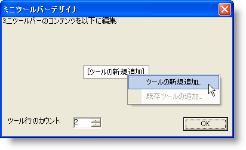
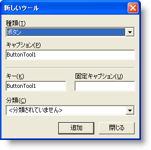
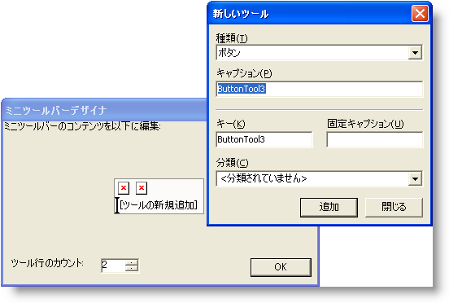
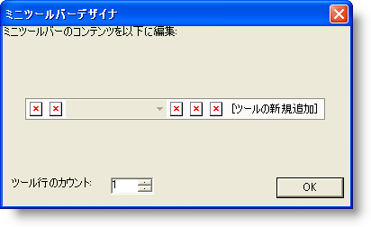

////

|metadata|
{
    "name": "wintoolbarsmanager-creating-a-minitoolbar",
    "controlName": ["WinToolbarsManager"],
    "tags": [],
    "guid": "{4CBE0CF4-78B7-42A1-82F9-BF3104BC7FA6}",  
    "buildFlags": [],
    "createdOn": "0001-01-01T00:00:00Z"
}
|metadata|
////

= MiniToolbar を作成

[NOTE]
====
注：{ProductName} の一部として提供されている Microsoft Office 2007 UI 機能を使用する場合、本ライセンスが、ユーザーに MICROSOFT OFFICE 2007 UI に対する権利を付与するものではないことに注意してください。詳細は、 officeui@microsoft.comにお問い合わせください。
====

== 始める前に

MiniToolbar はいくつかの点で標準ツールバーと似ています。標準のツールバーのようにデザイナで MiniToolbar をデザインできます。確かに、MiniToolbar デザイナは標準のツールバー デザイナと若干異なりますが、MiniToolbar はひとつの場所でフォームを設定しないので、コンテキスト メニューで右クリックするか、pick:[win-forms="link:{ApiPlatform}win.ultrawintoolbars{ApiVersion}~infragistics.win.ultrawintoolbars.minitoolbar~show.html[Show]"]  メソッドでプログラム的に表示します。標準のツールバーと MiniToolbar 間の他の大きな相違は、MiniToolbar は既に存在しているのに対して、標準のツールバーはインスタンス化が必要であることです。

== 達成すること

このトピックでは、デザイナから完全に機能する MiniToolbar を作成する方法を学習します。馴染みのある [新しいツール] ダイアログ ボックスで MiniToolbar にツールを追加します。

== 以下の手順を実行します。

[start=1]
. *フォームを設定します。*

.. Visual Basic または C# プロジェクトを新しく作成します。 
.. ツールボックスの UltraToolbarsManager コンポーネントをダブルクリックします。
.. [はい] をクリックして表示しているダイアログ ボックスを閉じます。コンポーネントトレイに ultraToolbarsManager1 コンポーネントが表示します。
.. ultraToolbarsManager1 コンポーネントが選択されていることを確認します。フォームの上に、[新しいツールバー]、[リボンを表示]、および [MiniToolbar をデザイン] の 3 つのボタンが表示されます。

image::images/WinToolbarsManager_Creating_the_MiniToolbar_01.png[]

.. [MiniToolbar をデザイン] をクリックします。[MiniToolbar デザイナ] が表示されます。

image::images/WinToolbarsManager_Creating_the_MiniToolbar_02.png[]

[start=2]
. *MiniToolbar にツールを追加します。*

.. [新しいツールを挿入] をクリックします。ポップアップが表示します。

.. ポップアップ メニューから [新しいツールを挿入] をクリックします。[新しいツール] ダイアログ ボックスが表示します。

.. [追加] を 2 度クリックして 2つのボタン ツールを追加します。ボタンを追加する時、以前のダイアログ ボックスに MiniToolbar が移植されていることに注意してください。

.. [ツール タイプ] を [フォント リスト] に変更し、[追加] をクリックします。FontList ツールが MiniToolbar に追加されます。
.. [ツール タイプ] を [状態ボタン] に変更し、3 度 [追加] をクリックします。3 つの StateButton ツールが MiniToolbar に追加されます。
.. [閉じる] をクリックして [新しいツール] ダイアログ ボックスを閉じます。
.. [ツール行数] を 2 から 1 に変更します。MiniToolbar は以下のようになります。

[start=3]
. *Show メソッドを処理するためにコードビハインドを書きます。*

.. Form1_Fill_Panel の MouseUp イベントを作成します。C# では、[プロパティ] ウィンドウのイベント ボタンをクリックし、MouseUp イベントをダブルクリックしてこれを実行できます。Visual Basic では、コード ビハインドに切り替え、コード ウィンドウの上で左ドロップダウンから Form1_Fill_Panel を選択し、コード ウィンドウの上で右ドロップダウンから MouseUp を選択します。
.. 次のコードを MouseUp イベントで使用します。

*Visual Basic の場合：*

----
Me.UltraToolbarsManager1.MiniToolbar.Show()
----

*C# の場合：*

----
this.ultraToolbarsManager1.MiniToolbar.Show();
----

[start=4]
. *アプリケーションを実行します。*

アプリケーションを実行すると空のフォームが表示されます。フォームの任意の場所を右クリックすると MiniToolbar が表示します。マウスをその近くまで移動すると透明度が低くなります。MiniToolbar からマウスを離すと、より透明度が増します。マウスを完全に離すと、MiniToolbar は完全に消えます。

image::images/WinToolbarsManager_Creating_the_MiniToolbar_07.png[]