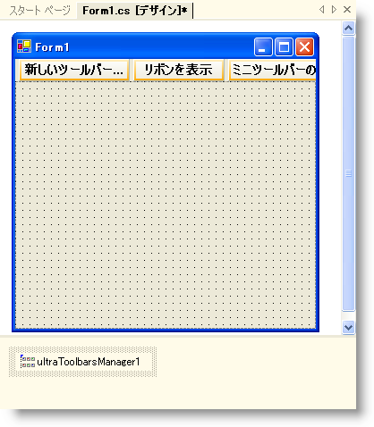
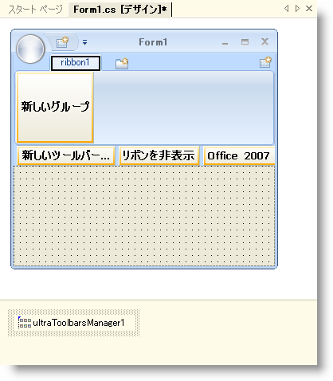
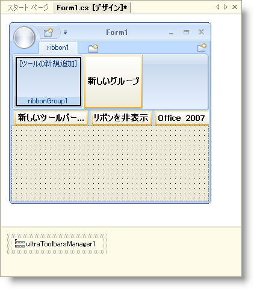
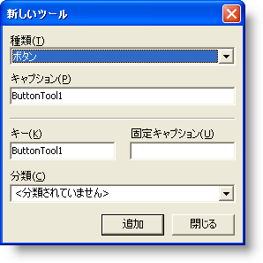
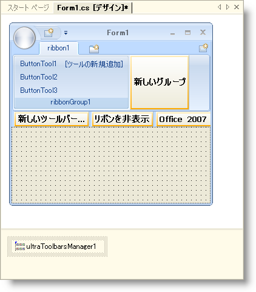
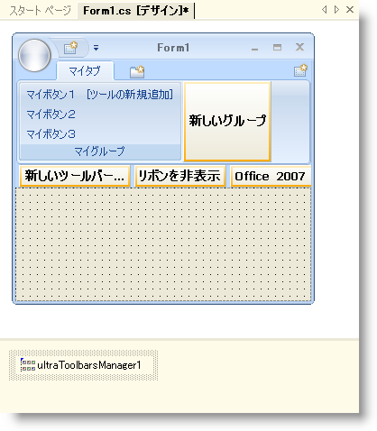
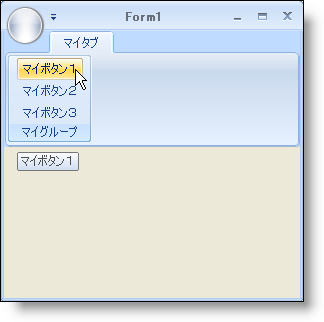

////

|metadata|
{
    "name": "wintoolbarsmanager-creating-a-ribbon",
    "controlName": ["WinToolbarsManager"],
    "tags": ["Getting Started"],
    "guid": "{B9C36B34-D0FD-4FB5-B8BD-7B05B5BC976F}",  
    "buildFlags": [],
    "createdOn": "2006-06-10T10:46:28Z"
}
|metadata|
////

= リボンを作成

[NOTE]
====
注：{ProductName} の一部として提供されている Microsoft Office 2007 UI 機能を使用する場合、本ライセンスが、ユーザーに MICROSOFT OFFICE 2007 UI に対する権利を付与するものではないことに注意してください。詳細は、 officeui@microsoft.comにお問い合わせください。
====

== 始める前に

WinToolbarsManager のオブジェクト モデルに既に馴染みのある開発者は、リボンがそんなに異なっていないことに気づくでしょう。WinToolbarsManager は、pick:[win-forms="link:{ApiPlatform}win.ultrawintoolbars{ApiVersion}~infragistics.win.ultrawintoolbars.toolbarscollection.html[Toolbars]"]  のコレクション内に pick:[win-forms="link:{ApiPlatform}win.ultrawintoolbars{ApiVersion}~infragistics.win.ultrawintoolbars.toolscollection.html[Tools]"]  のコレクションを持ちます。pick:[win-forms="link:{ApiPlatform}win.ultrawintoolbars{ApiVersion}~infragistics.win.ultrawintoolbars.ribbon.html[Ribbon]"] は、その構造にひとつのレベルだけを追加します。リボンはツールのコレクションを持ちます。その中には pick:[win-forms="link:{ApiPlatform}win.ultrawintoolbars{ApiVersion}~infragistics.win.ultrawintoolbars.ribbongroupcollection.html[Groups]"]  のコレクション、その中には pick:[win-forms="link:{ApiPlatform}win.ultrawintoolbars{ApiVersion}~infragistics.win.ultrawintoolbars.ribbontabcollection.html[Tabs]"] のコレクションがあります。この機能の追加レベルによって、アプリケーションが求める詳細な組織が得られます。

== 達成すること

この詳細なガイドは、デザイン タイムにリボンを作成する手順を説明します。リボンの作成は、タブ内での pick:[win-forms="link:{ApiPlatform}win.ultrawintoolbars{ApiVersion}~infragistics.win.ultrawintoolbars.ribbontab.html[RibbonTab]"] 、pick:[win-forms="link:{ApiPlatform}win.ultrawintoolbars{ApiVersion}~infragistics.win.ultrawintoolbars.ribbongroup.html[RibbonGroup]"]  の作成、そしてそのグループ内でのツールに関わります。

== 次の手順を実行します

[start=1]
. *WinToolbarsManager をフォームに追加します。*

.. ツールバーで UltraToolbarsManager コンポーネントを検索してダブルクリックします。ダイアログ ボックスが表示します。
.. [OK] をクリックします。ultraToolbarsManager1 コンポーネントがコンポーネント トレイに追加されます。

[start=2]
. *タブをリボンに追加します。*

.. フォームの上の [リボンを表示] をクリックします。これを実行すると、フォームの外観は Office 2007 ルック アンド フィールをエミュレートするために変更されます。リボンも表示されます。
.. [タブを追加] ボタンをクリックします。新しいタブが ribbon1 という名前で作成されます。これで [新しいグループ ] ボタンも表示できます。

[start=3]
. *[リボン] タブにグループを追加します。*

[新しいグループ] をクリックします。新しいグループが ribbonGroup1 という名前で作成されます。必要に応じてグループの数だけ [新しいグループ] ボタンをクリックし続けることができます。

ラン タイムでこの作業を実行するには、 link:wintoolbarsmanager-add-a-group-to-a-ribbon-tab.html[「リボン タブにグループを追加」]を参照してください。
[start=4]
. *リボン グループにツールを追加します。*

.. [新しいツールを挿入] をクリックします。ポップアップ メニューが [新しいツールを挿入] または [既存のツールを挿入] と共に表示されます。現時点では、[新しいツールを挿入] だけがアクティブです。Tools コレクションにツールが存在しないからです。
.. ポップアップ メニューから [新しいツールを挿入] をクリックします。[新しいツール] ダイアログ ボックスが表示されます。

.. [追加] を 3 度クリックし、3 つの ButtonTools をリボン グループに追加します。
.. [閉じる] をクリックして [新しいツール] ダイアログ ボックスを閉じます。

ラン タイムにこの作業を実行するには、 link:wintoolbarsmanager-add-a-tool-to-a-ribbon-group.html[「リボン グループにツールを追加」]を参照してください。
[start=5]
. *タブ、グループ、およびツールの名前を修正します。*

.. ultraToolbarsManager1 を選択した状態で、[プロパティ] ウィンドウでリボン オブジェクトを検索して展開します。
.. Tabs コレクションを検索して、[プロパティ] ウィンドウの右の省略記号（...）をクリックします。[RibbonTab コレクション エディタ] ダイアログ ボックスが表示します。
.. Caption プロパティを 'My Tab' に変更します。
.. Groups コレクションを検索して、プロパティ ウィンドウの右の省略記号（...）をクリックします。[RibbonGroup コレクション エディタ] ダイアログ ボックスが表示します。
.. Caption プロパティを 'My Group' に変更します。
.. [OK] をクリックして [RibbonGroup コレクション エディタ] ダイアログ ボックスを閉じます。
.. [OK] をクリックして [RibbonTab コレクション エディタ] ダイアログ ボックスを閉じます。
.. ButtonTool1 を右クリックして名前を 'My Button 1' に変更します。ButtonTool2 と ButtonTool3 をそれぞれ 'My Button 2' と 'My Button 3' の名前に同じことを実行します。

[start=6]
. *アプリケーションを実行します。*

アプリケーションを実行すると、デザイン タイムと同じように表示されます。リボン デザイナは非常に簡単に作業できます。簡単に既存のツールバーをリボンに変換することもできます。

