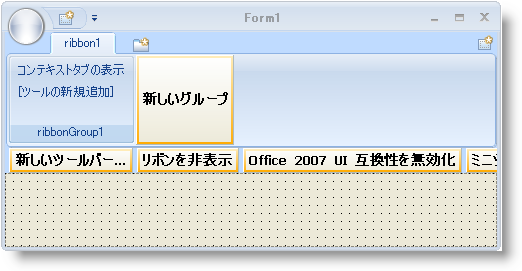
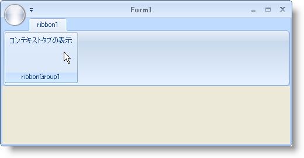
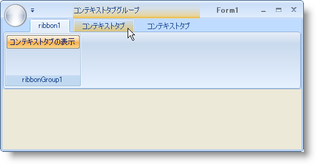

////

|metadata|
{
    "name": "wintoolbarsmanager-creating-a-tab-based-on-a-context",
    "controlName": ["WinToolbarsManager"],
    "tags": [],
    "guid": "{E2C865D3-F270-4CC3-8784-C738C27ADDBB}",  
    "buildFlags": [],
    "createdOn": "2006-06-10T10:47:09Z"
}
|metadata|
////

= コンテキストに基づきタブを作成

[NOTE]
====
注：{ProductName} の一部として提供されている Microsoft Office 2007 UI 機能を使用する場合、本ライセンスが、ユーザーに MICROSOFT OFFICE 2007 UI に対する権利を付与するものではないことに注意してください。詳細は、 officeui@microsoft.comにお問い合わせください。
====

== 始める前に

デフォルト状態でない、またはそれに近くない特別な状態があります。特定の要件が最初に満たされる場合に限って、特定のリボン タブを表示するオプションをユーザーに与えることによって、リボンのコンテキスト タブはこれらの状態を考慮します。考えられる例はワープロ プログラムの画像の場合があります。画像が選択される場合に限って、画像に関連するグループとツールを表示したい場合があります。これはリボンの混雑を排除し、ユーザー インターフェイスの領域を節約します。

== 達成すること

コンテキストに基づくリボンで新しいタブを作成する方法を学習します。pick:[win-forms="link:{ApiPlatform}win.ultrawintoolbars{ApiVersion}~infragistics.win.ultrawintoolbars.statebuttontool.html[StateButtonTool]"]  が切り替えられる時にコンテキスト タブを表示する pick:[win-forms="link:{ApiPlatform}win.ultrawintoolbars{ApiVersion}~infragistics.win.ultrawintoolbars.contextualtabgroup.html[ContextualTabGroup]"]  のインスタンスを作成します。

== 次の手順を実行します

[start=1]
. *リボンを設定します。*

.. ツールバーで UltraToolbarsManager コンポーネントを検索してダブルクリックします。ultraToolbarsManager1 コンポーネントがコンポーネント トレイに追加されます。
.. ultraToolbarsManager1 が選択されると、フォームの上のそばに [新しいツールバー] および [リボンを表示] ボタンが表示されます。[リボンを表示] ボタンをクリックします。リボンが表示します。
.. [タブを追加] ボタンをクリックします。新しいタブが表示します。
.. 新しいタブ内に [グループを追加] ボタンをクリックします。新しいグループが表示します。
.. 新しいグループで [新しいツールを挿入] ボタンをクリックします。ポップアップが表示します。
.. ポップアップ メニューの [新しいツールを挿入] をクリックします。[新しいツール] ダイアログ ボックスが表示します。
.. [新しいツール] ダイアログ ボックスで、[ツール タイプ] を [状態ボタン] に変更し、キャプションを 'コンテキスト タブを表示' に変更します。
.. [追加] をクリックします。新しいツールがグループに追加されます。
.. [閉じる] をクリックして [新しいツール] ダイアログ ボックスを閉じます。
[start=10]
.. メイン フォームを選択して、プロパティ ウィンドウで Size プロパティを検索します。幅を 500、高さを 250 に設定します。

この時点で、フォームは次のようになります。

[start=2]
. *必要なイベントを生成します。*

.. フォームのグレー領域内（リボンではなく）をダブルクリックします。FormLoad イベントがコードビハインドで生成されます。
.. デザイン ビューに切り替えてリボンの空白領域（[新しいグループ] ボタンの右の領域）をダブルクリックします。ultraToolbarsManager1 の pick:[win-forms="link:{ApiPlatform}win.ultrawintoolbars{ApiVersion}~infragistics.win.ultrawintoolbars.ultratoolbarsmanager~toolclick_ev.html[ToolClick]"]  イベントがコード ビハインドで生成されます。

[start=3]
. *using/Imports 文を追加します。*

コードの記述を開始する前にコード ビハインドに using/imports のディレクティブを配置します。そうすれば、メンバは完全に記述された名前を常に入力する必要がなくなります。

*Visual Basic の場合：*

----
Imports Infragistics.Win
Imports Infragistics.Win.UltraWinToolbars
----

*C# の場合：*

----
using Infragistics.Win;
using Infragistics.Win.UltraWinToolbars;
----

[start=4]
. *ContextualTabGroup に追加される RibbonTabs を作成します。*

FormLoad イベント内で、2 つのタブを作成して、それをリボンの pick:[win-forms="link:{ApiPlatform}win.ultrawintoolbars{ApiVersion}~infragistics.win.ultrawintoolbars.ribbontabcollection.html[Tabs]"]  コレクションに追加します。現時点では、2 つの標準タブを作成する場合の作業は同じです。

*Visual Basic の場合：*

----
Private Sub Creating_a_Tab_Based_on_a_Context_Load(ByVal sender As System.Object, _
  ByVal e As System.EventArgs) Handles MyBase.Load
	' 2 つのタブを作成し、リボンのタブ コレクションにそれを追加します。
	Dim contextualTab1 As New RibbonTab("Contextual Tab1", "ContextualTab")
	Dim contextualTab2 As New RibbonTab("Contextual Tab2", "ContextualTab")
	Me.ultraToolbarsManager1.Ribbon.Tabs.AddRange(New RibbonTab() _
	  {contextualTab1, contextualTab2})
----

*C# の場合：*

----
private void Creating_a_Tab_Based_on_a_Context_Load(object sender, EventArgs e)
{
	// 2 つのタブを作成し、リボンのタブ コレクションにそれを追加します。
	RibbonTab contextualTab1 = new RibbonTab("Contextual Tab1", "ContextualTab");
	RibbonTab contextualTab2 = new RibbonTab("Contextual Tab2", "ContextualTab");
	this.ultraToolbarsManager1.Ribbon.Tabs.AddRange(new RibbonTab[]
	  { contextualTab1, contextualTab2 }); 
	...
----

[start=5]
. *既存の ContextualTabGroupCollection をインスタンス化します。*

新しい pick:[win-forms="link:{ApiPlatform}win.ultrawintoolbars{ApiVersion}~infragistics.win.ultrawintoolbars.contextualtabgroupcollection.html[ContextualTabGroupCollection]"]  を作成するのではなく、リボンに既に存在するものを使用するだけです。以前のコード ブロックの後の FormLoad イベントに以下のコードを配置します。

*Visual Basic の場合：*

----
	' 簡単なアクセスのためにリボンの ContextualTabGroupCollection
	' のインスタンスを作成します。
	Dim tabGroupColl As ContextualTabGroupCollection = _
	  Me.UltraToolbarsManager1.Ribbon.ContextualTabGroups
----

*C# の場合：*

----
	...
	// 簡単なアクセスのためにリボンの ContextualTabGroupCollection
	// のインスタンスを作成します。
	ContextualTabGroupCollection tabGroupColl =
	  this.ultraToolbarsManager1.Ribbon.ContextualTabGroups
	  as ContextualTabGroupCollection;
	...
----

[start=6]
. *新しい ContextualTabGroup を作成して、これを ContextualTabGroups コレクションに追加します。*

これで、tabGroupColl は、

[source]
----
this.ultraToolbarsManager1.Ribbon.ContextulTabGroups
----

 を表し、pick:[win-forms="link:{ApiPlatform}win.ultrawintoolbars{ApiVersion}~infragistics.win.ultrawintoolbars.contextualtabgroupcollection~add.html[Add]"]  メソッドを使用して、新しい ContextualTabGroup をコレクションに追加できます。インデックスまたはキーで tabGroupColl 変数から ContextualTabGroup にアクセスできるので、それ自体の変数でインスタンス化する必要はありません。以前のコード ブロックの後の FormLoad イベントに以下のコードを追加します。

*Visual Basic の場合：*

----
	' 新しい ContextualTabGroup をコレクションに追加します。
	tabGroupColl.Add(New ContextualTabGroup("Contextual Group1", "ContextualTabGroup"))
----

*C# の場合：*

----
	...
	// 新しい ContextualTabGroup をコレクションに追加します。
	tabGroupColl.Add(new ContextualTabGroup("Contextual Group1",
	  "ContextualTabGroup"));
	...
----

[start=7]
. *タブを ContextualTabGroup に追加して非表示にします。*

タブを ContextualTabGroup の Tabs コレクションに配置すれば、コンテキスト タブになります。pick:[win-forms="link:{ApiPlatform}win.ultrawintoolbars{ApiVersion}~infragistics.win.ultrawintoolbars.contextualtabgroup~visible.html[Visible]"]  プロパティを false に設定する必要があり、そうすればコンテキスト タブはすぐには表示されません。以前のコード ブロックの後の FormLoad イベントに以下のコードを追加します。

*Visual Basic の場合：*

----
	' 2 つのタブをタブの ContextualTabGroup のコレクションに追加します。
	' ひとつのタブ グループしかないので、それを取得するためにキーではなく
	' インデックスを使用します。
	tabGroupColl(0).Tabs.AddRange(New RibbonTab() {contextualTab1, contextualTab2})
	' フォームがロードされる時にタブ グループを非表示にします。
	tabGroupColl(0).Visible = False
----

*C# の場合：*

----
	...
	// 2 つのタブをタブの ContextualTabGroup のコレクションに追加します。
	// ひとつのタブ グループしかないので、それを取得するためにキーではなく
	// インデックスを使用します。
	tabGroupColl[0].Tabs.AddRange(new RibbonTab[] {contextualTab1, contextualTab2});
	// フォームがロードされる時にタブ グループを非表示にします。
	tabGroupColl[0].Visible = false;
}
----

[start=8]
. *ToolClick イベント用のコードを追加します。*

コンテキスト タブを起動するにはいくつかの方法が必要です。通常、適切な要件が整えば、コンテキスト タブは表示します。この詳細なガイドでは、StateButtonTool を使用してコンテキスト タブを表示および非表示にします。ロジックは単純です。状態ボタンが選択されるとタブは表示され、状態ボタンの選択が解除されるとタブは非表示になります。以下の IF/ ELSE 文を ToolClick イベントに追加します。

*Visual Basic の場合：*

----
Private Sub ultraToolbarsManager1_ToolClick(sender As Object,_
  e As Infragistics.Win.UltraWinToolbars.ToolClickEventArgs)
	' クリックされたツールのインスタンスを作成します。
	Dim button As StateButtonTool = e.Tool
	If button.Checked = True Then 'If the StateButtonTool is selected...
	  Me.ultraToolbarsManager1.Ribbon.ContextualTabGroups(0).Visible = True
	Else ' StateButtonTool の選択が解除されると...
	  Me.ultraToolbarsManager1.Ribbon.ContextualTabGroups(0).Visible = False
	End If
End Sub
----

*C# の場合：*

----
private void ultraToolbarsManager1_ToolClick(object sender,
  Infragistics.Win.UltraWinToolbars.ToolClickEventArgs e)
{
	// クリックされたツールのインスタンスを作成します。
	StateButtonTool button = e.Tool as StateButtonTool;
	if(button.Checked == true) //If the StateButtonTool is selected...
	  this.ultraToolbarsManager1.Ribbon.ContextualTabGroups[0].Visible = true;
	else // StateButtonTool の選択が解除されると...
	  this.ultraToolbarsManager1.Ribbon.ContextualTabGroups[0].Visible = false;
}
----

[start=9]
. *アプリケーションを実行します。*

フォームがロードされると、ひとつのグループを持つひとつのタブ、およびそのグループ内に配置された StateButtonTool が表示されます。

[コンテキスト タブを表示] ボタンをクリックします。リボンに追加された 2 つのタブが、その上の強調表示領域で表示されます。

