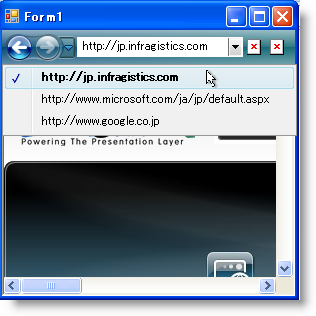

////

|metadata|
{
    "name": "wintoolbarsmanager-creating-an-internet-browsing-history",
    "controlName": ["WinToolbarsManager"],
    "tags": ["Application Scenarios","Navigation"],
    "guid": "{54387CBD-5D0A-485C-80C7-424B6AD4A210}",  
    "buildFlags": [],
    "createdOn": "0001-01-01T00:00:00Z"
}
|metadata|
////

= インターネット参照履歴を作成

== 始める前に

使い慣れていながらも操作性が向上した新しいユーザー インターフェイスの Microsoft® Internet Explorer® 7 によって、前バージョンよりも使用しやすくなりました。これらの改善点としては、ナビゲーション バーで、[戻る] ボタン、[次へ] ボタン、そして訪問した Web ページのリストを含むドロップダウン リストが挙げられます。このナビゲーション スキームは、エンド ユーザーのナビゲーション履歴を記録すると同時に簡単にアクセスできるようにします。

== 達成すること

この詳細なガイドは、ナビゲーション ツールバー、ComboBox ツール、および in-box WebBrowser コントロールを持つシンプルな Web ブラウズ アプリケーションを作成する手助けをします。この詳細なガイドを完了すれば、ナビゲーション ツールバーの基本、ナビゲーション履歴の維持方法、および履歴からナビゲートする方法を理解できます。

== 次の手順を実行します

[start=1]
. *フォームに NavigationToolbar を追加します。*

.. ツールボックスで link:{ApiPlatform}win.ultrawintoolbars{ApiVersion}~infragistics.win.ultrawintoolbars.ultratoolbarsmanager.html[UltraToolbarsManager] を見つけてダブルクリックします。ultraToolbarsManager1 コンポーネントがコンポーネント トレイに追加されます。表示される [UltraToolbarsManager 初期化] ダイアログ ボックスで [はい] をクリックします。
.. ultraToolbarsManager1 コンポーネントが選択された状態で、[プロパティ] ウィンドウで link:{ApiPlatform}win.ultrawintoolbars{ApiVersion}~infragistics.win.ultrawintoolbars.navigationtoolbar.html[NavigationToolbar] オブジェクトを展開して Visible プロパティを True に設定します。
.. ナビゲーション ツールバーで、[新しいツールを挿入] をクリックして、表示されるポップアップ メニューから [新しいツールを挿入] をクリックします。[新しいツール] ダイアログ ボックスが表示されます。
.. ツール タイプを link:{ApiPlatform}win.ultrawintoolbars{ApiVersion}~infragistics.win.ultrawintoolbars.comboboxtool.html[ComboBox]、キャプションを "AddressBar" に変更します。キーはキャプションのテキストで自動的に移植されます。[追加] をクリックします。
.. ツール タイプを link:{ApiPlatform}win.ultrawintoolbars{ApiVersion}~infragistics.win.ultrawintoolbars.buttontool.html[ButtonTool]、キャプションを "Refresh" に変更します。[追加] をクリックします。
.. ‘Stop’ のキャプションでもうひとつ ButtonTool を追加します。
.. [閉じる] をクリックして [新しいツール] ダイアログ ボックスを閉じます。
.. ultraToolbarsManager1 コンポーネントを選択したままの状態で、[プロパティ] ウィンドウで link:{ApiPlatform}win.ultrawintoolbars{ApiVersion}~infragistics.win.ultrawintoolbars.toolbarsettings.html[ToolbarSettings] オブジェクトを指定して link:{ApiPlatform}win.ultrawintoolbars{ApiVersion}~infragistics.win.ultrawintoolbars.toolbarsettings~fillentirerow.html[FillEntireRow] プロパティを True に設定します。
.. [プロパティ] ウィンドウで NavigationToolbar オブジェクトを指定し、 link:{ApiPlatform}win.ultrawintoolbars{ApiVersion}~infragistics.win.ultrawintoolbars.toolscollection.html[Tools]、AddressBar、および link:{ApiPlatform}win.ultrawintoolbars{ApiVersion}~infragistics.win.ultrawintoolbars.sharedprops.html[SharedProps] オブジェクトをドリルダウンし、 link:{ApiPlatform}win.ultrawintoolbars{ApiVersion}~infragistics.win.ultrawintoolbars.sharedprops~spring.html[Spring] プロパティを True に設定します。

現時点で、フォームのスクリーンショットのようになるはずです。

image::images/WinToolbarsManager_Creating_an_Internet_Browsing_History_01.png[]

[start=2]
. *Web ブラウザを設定します。*

.. Visual Studio® ツールボックスの Common Controls セクションを展開して WebBrowser コントロールを指定しダブルクリックします。Web ブラウザがフォームに追加されて親コンテナで自動的にドックします。
.. フォームのヘッダをダブルクリックします。Visual Studio はコード ビューに切り替わり、フォームの Load イベントを作成します。
.. Load イベントに、以下のコード行を追加します。このコードによって、Web ブラウザはエンド ユーザーのホームページにナビゲートされます。

*Visual Basic の場合：*

----
Me.WebBrowser1.GoHome()
----

*C# の場合：*

----
this.webBrowser1.GoHome();
----

[start=3]
. *ComboBox ツールとその ValueList への参照を作成します。*

.. コンボ ボックス ツールへの参照が必要になるので、ユーザーが作成するさまざまなメソッドでアクセスできます。コンボ ボックスの履歴を表す link:{ApiPlatform}win{ApiVersion}~infragistics.win.valuelist.html[ValueList] も必要になります。フォームの Load イベントの上に 2 つのグローバル変数を作成します。

*Visual Basic の場合：*

----
Dim vl As Infragistics.Win.ValueList
Dim combo As Infragistics.Win.UltraWinToolbars.ComboBoxTool
----

*C# の場合：*

----
Infragistics.Win.ValueList vl;
Infragistics.Win.UltraWinToolbars.ComboBoxTool combo;
----

.. ここで、フォームの Load イベントでこれらの変数を設定する必要があります。GoHome メソッドの前にこれらの 2 行のコードを必ず配置してください。配置しなければ、WebBrowser の DocumentCompleted イベントで後でコンボ ボックスにアクセスする場合、ヌル参照例外の危険性があります。

*Visual Basic の場合：*

----
Me.combo = Me.UltraToolbarsManager1.Tools("AddressBar")
Me.vl = Me.combo.ValueList
----

*C# の場合：*

----
this.combo = this.ultraToolbarsManager1.Tools["AddressBar"] 
		as Infragistics.Win.UltraWinToolbars.ComboBoxTool;
this.vl = this.combo.ValueList;
----

[start=4]
. *特定の Web ページを閲覧するメソッドを作成します。*

BrowseTo と呼ばれるメソッドを作成します。これは適切な Web ページを閲覧し、URL をナビゲーション ツールバーのナビゲーション履歴に追加し、URL をコンボ ボックスのドロップダウン リストに追加します。

*Visual Basic の場合：*

----
Private Sub BrowseTo()
' Web ページを閲覧します。
    Me.WebBrowser1.Navigate(Me.combo.Text)
' URL をナビゲーション履歴に追加します。
    Me.UltraToolbarsManager1.NavigationToolbar.NavigateTo _
        (Me.combo.Text, Nothing)
' URL をコンボのドロップダウン リストに追加します。
    Me.vl.ValueListItems.Insert _
        (0, New Infragistics.Win.ValueListItem(Me.combo.Text))
End Sub
----

*C# の場合：*

----
private void BrowseTo()
{
	// Web ページを閲覧します。
	this.webBrowser1.Navigate(this.combo.Text);
	// URL をナビゲーション履歴に追加します。
	this.ultraToolbarsManager1.NavigationToolbar.NavigateTo
		(this.combo.Text, null);
	// URL をコンボのドロップダウン リストに追加します。
	this.vl.ValueListItems.Insert
		(0, new Infragistics.Win.ValueListItem(this.combo.Text));
}
----

[start=5]
. *エラーのため URL をチェックするメソッドを作成します。*

閲覧する Web ページのドメインだけをエンド ユーザーが入力できるようにしたい場合があります。Web ページを閲覧する前にアドレス バーにコンテンツがあることを確かめたい場合もあります。このような状況を個別のメソッドでチェックし、エンド ユーザーが [更新] ボタンをクリックすると呼び出すことができます。このメソッドの中で、URL が有効であることに自信が持てれば、前の手順で作成した BrowseTo メソッドを呼び出すことができます。他のメソッドを作成し、CheckUrl を呼び出し、IF/ELSE 文を使用してアドレス バーが有効な入力を持つことを確認します。

*Visual Basic の場合：*

----
Private Sub CheckUrl()
' アドレス バーが空の場合は何も行いません。
    If Me.combo.Text = String.Empty Then
        Return
' アドレス バーが "http://" で開始しない場合は追加します。
' これによって、エンド ユーザーは完全な URL ではなく Web サイト 
' のドメインだけを入力できます。
    ElseIf Me.combo.Text.StartsWith("http://") = True Then
' URL を修正します。
        Me.combo.Text = "http://" + Me.combo.Text
        Me.BrowseTo()
' アドレス バーは正しいフォーマットとなります。
' もちろん、発生する可能性のある多くのその他のフォーマット問題があり、
' 確認する必要があります。
    Else
        Me.BrowseTo()
    End If
End Sub
----

*C# の場合：*

----
private void CheckUrl()
{
	// アドレス バーが空の場合は何も行いません。
	if (this.combo.Text == String.Empty) return;
	// アドレス バーが "http://" で開始しない場合は追加します。
	// これによって、エンド ユーザーは完全な URL ではなく Web サイト 
	// のドメインだけを入力できます。
	else if (!(this.combo.Text.StartsWith("http://")))
	{
		// URL を修正します。
		this.combo.Text = "http://" + this.combo.Text;
		this.BrowseTo();
	}
	// アドレス バーは正しいフォーマットとなります。
	// もちろん、発生する可能性のある多くのその他のフォーマット問題があり、
	// 確認する必要があります。
	else
	{
		this.BrowseTo();
	}
}
----

[start=6]
. *WinToolbarManager の ToolClick イベントを処理します。*

C# を使用する場合は [プロパティ] ウィンドウの光っているボルト、または Visual Basic を使用する場合はコード ビューの上のドロップダウン ボックスによって、 link:{ApiPlatform}win.ultrawintoolbars{ApiVersion}~infragistics.win.ultrawintoolbars.ultratoolbarsmanager~toolclick_ev.html[ToolClick] イベントのハンドラを作成します。[更新] ボタンは実際の参照を処理し、[停止] ボタンはブラウザの閲覧を停止します。

*Visual Basic の場合：*

----
Private Sub UltraToolbarsManager1_ToolClick(ByVal sender As Object, _
      ByVal e As Infragistics.Win.UltraWinToolbars.ToolClickEventArgs) _
      Handles UltraToolbarsManager1.ToolClick
        Select Case (e.Tool.Key)
            Case "Refresh"
                Me.CheckUrl()
            Case "Stop"
                Me.WebBrowser1.Stop()
        End Select
    End Sub
----

*C# の場合：*

----
private void ultraToolbarsManager1_ToolClick(object sender,
	Infragistics.Win.UltraWinToolbars.ToolClickEventArgs e)
{
	switch (e.Tool.Key)
	{
		case "Refresh":
			this.CheckUrl();
			break;
		case "Stop":
			this.webBrowser1.Stop();
			break;
	}
}
----

[start=7]
. *インターネット履歴を閲覧します。*

この時点で、ほとんどのインターネット閲覧機能は完了しました。ナビゲーション ツールバーでエンド ユーザーがインターネット履歴をナビゲートする時に閲覧するように WebBrowser コントロールを設定する必要があります。この作業は非常にシンプルで、関係するのは 2 行のコードだけです。UltraToolbarsManager の link:{ApiPlatform}win.ultrawintoolbars{ApiVersion}~infragistics.win.ultrawintoolbars.ultratoolbarsmanager~afternavigation_ev.html[AfterNavigation] イベントを処理する必要があります。このイベントは、ナビゲーション ツールバーでナビゲーションが完了すると発生します。エンド ユーザーがナビゲートしたナビゲーション履歴でアドレス バーのテキストを項目に最初に設定する必要があります。次に、WebBrowser コントロールでその Web ページを閲覧する必要があります。C# を使用する場合は [プロパティ] ウィンドウの光っているボルト、または Visual Basic を使用する場合はコード ビューの上のドロップダウン ボックスによって、AfterNavigation イベントのハンドラを作成します。

*Visual Basic の場合：*

----
Private Sub UltraToolbarsManager1_AfterNavigation(ByVal sender As Object, _
  ByVal e As Infragistics.Win.UltraWinToolbars.AfterNavigationEventArgs) _
  Handles UltraToolbarsManager1.AfterNavigation
    Me.combo.Text = e.CurrentItem.Text
    Me.WebBrowser1.Navigate(Me.combo.Text)
End Sub
----

*C# の場合：*

----
private void ultraToolbarsManager1_AfterNavigation
	(object sender, 
	Infragistics.Win.UltraWinToolbars.AfterNavigationEventArgs e)
{
	this.combo.Text = e.CurrentItem.Text;
	this.webBrowser1.Navigate(this.combo.Text);
}
----

[start=8]
. *アプリケーションを実行します。*

アプリケーションを実行すると、WebBrowser コントロールはユーザーのホームページを自動的に閲覧します（インターネットに接続していることが前提）。www.google.com と入力して [更新] ボタンをクリックすると、WebBrowser コントロールは Google.com にナビゲートします。アプリケーションは www.google.com をナビゲーション履歴とコンボ ボックスに追加します。Web ページへのナビゲートを続行し、アプリケーションは履歴の維持を続行します。ナビゲーション履歴のドロップダウン リストで項目をクリックすると、Web ブラウザが Web ページにナビゲートし、コンボ ボックスが正しい URL で移植されます。

