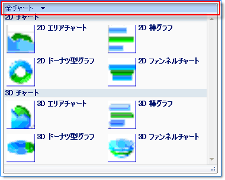

////

|metadata|
{
    "name": "wintoolbarsmanager-filtering-a-group-in-the-popupgallerytool",
    "controlName": ["WinToolbarsManager"],
    "tags": [],
    "guid": "{370B6D0D-B00E-4125-94C8-CC8A015F0B17}",  
    "buildFlags": [],
    "createdOn": "2006-06-10T10:53:29Z"
}
|metadata|
////

= PopupGalleryTool でグループをフィルタリング

[NOTE]
====
注：{ProductName} の一部として提供されている Microsoft Office 2007 UI 機能を使用する場合、本ライセンスが、ユーザーに MICROSOFT OFFICE 2007 UI に対する権利を付与するものではないことに注意してください。詳細は、 officeui@microsoft.comにお問い合わせください。
====

== 始める前に

pick:[win-forms="link:{ApiPlatform}win.ultrawintoolbars{ApiVersion}~infragistics.win.ultrawintoolbars.popupgallerytool.html[PopupGalleryTool]"]  は、ドロップダウンに複数の項目を表示できるので、これらの項目すべてをどのように整理しますか？PopupGalleryTool の各項目は、 link:wintoolbarsmanager-adding-groups-and-items-to-the-popupgallerytool.html[「グループと項目を PopupGalleryTool に追加する」]で学習したようにグループにソートできます。そうすれば、エンド ユーザーはこれらのグループをフィルターすることができるので、ひとつだけが一度に表示されます。この機能のほとんどは PopupGalleryTool に組み込まれています。ただし、この機能を利用するには複数の手順を踏む必要があります。

== 達成すること

この詳細なガイドは、既に作成されたグループにフィルタリングを追加するために「PopupGalleryTool にグループおよび項目を追加の詳細なガイド」に基づいています。3 つのフィルターを最初に作成する FormLoad イベントにコードを追加します。最初のフィルターはすべてのグループを表示します。2 番目のフィルターは、平面チャート グループだけを表示します。3 番目のフィルターは、立体チャート グループだけを表示します。

== 次の手順を実行します

[start=1]
. *フィルターを作成します。*

高いレベルから、基本的に 3 つのフィルターを作成し、それらのフィルターのコンテンツ（グループ）を定義し、PopupGalleryTool の pick:[win-forms="link:{ApiPlatform}win.ultrawintoolbars{ApiVersion}~infragistics.win.ultrawintoolbars.gallerytoolitemgroupfiltercollection.html[GroupFilters]"]  コレクションにそれらのフィルターを追加します。pick:[win-forms="link:{ApiPlatform}win.ultrawintoolbars{ApiVersion}~infragistics.win.ultrawintoolbars.gallerytoolitemgroupfilter.html[GalleryToolItemGroupFilter]"]  クラスの 3 つのインスタンスをインスタンス化することから始めます。フィルターの配列を使用することで、簡単に作成および維持をして、GroupFilters コレクションに追加できます。クラス コンストラクタのパラメータのひとつが文字列の配列を受け付けます。これらの文字列は、フィルターで必要となるグループの鍵になります。ひとつのフィルターには両方のグループが含まれ、すべての項目を表示するためのオプションがエンド ユーザーに与えられます。他のフィルターはそれぞれひとつのグループを持ちます。以下のコードは 3 つのフィルターを作成します。

*Visual Basic の場合：*

----
Dim filter() As GalleryToolItemGroupFilter = {_
  New GalleryToolItemGroupFilter("All Charts",_
                                 "All Charts",_
                                 New String() {"2D Charts", "3D Charts"}),_
  New GalleryToolItemGroupFilter("2D Charts",_
                                 "2D Charts",_
                                 New String() {"2D Charts"}),_
  New GalleryToolItemGroupFilter("3D Charts",_
                                 "3D Charts",_
                                 New String() {"3D Charts"})}
----

*C# の場合：*

----
// 2 つのグループから 3 つのフィルターを作成します。ひとつのフィルターには
// 平面チャートと立方チャートの両方が含まれ、他の 2 つのフィルターには
// 個々の平面チャートまたは立方チャートのタイプが含まれます。
GalleryToolItemGroupFilter[] filter = 
  new GalleryToolItemGroupFilter[] {
  new GalleryToolItemGroupFilter("All Charts", 
                                 "All Charts", 
                                 new string[] {"2D Charts", "3D Charts"}),
  new GalleryToolItemGroupFilter("2D Charts", 
                                 "2D Charts", 
                                 new string[] {"2D Charts"}),
  new GalleryToolItemGroupFilter("3D Charts", 
                                 "3D Charts", 
                                 new string[] {"3D Charts"})};
----

[start=2]
. *フィルターを GroupFilters コレクションに追加します。*

次の手順は比較的シンプルです。これで 3 つのフィルターが作成されました。GroupFilters コレクションにそれらを追加する必要があります。これを実行すれば、フィルターは自動的に機能し、他のプロパティを設定する必要はありません。GroupFilters コレクションの AddRange メソッドを呼び出し、GalleryToolItemGroupFilters の配列を追加します。この配列を既に作成したので、AddRange メソッドにフィルター配列を渡す必要があります。

*Visual Basic の場合：*

----
' 3 つのフィルターを GroupFilters コレクションに追加します。
chartGallery.GroupFilters.AddRange(filter);
----

*C# の場合：*

----
// 3 つのフィルターを GroupFilters コレクションに追加します。
chartGallery.GroupFilters.AddRange(filter);
----

[start=3]
. *アプリケーションを実行します。*

アプリケーションを実行すると、「グループと項目を PopupGalleryTool に追加」の詳細なガイドの最後と同様に表示されます。ただし、違いはドロップダウンです。ドロップダウン ボタンをクリックし、ドロップダウンの上のフィルタリング領域に注意してください。

この領域の任意の場所をクリックすると、GroupFilters コレクションに追加した 3 つのフィルターを含み、表示される他のドロップダウンが表示されます。

image::images/WinToolbarsManager_Filtering_a_Group_in_the_PopupGalleryTool_02.png[]