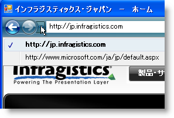

////

|metadata|
{
    "name": "wintoolbarsmanager-navigation-toolbar-navigate-to-a-new-item",
    "controlName": ["WinToolbarsManager"],
    "tags": ["Navigation"],
    "guid": "{77182DD9-2C3B-4DD1-A708-FA29AD44A43F}",  
    "buildFlags": [],
    "createdOn": "2007-12-09T12:09:16Z"
}
|metadata|
////

= 新しい項目にナビゲート

ナビゲーション履歴を作成する最も簡単な方法は、単に新しい項目にナビゲートすることです。ナビゲーション ツールバーはナビゲートされた各項目をナビゲーション履歴に自動的に追加するので、実行しなければならないのは link:{ApiPlatform}win.ultrawintoolbars{ApiVersion}~infragistics.win.ultrawintoolbars.navigationtoolbar~navigateto.html[NavigateTo] メソッドを呼び出すことだけです。NavigateTo メソッドを呼び出すと、ナビゲーション ツールバーは項目を link:{ApiPlatform}win.ultrawintoolbars{ApiVersion}~infragistics.win.ultrawintoolbars.navigationtoolbar~backhistory.html[BackHistory] コレクションに追加するので、ナビゲーション履歴が作成されます。

NavigateTo メソッドは 2 つのオーバーロードを公開します。 link:{ApiPlatform}win.ultrawintoolbars{ApiVersion}~infragistics.win.ultrawintoolbars.navigationtoolbar~navigateto(string,object).html[最初のオーバーロード]は文字列とオブジェクトを受け付け、 link:{ApiPlatform}win.ultrawintoolbars{ApiVersion}~infragistics.win.ultrawintoolbars.navigationtoolbar~navigateto(navigationhistoryitem).html[2 番目のオーバーロード]は link:{ApiPlatform}win.ultrawintoolbars{ApiVersion}~infragistics.win.ultrawintoolbars.navigationhistoryitem.html[NavigationHistoryItem] オブジェクトを受け付けます。最初のオーバーロードである文字列とオブジェクトを考えます。文字列は最新の履歴メニューに表示されるテキストで、[次へ] ボタンの右側のドロップダウン ボタンからアクセスされます。このオブジェクトは、項目に関連付けることができるオプションのオブジェクトです。このオブジェクトは別の文字列、画像、NavigationHistoryItem オブジェクトのコレクションなどが可能です。オブジェクトを関連付けないことを希望する場合は、null（Nothing）を渡します。

以下のコードは新しい項目にナビゲートするので、この項目が BackHistory コレクションに追加されます。

[NOTE]
====
*ヒント:* link:{ApiPlatform}win.ultrawintoolbars{ApiVersion}~infragistics.win.ultrawintoolbars.ultratoolbarsmanager~toolkeydown_ev.html[ToolKeyDown] イベントにこのコードを配置し、イベント引数によって正しい link:{ApiPlatform}win.ultrawintoolbars{ApiVersion}~infragistics.win.ultrawintoolbars.textboxtool.html[TextBoxTool] と Enter キーの両方をテストできます。これを行うことで、エンド ユーザーはテキスト ボックスにテキストを入力して、Enter を押して指定先にナビゲートできます。上記の画像は、関連付けられた WebBrowser コントロールによって Web サイトにナビゲートすることでこれを示します。詳細は、 link:wintoolbarsmanager-creating-an-internet-browsing-history.html[インターネット参照履歴を作成]を参照してください。
====

*Visual Basic の場合：*

----
Me.UltraToolbarsManager1.NavigationToolbar.NavigateTo _
	("http://jp.infragistics.com", Nothing);
----

*C# の場合：*

----
this.ultraToolbarsManager1.NavigationToolbar.NavigateTo
	("http://jp.infragistics.com", null);
----