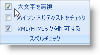
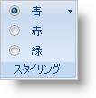

////

|metadata|
{
    "name": "wintoolbarsmanager-new-glyphs-for-statebutton-tool-whats-new-20071",
    "controlName": [],
    "tags": [],
    "guid": "{E1BCA0E4-7573-43F6-8AC0-724C36BF4035}",  
    "buildFlags": [],
    "createdOn": "2006-11-12T15:21:31Z"
}
|metadata|
////

= StateButton ツールの新しいグリフ

チェック ボックスおよび ラジオ ボタンは WinToolbarsManager で作成されたツールバーで以前は使用できなかった 2 つのツール タイプです。StateButton ツールから使用できる 2 つのコントロール タイプを作成しました。pick:[win-forms="link:{ApiPlatform}win.ultrawintoolbars{ApiVersion}~infragistics.win.ultrawintoolbars.statebuttontool~toolbardisplaystyle.html[ToolbarDisplayStyle]"]  プロパティを Glyph に設定することで、StateButton ツールがチェックボックスに変換されます。また、pick:[win-forms="link:{ApiPlatform}win.ultrawintoolbars{ApiVersion}~infragistics.win.ultrawintoolbars.statebuttontool~optionset.html[OptionSet]"]  プロパティが設定されている場合（以前のバージョンで既に存在している）、StateButton はラジオ ボタンの選択に変換します。

== 関連トピック

link:wintoolbarsmanager-transform-a-statebuttontool-into-a-checkbox.html[StateButtonTool をチェックボックスに変換]

link:wintoolbarsmanager-transform-a-statebuttontool-into-a-radio-button.html[StateButtonTool をラジオ ボタンに変換]