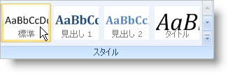
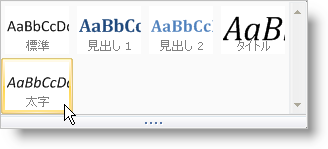

////

|metadata|
{
    "name": "wintoolbarsmanager-new-popupgallery-tool-whats-new-20063",
    "controlName": [],
    "tags": [],
    "guid": "{DBDE1008-9B36-421E-83EC-08DC1C5A8293}",  
    "buildFlags": [],
    "createdOn": "0001-01-01T00:00:00Z"
}
|metadata|
////

= 新しい PopupGallery ツール

PopupGallery ツールは、エンド ユーザーが作成する必要がある選択のプレビューを与える優れた新しい方法です。PopupGallery ツールでエンド ユーザーはその中に含まれる項目を簡単に見ることができます。ツールは [上] ボタンと [下] ボタンを使用してスクロールできるプレビュー領域をサポートします。ドロップダウン ボタンをクリックすると、ギャラリー項目が含まれるサイズ変更が可能なウィンドウが表示します。

PopupGallery ツールの他の機能は、ギャラリー項目をグループに分割するための機能です。グループになれば、エンド ユーザーは個々のグループでギャラリーをフィルターして不要な表示を減らすことができます。

== 関連トピック

link:wintoolbarsmanager-using-microsoft-office-2007-ui-capabilities.html[Microsoft Office 2007 UI 機能を使用する]