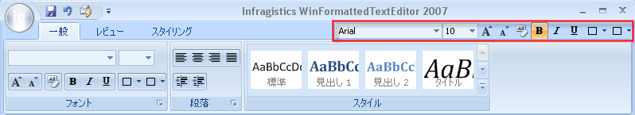

////

|metadata|
{
    "name": "wintoolbarsmanager-new-tab-item-toolbar-for-the-ribbon-whats-new-20071",
    "controlName": [],
    "tags": [],
    "guid": "{4EE57964-8402-4F85-B1DF-0563F049A56B}",  
    "buildFlags": [],
    "createdOn": "0001-01-01T00:00:00Z"
}
|metadata|
////

= リボン用の新しいタブ項目ツールバー

リボンに最後のリリースのツールを配置するために十分な場所があると考える場合、再考してください。リボンに他のツールバーが追加され、Infragistics のツールから期待する柔軟性が得られます。この新しいタブ項目ツールバーは、標準のツールバーとして表示および動作します。リボン、リボン グループの上、およびリボン タブの右にそれが見つかります。

タブ項目ツールバーは、 link:wintoolbarsmanager-quick-access-toolbar.html[クイック アクセス ツールバー] として同じ目的を果たし、常にエンド ユーザーに必要なツールへのアクセスをタイムリーに提供します。タブ項目ツールバーをアプリケーションに関係するタスクでエンド ユーザーを支援するツールを含む他の標準のツールバーとして使用することもできます。

完全にカスタマイズできる link:wintoolbarsmanager-new-minitoolbar-whats-new-20071.html[MiniToolbar] と結びつき、新しいこのリリースでもツールが欠落しているアプリケーションを見つけることはできないでしょう。

== 関連トピック

link:wintoolbarsmanager-creating-a-ribbon.html[リボンを作成]

link:wintoolbarsmanager-add-a-tool-to-a-ribbon-group.html[リボン グループにツールを追加]