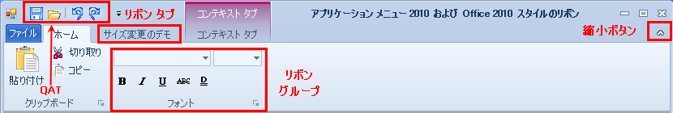

////

|metadata|
{
    "name": "wintoolbarsmanager-office-2010-ribbon-look-and-feel",
    "controlName": ["WinToolbarsManager"],
    "tags": ["Styling"],
    "guid": "3b7ec374-434c-41a9-9e86-f4de5ad1d841",  
    "buildFlags": [],
    "createdOn": "2010-09-20T14:02:53.7921674Z"
}
|metadata|
////

= Office 2010 リボンのルック アンド フィール

WinToolbarsManager™ コンポーネントのリボンに新しいスタイル、Office2010 が追加されました。Office 2010 スタイル リボンは、以前のバージョンのリボンに似ていますが、カラー スキームとスタイルにいくつかの変更が行われ、いくつかの機能が追加されています。

このスタイルで使用されているすべての色を管理するために新しい link:{ApiPlatform}win{ApiVersion}~infragistics.win.office2010colortable.html[Office2010ColorTable] が追加されました。Office2010ColorTable オブジェクトの link:{ApiPlatform}win{ApiVersion}~infragistics.win.office2010colortable~colorscheme.html[ColorScheme] プロパティを使用して色を変更できます。

[NOTE]
====
*注：* デフォルトで、カラー スキームは Blue に設定されています。
====

*Visual Basic の場合：*

----
Infragistics.Win.Office2010ColorTable.ColorScheme = 
Infragistics.Win.Office2010ColorScheme.Silver
----

*C# の場合：*

----
Infragistics.Win.Office2010ColorTable.ColorScheme =
  Infragistics.Win.Office2010ColorScheme.Silver;
----

UltraToolbarsManager.Style プロパティが Office2010 に設定されると、リボンは自動的に新しい外観を利用します。

*Visual Basic の場合：*

----
Me.ultraToolbarsManager1.Style = Infragistics.Win.UltraWinToolbars.ToolbarStyle.Office2010
----

*C# の場合：*

----
this.ultraToolbarsManager1.Style = Infragistics.Win.UltraWinToolbars.ToolbarStyle.Office2010;
----

UltraToolbarsManager Style プロパティが Office2010 に解決されると、リボンの左上隅に表示されている [ファイル] メニュー ボタンのスタイルが Office 2010 スタイルの [ファイル] メニュー ボタンで置き換えられます。さらにリボンには拡張されたグラスがありクライアント領域に拡張されており、タブ ストリップがグラスの上に描かれます。

link:{ApiPlatform}win.ultrawintoolbars{ApiVersion}~infragistics.win.ultrawintoolbars.ribbon~filemenustyle.html[FileMenuStyle] プロパティが Ribbon オブジェクトに追加されており、[ファイル] メニュー ボタンがクリックされた時にドロップダウンするメニューのタイプ（ApplicationMenu、ApplicationMenu2010、None）を定義します。FileMenuStyle プロパティを ApplicationMenu2010 に設定することによって、Microsoft Office 2010 Backstage ビューに似たアプリケーション メニューを取得できます。この Office 2010 スタイル アプリケーション メニューは、ヘッダー、ナビゲーション メニュー、コンテンツ領域で構成されます。

[NOTE]
====
*注：* デフォルトで、FileMenuStyle プロパティは ApplicationMenu に設定されます。
====

[BackStage ビューを表示するスクリーンショット]

この Office 2010 スタイルで、リボンの右上隅にピン設定/ピン解除ボタンが提供されます。これは通常、リボンを縮小/展開するために使用できます。

以下のスクリーンショットは、Office2010 スタイルにより異なるルック アンド フィールを付けたリボンの異なる領域を示します。

関連トピック:

link:wintoolbarsmanager-office-2010-style-application-menu.html[Office 2010 スタイル アプリケーション メニュー]

link:wintoolbarsmanager-add-tools-to-application-menu-2010.html[ツールをアプリケーション メニュー 2010 に追加]

link:wintoolbarsmanager-customize-areas-of-application-menu-2010-and-file-menu-button.html[アプリケーション メニュー 2010 の領域およびファイル メニュー ボタンのカスタマイズ]

link:styling-guide-office-2010-look-and-feel.html[Office 2010 のルック アンド フィール]