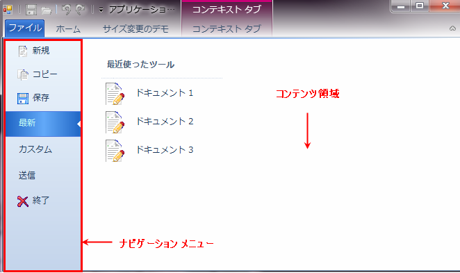

////

|metadata|
{
    "name": "wintoolbarsmanager-office-2010-style-application-menu",
    "controlName": ["WinToolbarsManager"],
    "tags": ["Styling"],
    "guid": "cfecbae9-5d90-4ba1-8cbb-246c264ce676",  
    "buildFlags": [],
    "createdOn": "2010-09-23T21:18:34.0653391Z"
}
|metadata|
////

= Office 2010 スタイル アプリケーション メニュー

Office 2010 のリリースによって、Microsoft® はリボン用の新しいユーザー インターフェイスを採用しました。リボンは新しいスタイルでリモデルされており、Backstage（Office 2010 スタイル アプリケーション メニュー）として知られているファイル メニューの一意のビューが追加されています。この Office 2010 スタイルアプリケーションメニューは、WinToolbarsManager™ コンポーネント内に実装されており、標準的なアプリケーション メニューの代わりに表示できます。

この機能をサポートするために、ドロップダウンされるファイル メニューのタイプ（ApplicationMenu、ApplicationMenu2010 または None）を示す新しい link:{ApiPlatform}win.ultrawintoolbars{ApiVersion}~infragistics.win.ultrawintoolbars.ribbon~filemenustyle.html[FileMenuStyle] プロパティが Ribbon オブジェクトに追加されています。このプロパティが ApplicationMenu2010 に設定されると、標準的なアプリケーション メニューの代わりに Office 2010 スタイル メニューが表示されます。

[NOTE]
====
*注：* デフォルトで、FileMenuStyle プロパティは ApplicationMenu に設定されます。
====

以下によって Office 2010 スタイル アプリケーション メニューを表示できます。

* メニュー ボタンをクリック。

[NOTE]
====
*注：* メニュー ボタンのスタイルは UltraToolbarsManager コンポーネントの Style プロパティ次第です。Office 2010 スタイルの [ファイル] メニュー ボタンを取得するには、Style プロパティを Office2010 に設定します。
====

* プログラムによって、ApplicationMenu2010. link:{ApiPlatform}win.ultrawintoolbars{ApiVersion}~infragistics.win.ultrawintoolbars.applicationmenu2010~dropdown.html[DropDown]() メソッドまたは ApplicationMenu2010.DropDown(activeContentTool) メソッドを呼び出す
* キーチップがアクティブの時:

** 関連付けられたキーを押す
** 左矢印キーを押してメニュー ボタンを選択し、Enter、スペースまたは下矢印キーを使用して Office 2010 スタイル アプリケーション メニューをアクティブにする

*Visual Basic の場合：*

----
Imports Infragistics.Win.UltraWinToolbarsManager
…
Me.ultraToolbarsManager1.Ribbon.ApplicationMenu2010.DropDown()
----

*C# の場合：*

----
using Infragistics.Win.UltraWinToolbarsManager
…
this.ultraToolbarsManager1.Ribbon.ApplicationMenu2010.DropDown();
----

Office 2010 スタイル アプリケーション メニューの左側はナビゲーション メニュー（標準的なアプリケーション メニューの ToolsAreaLeft に似ている）で、UltraToolbarsManger ツールの表示を担当します。アプリケーション メニュー 2010 の右側はコンテンツ領域と呼ばれ、ナビゲーション メニューのツールからポップアップするサブ項目またはコントロールをホストします。

Office 2010 スタイル アプリケーション メニューが表示されると、ナビゲーション メニューのツール コレクションの最初の有効で表示可能な PopupToolBase が ActiveContentTool として設定され、サブ項目またはコントロールがコンテンツ領域に表示されます。これは、 link:{ApiPlatform}win.ultrawintoolbars{ApiVersion}~infragistics.win.ultrawintoolbars.ultratoolbarsmanager~beforeapplicationmenu2010displayed_ev.html[BeforeApplicationMenu2010Displayed] イベント ハンドラーで ActiveContentTool を設定する、または ApplicationMenu2010.DropDown(activeContentTool) メソッドをプログラムで呼び出して、アクティブでコンテンツ領域に表示されるインスタンス ツールを渡すことによって、オーバーライドできます。

Office 2010 スタイル アプリケーション メニューが表示されるとき、クイック アクセス ツールバー（QAT）のツールはデフォルトで無効になります。この動作は、 link:{ApiPlatform}win.ultrawintoolbars{ApiVersion}~infragistics.win.ultrawintoolbars.ribbon~applicationmenu2010.html[Ribbon.ApplicationMenu2010] オブジェクトで link:{ApiPlatform}win.ultrawintoolbars{ApiVersion}~infragistics.win.ultrawintoolbars.applicationmenu2010~disableqat.html[DisableQAT] プロパティを False に設定することでオーバーライドできます。

アプリケーション メニュー 2010 を使用する時さまざまなアクションを処理するために以下のイベントを使用できます。

link:{ApiPlatform}win.ultrawintoolbars{ApiVersion}~infragistics.win.ultrawintoolbars.ultratoolbarsmanager~beforeapplicationmenu2010displayed_ev.html[BeforeApplicationMenu2010Displayed] - これは Office 2010 スタイル アプリケーション メニューが表示される前に発生するキャンセル可能なイベントです。

link:{ApiPlatform}win.ultrawintoolbars{ApiVersion}~infragistics.win.ultrawintoolbars.ultratoolbarsmanager~afterapplicationmenu2010displayed_ev.html[AfterApplicationMenu2010Displayed] - Office 2010 スタイル アプリケーション メニューが表示された後で発生するイベント。

link:{ApiPlatform}win.ultrawintoolbars{ApiVersion}~infragistics.win.ultrawintoolbars.ultratoolbarsmanager~beforeapplicationmenu2010closed_ev.html[BeforeApplicationMenu2010Closed] - Office 2010 スタイル アプリケーション メニューが閉じる前に発生するイベントで、キャンセル可能です。

link:{ApiPlatform}win.ultrawintoolbars{ApiVersion}~infragistics.win.ultrawintoolbars.ultratoolbarsmanager~afterapplicationmenu2010closed_ev.html[AfterApplicationMenu2010Closed] - Office 2010 スタイル アプリケーション メニューが閉じた後で発生するイベント。

関連トピック:

link:wintoolbarsmanager-add-tools-to-application-menu-2010.html[ツールをアプリケーション メニュー 2010 に追加]

link:wintoolbarsmanager-customize-areas-of-application-menu-2010-and-file-menu-button.html[アプリケーション メニュー 2010 の領域およびファイル メニュー ボタンのカスタマイズ]