////

|metadata|
{
    "name": "wintoolbarsmanager-office-2013-ribbon-look-and-feel",
    "controlName": [],
    "tags": [],
    "guid": "6efb2226-8e3c-4993-8cfd-2dde5deac1b0",  
    "buildFlags": [],
    "createdOn": "2013-08-12T16:01:21.6190555Z"
}
|metadata|
////

= Office 2013 リボンのルック アンド フィール

== トピックの概要

=== 目的

このトピックは、Office 2013 のリボン機能およびスタイルについての概要を説明し、Office 2010 との違いについても説明します。

=== このトピックの内容

このトピックは、以下のセクションで構成されます。

* <<_Ref361932124,Office 2013 のリボン>>
* <<_Ref361932134,はじめに>>
* <<_Ref361932142,プレビュー>>
* <<_Ref361932150,Office 2013 のリボン機能>>

** <<_Ref361932157,自動非表示>>
** <<_Ref361932165,リボンからグラスを削除>>
** <<_Ref361932185,[ピン固定] ボタンの位置>>
** <<_Ref361932192,フォームの描画>>
** <<_Ref361932205,ファイル メニュー (アプリケーション メニュー 2010)>>

* <<_Ref361932215,Office 2013 リボンのスタイル設定>>

** <<_Ref361932225,フォーム境界線の新しいスタイル>>
** <<_Ref361932253,クイック アクセス ツールバー>>
** <<_Ref361932266,リボン タブ>>
** <<_Ref361932276,リボン グループ>>
** <<_Ref361932287,コンテキスト タブ グループ>>
** <<_Ref361932296,ツールの外観>>
** <<_Ref361932306,キー チップおよびキーボード ナビゲーション>>
** <<_Ref361932317,キャプション領域の背景画像>>

* <<_Ref361932350,Office 2013 のリボン機能が影響する領域およびコントロール>>

** <<_Ref361932359,AppStylist>>
** <<_Ref361932371,アセンブリ>>
** <<_Ref353179659,列挙体>>
** <<_Ref361932389,グリフ エディター>>
** <<_Ref361932403,コントロール>>
** <<_Ref361932411,グローバリゼーションのローカライズ>>

* <<_Ref361932420,関連コンテンツ>>

[[_Ref361932124]]
== Office 2013 のリボン

[[_Ref361932134]]

=== はじめに

マイクロソフトは、Office 2013 リリースでリボンの新しいバージョンを導入しました。Office 2013 のリボンは旧バージョンのリボンと類似していますが、新たなカラー スキームやさまざまなスタイルなどの特徴があります。

link:{ApiPlatform}win.ultrawintoolbars{ApiVersion}~infragistics.win.ultrawintoolbars.ultratoolbarsmanager_members.html[UltraToolbarsManager] コンポーネントではすでに、Office 2007、Office 2010、Scenic Ribbons を再現する複数のビュー スタイルがサポートされています。Office 2013 のリボン機能には、現在のリボン デザインに変更されたスタイルのほとんどが反映されています。

[[_Ref361932142]]

=== プレビュー

Office 2013 のリボン

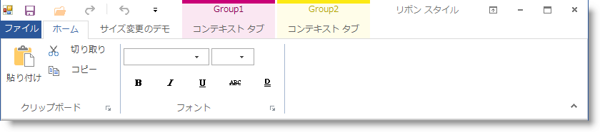

`UltraToolbarsManager.Style` プロパティを使用して Office 2013 スタイルでリボンを設定します。

1.コード例の構成

*C# の場合:*

[source,csharp]
----
ultraToolbarsManager1.Style = ToolbarStyle.Office2013;
----

*Visual Basic の場合:*

[source,vb]
----
ultraToolbarsManager1.Style = ToolbarStyle.Office2013
----

2.Visual Studio のプロパティ ウィンドウを使用したスタイルの構成

image::images/WinToolbarsManager_Office_2013_Ribbon_2.png[]

[[_Ref361932150]]
== Office 2013 のリボン機能

[[_Ref361932157]]

=== 自動非表示

リボンの表示オプション ボタンが Office 2013 のリボン に新たに追加され、リボンのキャプション領域に配置されています。ドロップダウン ボタンによりリボンの表示が選択できます。リボン全体を非表示することによりリボンを表示していた領域を利用することができます。キャプションは 3 つのボタン ( *リボンを表示* 、 *リボンの表示オプション* 、 *閉じる* ) を含むキャプション バーに置き換えられます。

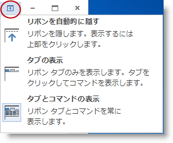

*  *[リボンを自動的に隠す]*  は、表示されているリボンを右揃えの 3 つのボタン ( *リボンを表示* 、 *リボンの表示オプション* 、 *閉じる* ) がある細いバーに置き換えて、リボン用の領域を最小化します。

image::images/WinToolbarsManager_Office_2013_Ribbon_4.png[]

*  *リボンを表示*  - フォーカスをやめると自動的に非表示になるドロップダウンに、リボン全体 (タブ、クイック アクセス ツールバー、キャプションを含む) を表示します。
*  *リボンの表示オプション*  - 標準のキャプション上の表示オプションと同じメニューを表示します。
*  *閉じる*  - フォームを閉じます。

*  *タブの表示*  - このオプションは、Office 2010 バージョンのリボンのピン解除状態と同じです。
*  *タブとコマンドの表示*  - このオプションは、旧バージョンのリボンのピン設定/標準状態と同じです。

[[_Ref361932165]]

=== リボンからグラスを削除

フラットでシンプルなデザインのOffice 2013 のリボンは、3D 風のアイコンを使用した Office 2010 のリボンと比較すると圧迫感がありません。マイクロソフトは Office 2013 で Aero グラス テーマを無効にしました。

[options="header", cols="a,a"]
|====
|Aero グラス テーマがある Office 2010|Aero グラス テーマのない Office 2013

|image::images/WinToolbarsManager_Office_2013_Ribbon_5.png[]
|image::images/WinToolbarsManager_Office_2013_Ribbon_6.png[]

|====

Office 2013 のツールバー スタイルを使用する場合は常に、`IsGlassSupported` プロパティが false に解決されます。

[[_Ref361932185]]

=== [ピン固定] ボタンの位置

Office 2013 では、ピン設定/ピン解除ボタンがキャプション領域からリボン グループ領域に移動しています。

[options="header", cols="a,a"]
|====
|Office 2010|Office 2013

|image::images/WinToolbarsManager_Office_2013_Ribbon_7.png[]
|image::images/WinToolbarsManager_Office_2013_Ribbon_8.png[]

|====

[[_Ref361932192]]

=== フォームの描画

Office 2013 の描画フォームは、長方形の細い境界線 (シャドー/グロー付き) に変更されました。

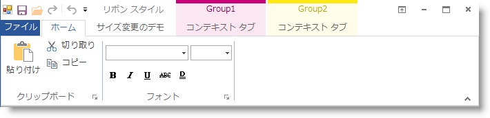

[[_Ref361932205]]

=== ファイル メニュー (アプリケーション メニュー 2010)

Office 2010 のファイル メニュー (アプリケーション メニュー 2010) 領域は、タブの下のコンテナー下部全体を含んで表示されます。アプリケーション メニュー 2010 を閉じるには、ファイル タブなど任意のタブをクリックする必要があります。

==== Office 2010

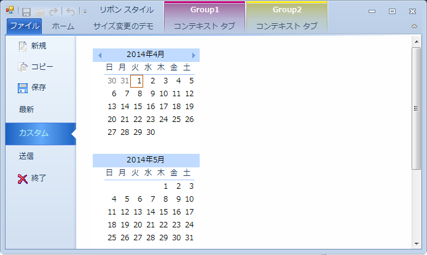

Office 2013 では、アプリケーション メニュー 2010 がコンテナー全体が表示されるように変更されました。アプリケーション メニュー 2010 は同じ領域に表示されますが、アプリケーション メニュー 2010 の上の領域の描画は異なります。タブ項目が削除され、アプリケーション メニュー 2010 を閉じることができるように、ナビゲーション領域の上に固定の [ *[戻る* ] ボタンが追加されています。

==== Office 2013

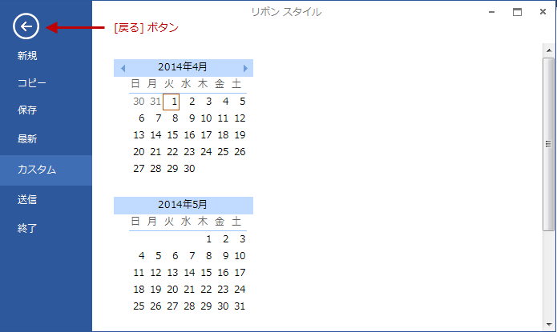

[[_Ref361932215]]
== Office 2013 リボンのスタイル設定

[[_Ref361932225]]

=== フォーム境界線の新しいスタイル

link:{ApiPlatform}win.ultrawintoolbars{ApiVersion}~infragistics.win.ultrawintoolbars.ultratoolbarsmanager_members.html[UltraToolbarsManager] は、ホスティング フォームを融合してカスタム フォーム境界線を描画できます。Office 2013 では、旧バージョンになかった新しい境界線のスタイルを使用します。フォーム境界は、輪郭がシングル ピクセルの長方形です。また、アクティブなフォームではグロー/シャドー効果が使用できます。

==== アクティブなフォーム

* 1 ピクセルの輪郭。「 *ファイル* 」アプリケーション メニュー ボタンに合わせた彩色。
* 輪郭のグロー/シャドー効果。

==== 非アクティブなフォーム

* 1 ピクセルの輪郭。フォームはダーク グレーでテキストはライト グレー (Office 2013)。
* グロー効果なし。

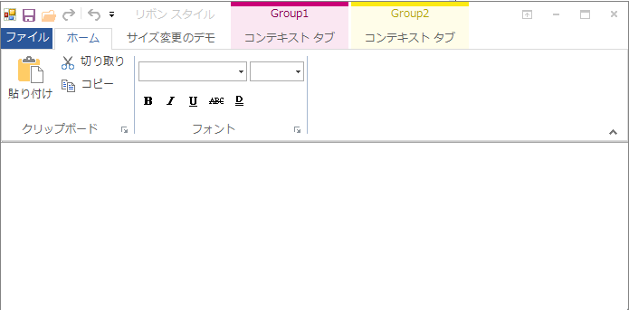

[[_Ref361932253]]

=== クイック アクセス ツールバー

Office 2013 では、Office 2010 のリボンで使用されていたシステム メニュー アイコンとクイック アクセス ツールバー (QAT) クイック カスタマイズ メニュー間のツールを区切る 2 つのセパレーターが廃止されました。

Office 2013 では QAT のセパレーターはありません。

[options="header", cols="a,a"]
|====
|Office 2010|Office 2013

|image::images/WinToolbarsManager_Office_2013_Ribbon_14.png[]
|image::images/WinToolbarsManager_Office_2013_Ribbon_15.png[]

|====

[[_Ref361932266]]

=== リボン タブ

Office 2010 および Office 2013 ともにリボン機能は同じです。唯一の違いは外観です。

選択されたタブのコーナーは、形状が丸から直角に変更されました。また、タブを選択した時のフォントの色は、「 *ファイル* 」アプリケーション メニュー ボタンと同じ色になります。

[options="header", cols="a,a"]
|====
|Office 2010|Office 2013

|image::images/WinToolbarsManager_Office_2013_Ribbon_16.png[]
|image::images/WinToolbarsManager_Office_2013_Ribbon_17.png[]

|====

Office 2010 のリボンで選択されていないタブをホットトラックする (タブ上にマウスを移動) と、タブの周囲に光彩のある境界線が表示されます。Office 2013 のリボンでは、タブの境界線は表示されずにフォント色のみが変化してホットトラックしていることを示します。

[options="header", cols="a,a"]
|====
|Office 2010|Office 2013

|image::images/WinToolbarsManager_Office_2013_Ribbon_18.png[]
|image::images/WinToolbarsManager_Office_2013_Ribbon_19.png[]

|====

[[_Ref361932276]]

=== リボン グループ

Office 2010 および Office 2013 のリボンはともに、隣接するリボン グループ間にセパレーターを使用しています。Office 2010 のセパレーターは、タブ ページの下端に接触して上端に向かって徐々に濃度が薄くなっていきますが、Office 2013 のセパレーターは実線で表示され、リボン グループの上部や下部に若干のスペースが空いています。リボン グループの背景は、リボン タブと同じオフ ホワイト一色です。

[options="header", cols="a,a"]
|====
|Office 2010 のセパレーター|Office 2013 のセパレーター

|image::images/WinToolbarsManager_Office_2013_Ribbon_20.png[]
|image::images/WinToolbarsManager_Office_2013_Ribbon_21.png[]

|====

[[_Ref361932287]]

=== コンテキスト タブ グループ

Office 2010 および Office 2013 のリボンのコンテキスト タブ グループには、表面的な違いしかありません。Office 2010 および Office 2013 のコンテキスト タブ グループのヘッダーはともに、そのグループ色を示す実線で上部に沿って描画されます。

Office 2010 リボンのコンテキスト タブ グループのヘッダーでは、グラス部分は上から下に明るく変化するグラデーション カラーで、コンテキスト タブ グループを区切る線は、上部から下部に向かって徐々に濃度が薄くなりタブ ページの上端には接触しません。タブを選択すると、選択したタブ ページはコンテキスト タブ グループと同じ色の境界線で描画されます。

Office 2013 リボンのコンテキスト タブ グループのヘッダーはグラデーションではなく、グループ色のアルファブレンドを使用した実線での描画です。また、選択したタブの上の境界線は、コンテキスト タブ グループの色に応じて変化しません。代わりに、選択したタブ、ホットトラックされたタブ、およびグループ ヘッダーのフォントの色が、グループ色と一致します。

[options="header", cols="a,a"]
|====
|Office 2010|Office 2013

|image::images/WinToolbarsManager_Office_2013_Ribbon_22.png[]
|image::images/WinToolbarsManager_Office_2013_Ribbon_23.png[]

|====

[[_Ref361932296]]

=== ツールの外観

Office 2013 ツールでのスタイル設定は、Office 2010 のリリース以降、大幅に変更されています。旧バージョンのグロー効果およびグラデーション スタイルは全体的に、境界線も濃淡もないベタ一色のスタイルに置き換えられています。

[options="header", cols="a,a,a"]
|====
|状態|Office 2010|Office 2013

|標準
|image::images/WinToolbarsManager_Office_2013_Ribbon_24.png[]
|image::images/WinToolbarsManager_Office_2013_Ribbon_25.png[]

|ホットトラックされた状態
|image::images/WinToolbarsManager_Office_2013_Ribbon_26.png[]
|image::images/WinToolbarsManager_Office_2013_Ribbon_27.png[]

|選択された状態
|image::images/WinToolbarsManager_Office_2013_Ribbon_28.png[]
|image::images/WinToolbarsManager_Office_2013_Ribbon_29.png[]

|押された状態
|image::images/WinToolbarsManager_Office_2013_Ribbon_30.png[]
|image::images/WinToolbarsManager_Office_2013_Ribbon_31.png[]

|====

[[_Ref361932306]]

=== キー チップおよびキーボード ナビゲーション

Microsoft Office のリボンには、タブおよびタブ メンバー間のキーボードでのナビゲートを容易にする `keyTips` が用意されています。`KeyTips` およびキーボード ナビゲーションは Office 2010 と Office 2013 で同じですが、`keyTips` 要素の外観に変更が加えられています。

Office 2010 以前のバージョンのリボンでは、`keyTips` は薄いグラデーションと丸みのある境界線で描画されていますが、Office 2013 の `keyTips` は濃いべた一色と四角のコーナーで描画されています。

==== Office 2010

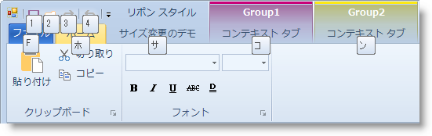

In.

==== Office 2013

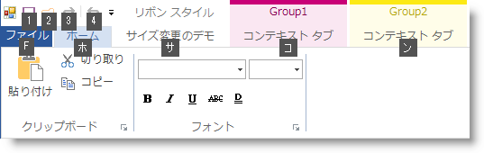

[[_Ref361932317]]

=== キャプション領域の背景画像

Office 2013 では、選択した背景画像 (提供なし) を以下のプロパティを使用してアプリケーションのキャプション領域に描画できます。

`ultraToolbarsManager1.Ribbon.CaptionAreaAppearance.ImageBackground`

image::images/WinToolbarsManager_Office_2013_Ribbon_34.png[]

[[_Ref361932350]]
== Office 2013 のリボン機能が影響する領域およびコントロール

[[_Ref361932359]]

=== AppStylist

新しい  _AutoHide_   機能が Office 2010 のリボンに追加されたため、Application Styling が Office 2010 と Office 2013 のリボン間で変更されました。

[[_Ref361932371]]

=== アセンブリ

Office 2013 のリボン機能を現在のアーキテクチャに統合するために、新しい値が現在の<<_Ref353179659,列挙体>>に追加されました。現在の列挙体の更新に伴い、エディター コントロールやボタン コントロールなどスタイル設定用の列挙体を使用するアッセンブリも同様に更新されました。

以下のリストは、更新により影響を受けたアッセンブリを示します。

* {ApiPlatform}Win.UltraWinEditors
* {ApiPlatform}Win.UltraWinGrid
* {ApiPlatform}Win.UltraWinMaskedEdit
* {ApiPlatform}Win.UltraWinSchedule
* {ApiPlatform}Win.UltraWinTabControl
* {ApiPlatform}Win.UltraWinListView
* {ApiPlatform}Win.UltraWinDataSource
* {ApiPlatform}Win.UltraWinToolbars

[[_Ref353179659]]

=== 列挙体

以下の表は、Office 2013 のビュー スタイルのサポートで追加された新しい値を含む現在の列挙体の一覧です。

[options="header", cols="a,a"]
|====
|列挙体|新しい値

|Infragistics.Win.AppStyling.ViewStyle
|Office2013

|Infragistics.Win.GlyphStyle
|Office2013

|Infragistics.Win.IGControls.MenuStyle
|Office2013

|Infragistics.Win.EmbeddableElementDisplayStyle
|Office2013

|Infragistics.Win.Pager.PagerDisplayStyle
|Office2013

|Infragistics.Win.UltraWinScrollBar.ScrollBarViewStyle
|Office2013

|Infragistics.Win.UIElementButtonStyle
|Office2013

|Infragistics.Win.UltraWinForm.UltraFormStyle
|Office2013

|====

[[_Ref361932389]]

=== グリフ エディター

既存の link:{ApiPlatform}win.ultrawineditors{ApiVersion}~infragistics.win.ultrawineditors.ultracheckeditor_members.html[UltraCheckEditor] 用グリフ エディターおよび link:{ApiPlatform}win.ultrawineditors{ApiVersion}~infragistics.win.ultrawineditors.ultraoptionset_members.html[UltraOptionSet] グリフは、Office 2013 のオプションを含むように更新されました。グリフ エディター ダイアログは link:{ApiPlatform}win{ApiVersion}~infragistics.win.standardglyphinfo_members.html[GlyphInfo] タイプのプロパティを表示します。 link:{ApiPlatform}win.ultrawineditors{ApiVersion}~infragistics.win.ultrawineditors.ultracheckeditor_members.html[UltraCheckEditor] および link:{ApiPlatform}win.ultrawineditors{ApiVersion}~infragistics.win.ultrawineditors.ultraoptionset_members.html[UltraOptionSet] コントロールの  _AppStylist for Windows Forms_   デザイン ダイアログ (チェック ボックス デザイナーおよびラジオ ボタン デザイナーのスクリーンショットに表示) に、Office 2013 スタイルが追加されました。これらのオプションは、それぞれ link:{ApiPlatform}win.ultrawintoolbars{ApiVersion}~infragistics.win.ultrawintoolbars.ultratoolbarsmanagerrole~checkboxglyphinfo.html[CheckBoxGlyphInfo] および link:{ApiPlatform}win.ultrawintoolbars{ApiVersion}~infragistics.win.ultrawintoolbars.ultratoolbarsmanagerrole~radiobuttonglyphinfo.html[RadioButtonGlyphInfo] プロパティを使用して設定します。

==== _UltraCheckEditor_   コンポーネントのロール設定

以下のスクリーンショットは、デザイン ダイアログの Office 2013 スタイル オプションの選択肢を示しています。このダイアログは次の手順で表示します。

1.AppStylist を開き `ロール` タブをクリックします。

2.コントロールの一覧から UltraCheckEditor コントロールを選択します。その下に共通コンポーネント プロパティ セクション セクションが表示されます。

3.CheckBoxGlyphInfo プロパティを選択します。その行の右端の 3 点リーダー (...) が表示されたボタンが有効になります。

4.ボタンをクリックすると、Office 2013 スタイル オプションを示すデザイナー ダイアログが表示されます。

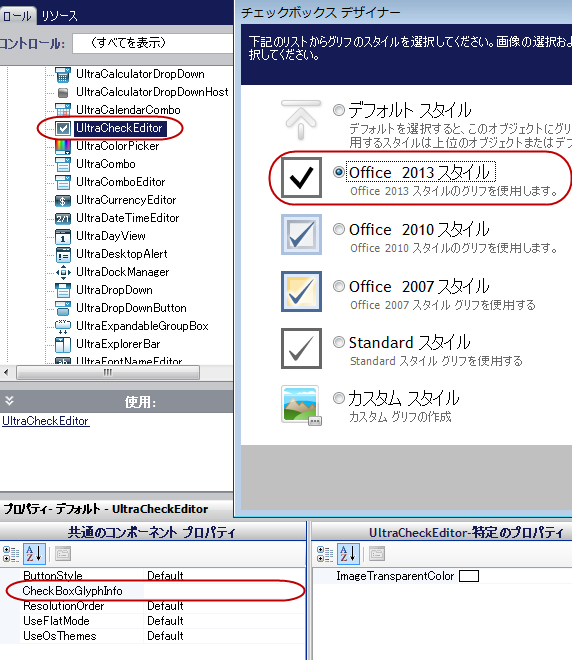

==== _UltraOptionSet_   コンポーネントのロール設定

以下のスクリーンショットは、デザイン ダイアログの Office 2013 スタイル オプションの選択肢を示しています。このダイアログは次の手順で表示します。

1.AppStylist を開き `ロール` タブをクリックします。

2.コントロールの一覧からUltraOptionSet コントロールを選択します。その下に共通コンポーネント プロパティ セクションが表示されます。

3.RadioButtonGlyphInfo プロパティを選択します。その行の右端の 3 点リーダー (...) が表示されたボタンが有効になります。

4.ボタンをクリックすると、Office 2013 スタイル オプションを示すデザイナー ダイアログが表示されます。

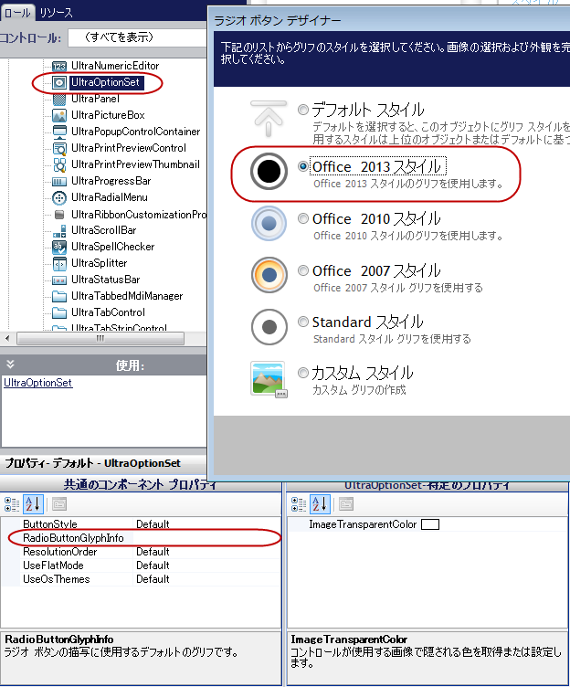

[[_Ref361932403]]

=== コントロール

以下のコントロールは Office 2013 のリボン スタイルをサポートしています。スクリーンショットに、Office 2013 のリボンで項目を描画するさまざまな方法を示します。

[options="header", cols="a,a"]
|====
|*コントロール*|* スクリーンショット*

| link:{ApiPlatform}win.misc{ApiVersion}~infragistics.win.misc.ultrabutton_members.html[UltraButton] 

link:{ApiPlatform}win.misc{ApiVersion}~infragistics.win.misc.ultradropdownbutton_members.html[UltraDropDownButton]

|==== 標準

image::images/WinToolbarsManager_Office_2013_Ribbon_37.png[] 

==== ホットトラックされた状態

image::images/WinToolbarsManager_Office_2013_Ribbon_38.png[] 

==== 押された状態 

image::images/WinToolbarsManager_Office_2013_Ribbon_39.png[] 

| link:{ApiPlatform}win.ultrawineditors{ApiVersion}~infragistics.win.ultrawineditors.ultrawincalc.ultracalculatordropdown_members.html[UltraCalculatorDropDown] 

link:{ApiPlatform}win.ultrawinschedule{ApiVersion}~infragistics.win.ultrawinschedule.ultracalendarcombo_members.html[UltraCalendarCombo] 

link:{ApiPlatform}win.ultrawineditors{ApiVersion}~infragistics.win.ultrawineditors.ultracolorpicker_members.html[UltraColorPicker] 

link:{ApiPlatform}win.ultrawingrid{ApiVersion}~infragistics.win.ultrawingrid.ultracombo_members.html[UltraCombo] 

link:{ApiPlatform}win.ultrawineditors{ApiVersion}~infragistics.win.ultrawineditors.ultracomboeditor_members.html[UltraComboEditor] 

link:{ApiPlatform}win.ultrawineditors{ApiVersion}~infragistics.win.ultrawineditors.ultracurrencyeditor_members.html[UltraCurrencyEditor] 

link:{ApiPlatform}win.ultrawineditors{ApiVersion}~infragistics.win.ultrawineditors.ultradatetimeeditor_members.html[UltraDateTimeEditor] 

link:{ApiPlatform}win.ultrawineditors{ApiVersion}~infragistics.win.ultrawineditors.ultrafontnameeditor_members.html[UltraFontNameEditor] 

link:{ApiPlatform}win.ultrawineditors{ApiVersion}~infragistics.win.ultrawineditors.ultratimezoneeditor_members.html[UltraTimeZoneEditor]
| ==== 標準 

image::images/WinToolbarsManager_Office_2013_Ribbon_40.png[] 

==== ホットトラックされたテキスト (DropDown) 

image::images/WinToolbarsManager_Office_2013_Ribbon_41.png[] 

==== ホットトラックされたテキスト (DropDownList) 

image::images/WinToolbarsManager_Office_2013_Ribbon_42.png[] 

==== ホットトラックされたボタン 

image::images/WinToolbarsManager_Office_2013_Ribbon_43.png[]

| link:{ApiPlatform}win.ultrawineditors{ApiVersion}~infragistics.win.ultrawineditors.ultracheckeditor_members.html[UltraCheckEditor] (チェックおよびチェック解除)

| ==== 標準

image::images/WinToolbarsManager_Office_2013_Ribbon_44.png[] 

image::images/WinToolbarsManager_Office_2013_Ribbon_47.png[] 

==== ホットトラックされた状態

image::images/WinToolbarsManager_Office_2013_Ribbon_45.png[] 

image::images/WinToolbarsManager_Office_2013_Ribbon_48.png[] 

==== 押された状態 

image::images/WinToolbarsManager_Office_2013_Ribbon_46.png[] 

image::images/WinToolbarsManager_Office_2013_Ribbon_49.png[]

| link:{ApiPlatform}win.ultrawineditors{ApiVersion}~infragistics.win.ultrawineditors.ultranumericeditor_members.html[UltraNumericEditor] 

link:{ApiPlatform}win.ultrawineditors{ApiVersion}~infragistics.win.ultrawineditors.ultratimespaneditor_members.html[UltraTimeSpanEditor]
|==== 標準 

image::images/WinToolbarsManager_Office_2013_Ribbon_50.png[] 

==== ホットトラックされたテキスト 

image::images/WinToolbarsManager_Office_2013_Ribbon_51.png[] 

==== ホットトラックされたボタン 

image::images/WinToolbarsManager_Office_2013_Ribbon_52.png[] 

image::images/WinToolbarsManager_Office_2013_Ribbon_53.png[]

| link:{ApiPlatform}win.ultrawinstatusbar{ApiVersion}~infragistics.win.ultrawinstatusbar.ultrastatusbar_members.html[UltraStatusBar]
|==== 標準 

image::images/WinToolbarsManager_Office_2013_Ribbon_54.png[] 

==== ホットトラックのつまみ 

image::images/WinToolbarsManager_Office_2013_Ribbon_55.png[] 

==== 押されたつまみ 

image::images/WinToolbarsManager_Office_2013_Ribbon_56.png[] 

==== ホットトラック ボタン 

image::images/WinToolbarsManager_Office_2013_Ribbon_57.png[] 

==== 押されたボタン 

image::images/WinToolbarsManager_Office_2013_Ribbon_58.png[]

|====

[[_Ref361932411]]

=== グローバリゼーションのローカライズ

新しい  *自動非表示*  ボタンのメニュー オプションおよびツールチップは、ローカライズされたテキストで表示されます。たとえば、Office 2013 のリボンが英語以外のバージョンのコンピューターで実行されている場合、開発者がカスタマイズ可能なリソース文字列を使用してドロップダウン メニューおよびツールチップで表示される文字列をコンピュータの言語環境に応じてローカライズできます。

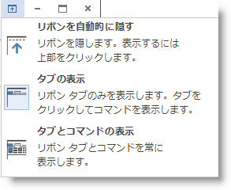

以下の表は、カスタマイズ可能なテキスト要素 (左の列) および相対するリソース文字列 (右の列) を表示します。テキスト要素をカスタマイズするか、ローカライズできます。

[options="header", cols="a,a"]
|====
|カスタマイズ可能なテキスト要素|リソース文字列名

|image::images/WinToolbarsManager_Office_2013_Ribbon_60.png[]
|RibbonDisplayOptions

|image::images/WinToolbarsManager_Office_2013_Ribbon_61.png[]
|RibbonDisplayOptions_AutoHide_Title

|image::images/WinToolbarsManager_Office_2013_Ribbon_62.png[]
|RibbonDisplayOptions_AutoHide_Description

|====

テキスト要素をカスタマイズするコード例。

*C# の場合:*

[source,csharp]
----
private Infragistics.Shared.ResourceCustomizer _rc;
_rc = Infragistics.Win.UltraWinToolbars.Resources.Customizer;
_rc.SetCustomizedString("RibbonDisplayOptions", "[Localized] - RibbonDisplayOptions");
_rc.SetCustomizedString("RibbonDisplayOptions_AutoHide_Title", "[Localized] - AutoHide Title");
_rc.SetCustomizedString("RibbonDisplayOptions_AutoHide_Description", "[Localized] - AutoHide Description");
----

*Visual Basic の場合:*

[source,vb]
----
Private _rc As Infragistics.Shared.ResourceCustomizer
_rc = Infragistics.Win.UltraWinToolbars.Resources.Customizer
_rc.SetCustomizedString("RibbonDisplayOptions", "[Localized] - RibbonDisplayOptions")
_rc.SetCustomizedString("RibbonDisplayOptions_AutoHide_Title", "[Localized] - AutoHide Title")
_rc.SetCustomizedString("RibbonDisplayOptions_AutoHide_Description", "[Localized] - AutoHide Description")
----

上記の例の結果です。

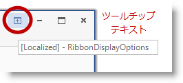

image::images/WinToolbarsManager_Office_2013_Ribbon_64.png[]

リソース文字列をカスタマイズする方法の詳細は、 link:win-customizing-assembly-resource-strings.html[アセンブリ リソース文字列のカスタマイズ]トピックを参照してください。

[[_Ref361932420]]
== 関連コンテンツ

=== トピック

このトピックの追加情報については、以下のトピックも合わせてご参照ください。

[options="header", cols="a,a"]
|====
|トピック|目的

| link:styling-guide-office-2010-look-and-feel.html[Office 2010 のルック アンド フィール]
|{ProductName} 2010 Volume 3 では、コントロールに新しいルック アンド フィール (Microsoft® Office 2010 のルック アンド フィール) が追加されました。

| link:styling-guide-office-2007-look-and-feel.html[Office 2007 のルック アンド フィール]
|Office 2007 のルック アンド フィールは、Microsoft® Office 2007 に対応したビジュアル テーマです。このルック アンド フィールの最も注目すべき機能は、リボン、Office 2007 の配色、オプション セットおよびチェックボックス用のグリフ、およびグラス グラデーションです。

|====