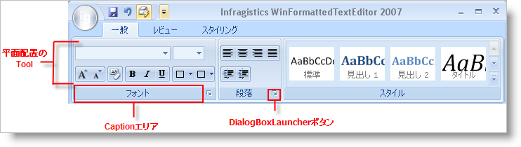

////

|metadata|
{
    "name": "wintoolbarsmanager-ribbon-groups",
    "controlName": ["WinToolbarsManager"],
    "tags": [],
    "guid": "{EA206612-129D-48F5-8126-A1702B98ACD4}",  
    "buildFlags": [],
    "createdOn": "0001-01-01T00:00:00Z"
}
|metadata|
////

= リボン グループ

[NOTE]
====
注：{ProductName} の一部として提供されている Microsoft Office 2007 UI 機能を使用する場合、本ライセンスが、ユーザーに MICROSOFT OFFICE 2007 UI に対する権利を付与するものではないことに注意してください。詳細は、 officeui@microsoft.comにお問い合わせください。
====

通常またはコンテキストに関わらず、各タブにはグループがあります。グループを使用して類似するツールを一緒にまとめます。ワープロ アプリケーションでは、太字、斜体、および下線などのツールを含むフォント選択に関わるすべてのツールをグループ化したい場合があります。

グループのツールは水平または垂直にレイアウトすることができます。ツールを垂直（デフォルト）にレイアウトすると、新しい列に移動する前に 3 つのグループ（ツールのサイズによって異なる）でスタックされます。ツールを水平にレイアウトすると、2 行に均等に分散されます。

各グループにはキャプション領域があり、グループを説明するテキストを含むことができます。DialogBoxLauncher ボタンを含むために選択することもあります。DialogBoxLauncher ボタンはグループのキャプションの右側にある小さいボタンです。このボタンはそれ自体のツールチップを持つことができます。DialogBoxLauncher ボタンを使用して、グループのツールよりも高度なオプションがあるダイアログ ボックスを開きます。グループにフォント スタイルに関係するツールが含まれる場合、より高度なフォント オプションのあるダイアログ ボックスが適切です。

デザイン タイムでグループを作成するには、現在のタブの [新しいグループ] ボタンをクリックする必要があります。ラン タイムにこれを行う方法は、 link:wintoolbarsmanager-add-a-group-to-a-ribbon-tab.html[「リボン タブにグループを追加」]を参照してください。