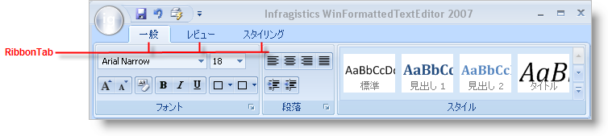
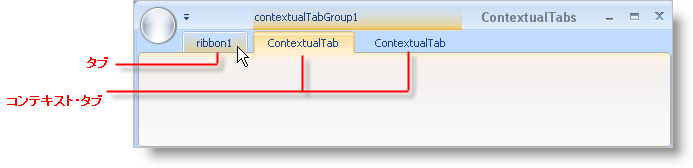

////

|metadata|
{
    "name": "wintoolbarsmanager-ribbon-tabs",
    "controlName": ["WinToolbarsManager"],
    "tags": [],
    "guid": "{892EC484-F3AB-4CA8-874C-C7363AD61E2B}",  
    "buildFlags": [],
    "createdOn": "0001-01-01T00:00:00Z"
}
|metadata|
////

= リボン タブ

[NOTE]
====
注：{ProductName} の一部として提供されている Microsoft Office 2007 UI 機能を使用する場合、本ライセンスが、ユーザーに MICROSOFT OFFICE 2007 UI に対する権利を付与するものではないことに注意してください。詳細は、 officeui@microsoft.comにお問い合わせください。
====

通常とコンテキストの 2 つのタイプのリボン タブがあります。通常のタブ（単に「タブ」と呼ばれる）は常に表示されています（Visible プロパティを False に設定しない限り）。

コンテキスト タブは特定の場合に限って表示されます。たとえば、画像をワープロ アプリケーションで選択すると、画像を表示するために [画像] タブが必要です。エンド ユーザーは画像を編集しない限りタブを表示する必要はありません。コンテキスト タブが表示されると、それがコンテキストであることを示す強調表示と共にリボン ヘッダにキャプションが示されます。

デザイン タイムでタブを作成するには、[タブを追加] ボタンをクリックする必要があります。ラン タイムでこれを行う方法は、 link:wintoolbarsmanager-add-a-tab-to-the-ribbon.html[「リボンにタブを追加」]を参照してください。