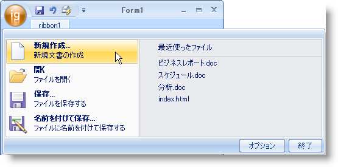
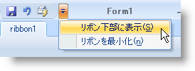
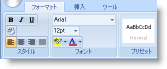

////

|metadata|
{
    "name": "wintoolbarsmanager-ribbon-whats-new-20063",
    "controlName": [],
    "tags": ["Navigation","Styling"],
    "guid": "{4850F211-8922-460E-B857-A52733857AF9}",  
    "buildFlags": [],
    "createdOn": "0001-01-01T00:00:00Z"
}
|metadata|
////

= リボン

Microsoft® Office 2007 には複数の新しく興味深いスタイルが含まれます。マイクロソフトは、よりアクセス性を向上し、ファイルの指定を簡単にするため、ツールバーおよびメニューの項目を作成するための UI スキーム全体を完全に再デザインしました。Infragistics は、すべてのリボンにこの新しい UI メタファーを採用しました。リボンを使用すれば、メイン メニューバーは不要で、アプリケーション オプションのすべてがタブをクリックして表示できます。アプリケーションの UI の見栄えを大幅に改善する新しいリボンのエキサイティングな機能があります。

image::images/WinToolbarsManager_Ribbon_Whats_New_20063_01.png[フル リボンの画像]

== アプリケーション メニュー

標準のメイン メニューから受け継ぎ、アプリケーション メニューは新しい Office 2007 ルック アンド フィールをサポートするグラフィカル エレメントです。アプリケーション メニューは 3 つの領域に分割されます。

* 左の領域は、ファイル操作を目的としたボタンを表示できます。
* 右の領域は左の領域と同じボタンを表示できます。右の領域の他の使用は、最近使用されたリストです。
* 下の領域は、アプリケーション オプションまたは終了ボタンなどのボタンを表示できます。

== クイック アクセス ツールバー

Quick Access Toolbar (QAT) は、標準タイプのツールバーで、常にリボンで表示されます。QAT は、それにほとんどの標準ツールを追加できるという点で非常に用途が広いです。QAT はリボン（デフォルト）の上または下に配置することもできます。

== タブおよびタブ グループ

リボンは、過去に弊社の WinToolbarsManager コンポーネントを使用していたユーザーに非常に馴染みのあるオブジェクト モデルを持ちます。リボンはタブのコレクションおよびタブ グループに構築されます。タブをリボン、グループをタブ、そしてツールをグループに追加します。一定時間または状況に限って表示するコンテキスト タブを表示することもできます。

== 関連トピック

link:wintoolbarsmanager-ribbon-about-the-ribbon.html[リボンについて]

link:wintoolbarsmanager-using-the-ribbon.html[リボンの使用]

link:wintoolbarsmanager-using-microsoft-office-2007-ui-capabilities.html[Microsoft Office 2007 UI 機能を使用する]