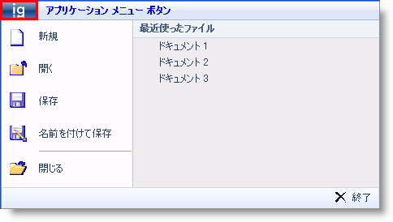
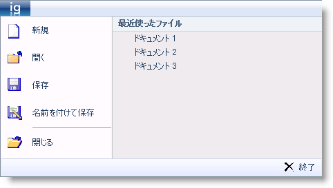
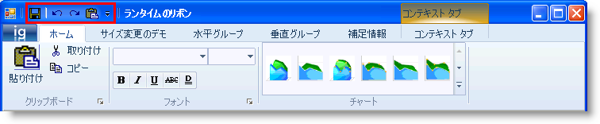
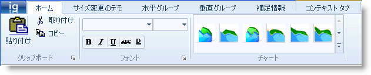
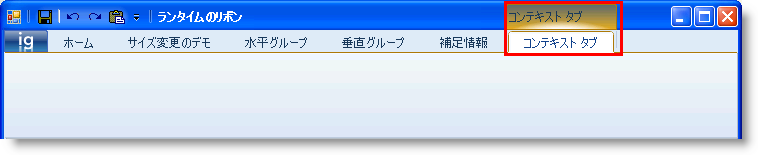
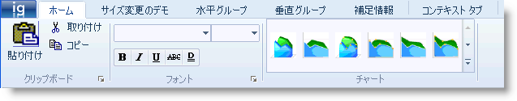

////

|metadata|
{
    "name": "wintoolbarsmanager-scenic-ribbon-look-and-feel",
    "controlName": ["WinToolbarsManager"],
    "tags": ["Styling"],
    "guid": "{2921E120-A90A-4CCA-BD86-42544FCB82D1}",  
    "buildFlags": [],
    "createdOn": "0001-01-01T00:00:00Z"
}
|metadata|
////

= Scenic Ribbon のルック アンド フィール

このトピックは、Scenic Ribbon スタイルを使用する場合の WinToolBarsManager™ コンポーネントでのスタイル変更に焦点を当てます。 デザイン タイムにまたはコードから ScenicRibbon に Style プロパティを設定することによって、新しいスタイルを適用できます。

*Visual Basic の場合：*

----
Me.ultraToolbarsManager1.Style = ToolbarStyle.ScenicRibbon
----

*C# の場合：*

----
this.ultraToolbarsManager1.Style = ToolbarStyle.ScenicRibbon;
----

== アプリケーション メニュー：

ScenicRibbon スタイルがあるアプリケーション メニューには、デフォルトで左右にツール領域があります。 フッター ツール領域はありません。 ただし、新しいスタイルに切り替わる時点で、フッター ツール領域にいくつかの表示可能なツールがある場合、それらはこれまでどおり使用可能で、動作します。このケースでは、完全な ScenicRibbon スタイルを希望する場合、フッター領域のツールの削除については開発者が責任を持ちます。

アプリケーション メニュー ボタンが、リボン タブ領域にタブとして表示されます。 また、アプリケーション メニュー ボタンをダブルクリックしても、Fluent Ribbon のようにアプリケーションを閉じません。 アプリケーション メニュー ボタンのデフォルトのキー チップは “F” のままです。

左右のツール領域があるアプリケーション メニュー：

左右およびフッターのツール領域のあるアプリケーション メニュー：

== クイック アクセス ツールバー

== リボン タブ

== コンテキスト タブ グループ

== リボン グループ

