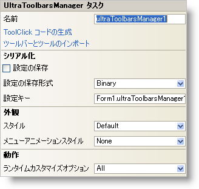

////
|metadata|
{
    "name": "wintoolbarsmanager-smart-tag",
    "controlName": ["WinToolbarsManager"],
    "tags": ["Design Environment"],
    "guid": "{48638BEA-E3C1-4C08-A303-20FF18ADFBFF}",
    "buildFlags": [],
    "createdOn": "0001-01-01T00:00:00Z"
}
|metadata|
////

= WinToolbarsManager スマート タグ

Visual Studio 2005（.NET Framework 2.0）では、それぞれの {ProductName} コントロール/コンポーネントが固有のスマート タグを備えています。コントロール/コンポーネントを単に選択すると、Smart Tag のアンカーが表示されます。このアンカーをクリックするとポップアップ パネルが表示され、そこからコントロール/コンポーネントの最もよく使用するプロパティや設定にすばやく簡単にアクセスできます。

WinToolbarsManager スマート タグには、コンポーネントの名前と次のセクションがあります。

* 外観 -- コントロールの外観やルック アンド フィールに関連する一般的なタスクがあります。
* 動作 -- フォーム上でのコントロールの動作を制御するプロパティに簡単にアクセスできます。
* シリアル化 -- IPersistComponentSettings インタフェースで使用されるプロパティにすばやくアクセスできます。

各セクションの項目（たとえば、フィールド、ドロップダウン リスト、チェックボックス）およびプロパティ グリッドの項目の対応するプロパティの説明については以下を参照してください。

[options="header", cols="a,a,a"]
|====
|外観|説明|対応するプロパティ

|メニューアニメーションスタイル
|ツールバー メニューのアニメーション スタイルをドロップダウンから選択します。"Random"、"Unfold"、"Slide"、"Fade" の中から選択できます。
| link:{ApiPlatform}win.ultrawintoolbars{ApiVersion}~infragistics.win.ultrawintoolbars.ultratoolbarsmanager~menuanimationstyle.html[MenuAnimationStyle]

|スタイル
|WinToolbarsManager の外観を、Office XP、Office 2000、Office 2003、Visual Studio 2005、または Office 2007 に似たスタイルに変更します。
| link:{ApiPlatform}win.ultrawintoolbars{ApiVersion}~infragistics.win.ultrawintoolbars.ultratoolbarsmanager~style.html[Style]

|====

[options="header", cols="a,a,a"]
|====
|動作|説明|対応するプロパティ

|ランタイム カスタマイズ 

オプション
|ドロップダウンをクリックすると、いくつかのオプションが表示されます。これらのオプションは WinToolbarsManager をランタイムにカスタマイズするために存在します。
| link:{ApiPlatform}win.ultrawintoolbars{ApiVersion}~infragistics.win.ultrawintoolbars.ultratoolbarsmanager~runtimecustomizationoptions.html[RuntimeCustomizationOptions]

|====

[options="header", cols="a,a,a"]
|====
|シリアル化|説明|対応するプロパティ

|設定の保存
|このチェックボックスをオンにすると、コンポーネントのプロパティ設定がアプリケーションの設定と共に自動的にロード/保存されます。
| link:{ApiPlatform}win.ultrawintoolbars{ApiVersion}~infragistics.win.ultrawintoolbars.ultratoolbarsmanager~savesettings.html[SaveSettings]

|設定の保存形式
|コンポーネントの設定をバイナリ形式と XML 形式のどちらで保存するかを選択します。
| link:{ApiPlatform}win.ultrawintoolbars{ApiVersion}~infragistics.win.ultrawintoolbars.ultratoolbarsmanager~savesettingsformat.html[SaveSettingsFormat]

|設定のキー
|ロード/保存する設定値を一意に識別するための設定キーを指定できます。デフォルトでは、格納側のフォーム/コントロールの名前とコンポーネントの名前に基づいて設定キーの値が設定されます。
| link:{ApiPlatform}win.ultrawintoolbars{ApiVersion}~infragistics.win.ultrawintoolbars.ultratoolbarsmanager~settingskey.html[SettingsKey]

|====