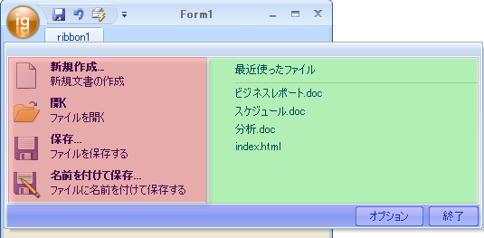

////
|metadata|
{
    "name": "wintoolbarsmanager-the-ribbon-application-menu",
    "controlName": ["WinToolbarsManager"],
    "tags": [],
    "guid": "{7F70E977-0E81-459B-BAE5-045F4420AEDB}","buildFlags": [],
    "createdOn": "0001-01-01T00:00:00Z"
}
|metadata|
////

= リボンのアプリケーション メニュー

リボンの左上角に丸いボタンがあります。このボタンは、リボンを使用するアプリケーション用のアプリケーション メニューです。もちろん、WinToolbarsManager に含まれる標準のファイル メニューを使用したい場合、FileMenuStyle プロパティを None に設定してこのボタンを非表示にすることができます。

.注:
[NOTE]
====
Ribbon オブジェクトの ApplicationMenu.Visible プロパティは廃止されました。 代わりに、FileMenuStyle プロパティを使用します。
====

.注:
[NOTE]
====
アプリケーション メニューを非表示にする場合、リボンの下にクイック アクセス ツールバー ( link:wintoolbarsmanager-quick-access-toolbar.html[「クイック アクセス ツールバー」]を参照) を再配置 (または一緒に非表示) したい場合があります。
====

アプリケーション メニューをクリックすると、ダイアログ ボックスが 3 つのセクションに分割されます。左のセクションは pick:[win-forms="link:{ApiPlatform}win.ultrawintoolbars{ApiVersion}~infragistics.win.ultrawintoolbars.applicationmenu~toolarealeft.html[ToolAreaLeft]"]  という名前で (この領域は以下の画像で赤色影が付けられている)、開く、保存、新規保存、および閉じるなどのコマンド付きのフォーマットされたツールを置きます。右のセクションは pick:[win-forms="link:{ApiPlatform}win.ultrawintoolbars{ApiVersion}~infragistics.win.ultrawintoolbars.applicationmenu~toolarearight.html[ToolAreaRight]"]  という名前で (この領域は以下の画像で緑色影が付けられている)、ToolAreaRight セクションと同じタイプの項目を含むことができますが、最近使用されたリストまたは他の共通コマンドをホストすることが主な目的です。3 番目のセクションは、ファイル メニューの下にあり、pick:[win-forms="link:{ApiPlatform}win.ultrawintoolbars{ApiVersion}~infragistics.win.ultrawintoolbars.applicationmenu~footertoolbar.html[FooterToolbar]"]  という名前です (この領域は以下の画像で青色影が付けられている)。フッタ領域には [アプリケーションを終了] ボタンが含まれます。

ファイル メニューをクリックし、3 つの領域の [ツールを挿入] をクリックしてデザイン タイムにツールをファイル メニューに追加することができます。ラン タイムにこれを行う方法についての詳細は、 link:wintoolbarsmanager-add-a-tool-to-the-tool-area-of-the-ribbons-application-menu.html[「リボンのアプリケーション メニューのツール領域にツールを追加」] を参照してください。