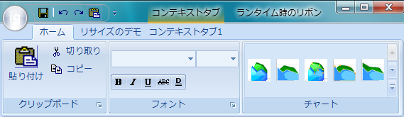

////

|metadata|
{
    "name": "wintoolbarsmanager-the-ribbon-now-supports-glass-in-windows-vista",
    "controlName": [],
    "tags": [],
    "guid": "{467DE629-6601-46FF-8294-4903ED24F483}",  
    "buildFlags": [],
    "createdOn": "2007-05-02T17:19:50Z"
}
|metadata|
////

= リボンは Windows vista で Glass をサポート

最先端の技術を取り入れることはアプリケーション開発者にとって重要です。この重要性を理解し、弊社は Windows® Vista™ システムで表示する時にキャプション領域にグラスを表示するため、リボンに機能を追加しました。グラス効果によって、半透明でリボンのキャプション ヘッダを表示することができます。この機能は、[構成] をオペレーティング システムから有効にすればデフォルトで使用でき、リボン自体に追加のプロパティを設定する必要はありません。

== 関連トピック

link:wintoolbarsmanager-working-with-the-ribbon.html[リボンの操作] 