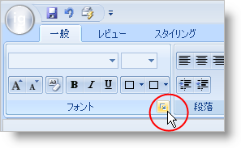

////

|metadata|
{
    "name": "wintoolbarsmanager-use-the-dialogboxlauncher-button-to-display-a-dialog-box",
    "controlName": ["WinToolbarsManager"],
    "tags": [],
    "guid": "{C2A4D23C-5D7B-4E31-B5C7-3BE9358FE420}",  
    "buildFlags": [],
    "createdOn": "0001-01-01T00:00:00Z"
}
|metadata|
////

= ダイアログ ボックスを表示するために DialogBoxLauncher を使用

[NOTE]
====
注：{ProductName} の一部として提供されている Microsoft Office 2007 UI 機能を使用する場合、本ライセンスが、ユーザーに MICROSOFT OFFICE 2007 UI に対する権利を付与するものではないことに注意してください。詳細は、 officeui@microsoft.comにお問い合わせください。
====

各リボン グループは正規のボタンが実行できる作業を実行可能なユニークなボタンを表示できます。このボタンは、pick:[win-forms="link:{ApiPlatform}win.ultrawintoolbars{ApiVersion}~infragistics.win.ultrawintoolbars.ribbongroup~dialogboxlauncherkey.html[DialogBoxLauncher]"]  ボタンと呼ばれます。一般的な使用のケースは、グループ内でツールに関係するダイアログ ボックスを表示することです。[詳細] ボタンもフォーマットされたツールチップを表示でき、エンド ユーザーに表示したいダイアログ ボックスのサムネイルを表示できます。フォーマットされたツールチップの詳細は、 link:wintooltipmanager-creating-a-formatted-tooltip.html[「フォーマットされたツールチップの作成」]を参照してください。

以下のコードは、標準ボタン ツールの作成とグループの [詳細] ボタンにそれを設定する方法を示しています。このコードは、そのボタン用に ToolClick イベントを作成する方法も示しているので、WinFormattedTextEditor の [フォント] ダイアログ ボックスを起動することができます。 [リボン] タブ内にリボン グループを作成する支援が必要な場合は、 link:wintoolbarsmanager-add-a-group-to-a-ribbon-tab.html[「リボン タブにグループを追加」]を参照してください。

*Visual Basic の場合：*

----
Imports Infragistics.Win.UltraWinToolbars
Imports Infragistics.Win.FormattedLinkLabel
...
Private Sub Form1_Load(sender As Object, e As System.EventArgs)
' [フォント] ダイアログ ボックスを開くツールを作成します。
   Dim fontDialog As New ButtonTool("FontDialog")
' WinToolbarsManager の Tools コレクションにツールを追加します。
   Me.ultraToolbarsManager1.Tools.Add(fontDialog)
' グループの DialogBoxLauncher ボタンとしてツールを設定します。
   Me.ultraToolbarsManager1.Ribbon.Tabs(0).Groups(0).DialogBoxLauncherKey = "FontDialog"
' ツール用に ToolClick イベント ハンドラを作成します。
   fontDialog.ToolClick += New ToolClickEventHandler(Me.fontDialog_ToolClick)
End Sub
' DialogBoxLauncher ボタンをクリックした時に発生するイベントを作成します。
Private Sub fontDialog_ToolClick(sender As Object, e As ToolClickEventArgs)
' WinFormattedTextEditor の [フォント] ダイアログ ボックスを表示します。
   Me.ultraFormattedTextEditor1.EditInfo.ShowFontDialog()
End Sub
----

*C# の場合：*

----
using Infragistics.Win.UltraWinToolbars;
using Infragistics.Win.FormattedLinkLabel;
...
private void Form1_Load(object sender, System.EventArgs e)
{
// [フォント] ダイアログ ボックスを開くツールを作成します。
ButtonTool fontDialog = new ButtonTool("FontDialog");
// WinToolbarsManager の Tools コレクションにツールを追加します。
this.ultraToolbarsManager1.Tools.Add(fontDialog);
// グループの DialogBoxLauncher ボタンとしてツールを設定します。
this.ultraToolbarsManager1.Ribbon.Tabs[0].Groups[0].DialogBoxLauncherKey = "FontDialog";
	// ツール用に ToolClick イベント ハンドラを作成します。
	fontDialog.ToolClick += new ToolClickEventHandler(this.fontDialog_ToolClick);
}
// DialogBoxLauncher ボタンをクリックした時に発生するイベントを作成します。
private void fontDialog_ToolClick(object sender, ToolClickEventArgs e)
{
	// WinFormattedTextEditor の [フォント] ダイアログ ボックスを表示します。
	this.ultraFormattedTextEditor1.EditInfo.ShowFontDialog();
}
----