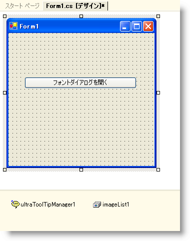
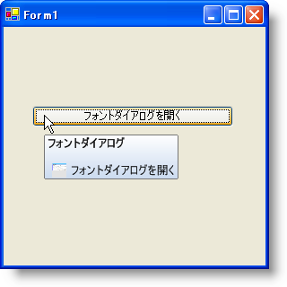

////

|metadata|
{
    "name": "wintooltipmanager-creating-a-formatted-tooltip",
    "controlName": ["WinToolTipManager"],
    "tags": ["How Do I","Styling"],
    "guid": "{33BFD689-628F-4AF0-B23C-26012E66908A}",  
    "buildFlags": [],
    "createdOn": "0001-01-01T00:00:00Z"
}
|metadata|
////

= フォーマットされたツールチップを作成

== 始める前に

{ProductName} 2006 Volume 3 では、WinToolTipManager コントロールの機能にフォーマットされたテキストが追加されました。この新しい機能は、pick:[win-forms="link:{ApiPlatform}win{ApiVersion}~infragistics.win.ultrawintooltip.ultratooltipinfo~tooltiptextformatted.html[ToolTipTextFormatted]"]  プロパティのフォームにあります。このプロパティを使用すれば、ツールチップ内の WinFormattedTextEditor コントロールのすべてのフォーマッティング機能を使用できます。

デザイン タイムにフォーマットされたツールチップを作成することは非常にシンプルです。これは、フォームに適切なコントロールをドロップし、次にユーザーがツールチップを必要とするコントロールの ToolTipTextFormatted エクステンダ プロパティを設定することに関わります。デザイン タイムでもフォーマットされたテキスト デザイナは役立ちます。このダイアログ ボックスはテキストと画像をグラフィック的に挿入する支援をします。

== 達成すること

これらの視覚的な支援はいずれもラン タイムでは使用できません。しかし、コードを使用することで、フォーマットされたテキストで可能なことと可能でないことを制御することができます。以下でフォーマットされたテキストと画像でツールチップを作成する方法を学習します。異なるスタイル属性の使用方法や画像を文字列にエンコードする方法を学習します。

== 次の手順を実行します

[start=1]
. UltraButton、UltraToolTipManager、および Visual Studio ツールボックスの Microsoft® の ImageList をダブルクリックします。デザイン タイムでフォームにこれらのコントロールを配置すると、コードを書く時に作業が簡単になります。ボタンは自由に整理できます。「フォント ダイアログを開く」などの意味のあるテキストをボタンに追加します。そうすれば、ボタンがどのようなことを実行するか分かります（ツールチップ テキストに基づいて作成）。この時点で、フォームは次のようになります。

[start=2]
. ImageList に画像を追加する必要があります。これを行うには、imageList1 がコンポーネント トレイで選択され、プロパティ ウィンドウの Images プロパティで省略記号（...）をクリックする必要があります。以下のダイアログ ボックスで [追加] をクリックします。ファイル システムから画像を選択して [開く] をクリックします。終わったら、[OK] をクリックします。WinFormattedTextEditor の [フォント] ダイアログ ボックスのサムネイルを使用したい場合、以下の画像を右クリックして [写真として保存] を選択します。

image::images/WinToolTipManager_Creating_a_Formatted_ToolTip_02.png[]

[start=3]
. コードの記述を開始する前にコードビハインドに使用/インポートのディレクティブを配置します。そうすれば、メンバーは完全に記述された名前を常にタイプする必要がなくなります。

*Visual Basic の場合：*

----
Imports Infragistics.Win
Imports Infragistics.Win.UltraWinToolTip
Imports Infragistics.Win.FormattedLinkLabel
----

*C# の場合：*

----
using Infragistics.Win;
using Infragistics.Win.UltraWinToolTip;
using Infragistics.Win.FormattedLinkLabel;
----

[start=4]
. フォーマットされたテキスト内に画像オブジェクトを組み込みたい場合、画像を文字列にエンコードする必要があります。FormattedLinkEditor オブジェクトの EncodeImage static メソッドを使用します。EncodeImage は画像を受け付け、文字列を返します。この文字列は、画像タグのデータ属性に設定可能な文字列にエンコードされた画像です。ImageList から画像を EncodeImage メソッドに私、同時に新しい文字列に設定します。

*Visual Basic の場合：*

----
string image = FormattedLinkEditor.EncodeImage(Me.ImageList1.Images[0])
----

*C# の場合：*

----
string image = FormattedLinkEditor.EncodeImage(this.imageList1.Images[0]);
----

[start=5]
. 次の手順は ToolTipInfo オブジェクトを作成することで、これは実際のフォーマットされたテキストを含みます。ToolTipInfo の ToolTipTextStyle プロパティを Formatted に設定する必要もあります。デフォルトでは、ToolTipInfo の ToolTipTextFormatted プロパティを設定する場合、テキストがフォーマットされます。ただし、ToolTipTextStyle プロパティが Raw に設定されている場合、ToolTip はフォーマットするのではなく raw テキストとして表示されます。ToolTipTextFormatted の代わりに ToolTipText プロパティを設定すると、ToolTipTextStyle を Formatted に設定しない限り、テキストはフォーマットされる代わりに raw で表示されます。

*Visual Basic の場合：*

----
Dim TipInfo as New UltraToolTipInfo()
TipInfo.ToolTipTextStyle = ToolTipTextStyle.Formatted
----

*C# の場合：*

----
UltraToolTipInfo tipInfo = new UltraToolTipInfo();
tipInfo.ToolTipTextStyle = ToolTipTextStyle.Formatted;
----

[start=6]
. これで ToolTipInfo オブジェクトが作成されました。WinToolTipManager からそれにボタンを接続する必要があります。これを達成するには、SetUltraToolTip メソッドを使用します。SetUltraToolTip は 2 つの引数をとります。ツールチップを表示するコントロールとツールチップを表示する ToolTipInfo オブジェクトです。使用しているコントロールは ultraButton1 で、ToolTipInfo オブジェクトは tipInfo です。ToolTip を新しい Office 2007 のツールチップのように見せたい場合は、DisplayStyle プロパティを Office2007 に設定する必要もあります。

*Visual Basic の場合：*

----
Me.UltraToolTipManager1.SetUltraToolTip(Me.UltraButton1, TipInfo)
Me.UltraToolTipManager1.DisplayStyle = ToolTipDisplayStyle.Office2007
----

*C# の場合：*

----
this.ultraToolTipManager1.SetUltraToolTip(this.ultraButton1, tipInfo);
this.ultraToolTipManager1.DisplayStyle = ToolTipDisplayStyle.Office2007;
----

[start=7]
. これで、すべての舞台裏接続が完了し、ToolTipTextFormatted プロパティを実際のフォーマットされたテキストに設定できます。WinFormattedTextEditor コントロールでどのタグおよび属性が提供されるか不明である場合、完全なリストについては、 link:winformattedlinklabel-formatting-text-and-hyperlinks.html[「テキストとハイパーリンクのフォーマッティング」]および link:winformattedtexteditor-style-attribute.html[「スタイル属性」]を参照してください。WYSIWYG (What You See Is What You Get) デザイナを使用したい場合、デザイン ビューを切り替え、ultraButton1 を選択し、プロパティ ウィンドウの UltraToolTip オブジェクトの ToolTipTextFormatted プロパティで省略記号をクリックします。これでデザイナが開き、カスタム ツールチップを作成できます。完了すれば、raw テキストをコピーし、コード表示にそれを貼り付けます。その代わりに、以下のコードを使用できます。これは WinFormattedTextEditor コントロールの [フォント] ダイアログ ボックスを開くボタンのツールチップの例です。

[NOTE]
====
*注：* 以下のコードのフォーマッティングは、個別の文字列に分割して一緒に追加することによって、読みやすさのために変更されました。フォーマットされたテキスト全体を 1 行のコードに配置することができます。二重引用符の代わりに '\"' を使用する必要があることに注意してください。二重引用符を一重引用符で置き換えることで読みやすさを改善することもできます。これによって、コンパイラーが早期の行の終わりとして解釈することを防止できます。
====

*Visual Basic の場合：*

----
TipInfo.ToolTipTextFormatted = "
 " +_
				"Font Dialog
 " +_
					"
 " +_
				" " +_
				"Opens the Font dialog box.
";
----

*C# の場合：*

----
tipInfo.ToolTipTextFormatted = "
 " +
				"Font Dialog
 " + 
					"
 " + 
				" " +
				"Opens the Font dialog box.
";
----

[start=8]
. アプリケーションを実行します。ボタンにマウスを重ねると、ツールチップがポップアップします。

