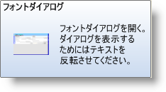

////

|metadata|
{
    "name": "wintooltipmanager-formatted-tooltips-whats-new-20063",
    "controlName": [],
    "tags": [],
    "guid": "{804A8498-6768-4F45-BE18-11BAFC5FDD20}",  
    "buildFlags": [],
    "createdOn": "0001-01-01T00:00:00Z"
}
|metadata|
////

= フォーマットされたツールチップ

ツールチップは長年にわたり素早く情報を収集する定番となっています。ただし、ツールチップは、同じフォントと色を何度も使用していて味気ない傾向があります。フォーマットされたツールチップは、この単調さに終止符を打ちました。pick:[win-forms="link:{ApiPlatform}win{ApiVersion}~infragistics.win.formattedlinklabel.formattedlinkeditor.html[FormattedLinkEditor]"]  を使用すれば、ツールチップは簡単な Web ページのように表示できます。

フォーマットされたツールチップで、ツールチップに画像を追加することを選択できます。テキストを右揃え、水平方向の罫線を使用、または用途の広い link:winformattedtexteditor-style-attribute.html[スタイル属性]も使用することができます。フォーマットされたツールチップは、ポップアップ ヘルプの次世代です。

以下は Microsoft® Office 2007 でツールチップが動作するのと全く同じに機能するフォーマットされたツールチップの画像です。上記のツールチップの作成をガイドするためのトピックへの役立つリンクもあります。

== 関連トピック

link:wintooltipmanager-creating-a-formatted-tooltip.html[フォーマットされたツールチップを作成]

link:styling-guide-office-2007-look-and-feel.html[Office 2007 のルック アンド フィール]