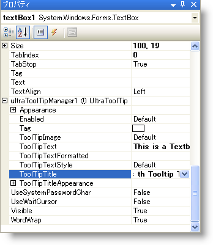

////

|metadata|
{
    "name": "wintooltipmanager-set-up-wintooltipmanager-at-design-time",
    "controlName": ["WinToolTipManager"],
    "tags": ["Design Environment","How Do I"],
    "guid": "{0F5C753A-37C6-47B3-9691-873DFAA4DE4D}",  
    "buildFlags": [],
    "createdOn": "2005-08-09T00:00:00Z"
}
|metadata|
////

= WinToolTipManager をデザインタイムに設定

pick:[win-forms="link:{ApiPlatform}win{ApiVersion}~infragistics.win.ultrawintooltip.ultratooltipmanager.html[UltraToolTipManager]"]  クラスは "UltraToolTip" というエクステンダ プロパティをコントロールに追加します。UltraToolTip プロパティは、WinToolTipManager でコントロールを管理することを目的とします。これにより、マウスがコントロールの上に置かれたときにツールヒントを自動的に表示できるようになります。

[start=1]
. *始めに、フォームにコントロールを配置します。*

どのようなコントロールを配置してもかまいませんが、この例では TextBox を使用します。
[start=2]
. *UltraToolTipManager コンポーネントをフォームに配置します。*
[start=3]
. *TextBox の ToolTipText プロパティを設定します。*

デフォルトでは、WinToolTipManager は、コントロールの pick:[win-forms="link:{ApiPlatform}win{ApiVersion}~infragistics.win.ultrawintooltip.ultratooltipinfo~tooltiptext.html[ToolTipText]"]  が有効な文字列に設定されている場合のみ、そのコントロールの上にマウスが置かれたときにツールヒントを表示します。

[start=4]
. *オプションのプロパティを設定します。*

ToolTipText を設定したら、ランタイムに TextBox の上にマウスを置いたときに TextBox のツールヒントが表示されます。

ツールヒントにタイトルも表示する場合は、pick:[win-forms="link:{ApiPlatform}win{ApiVersion}~infragistics.win.ultrawintooltip.ultratooltipinfo~tooltiptitle.html[ToolTipTitle]"]  プロパティを設定します。

ツールヒントのタイトルにイメージを表示する場合は、pick:[win-forms="link:{ApiPlatform}win{ApiVersion}~infragistics.win.ultrawintooltip.ultratooltipinfo~tooltipimage.html[ToolTipImage]"]  を設定します。ToolTipImage には一般的なイメージを表示するオプションがあります。カスタム イメージを表示するには、ToolTipImage プロパティを pick:[win-forms="link:{ApiPlatform}win{ApiVersion}~infragistics.win.tooltipimage.html[Custom]"]  に設定し、pick:[win-forms="link:{ApiPlatform}win{ApiVersion}~infragistics.win.appearance~image.html[Appearance.Image]"]  プロパティまたは ToolTipTitleAppearance.Image プロパティを設定します。

この時点で、BackColor や ForeColor などの他の Appearance プロパティも設定できます。
[start=5]
. *アプリケーションを実行します。*

アプリケーションを実行して TextBox の上にマウスを置きます。WinToolTipManager の pick:[win-forms="link:{ApiPlatform}win{ApiVersion}~infragistics.win.ultrawintooltip.ultratooltipmanager~initialdelay.html[InitialDelay]"]  プロパティで指定された遅延時間（デフォルトは 0.5秒）が経過した後、ツールヒントが表示されます。

image::images/WinToolTips_Walk_Through_Setting_Up_ToolTips_At_Design-Time_04.png[]