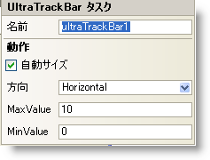

////
|metadata|
{
    "name": "wintrackbar-smart-tag",
    "controlName": ["WinTrackBar"],
    "tags": ["API","Design Environment"],
    "guid": "{E9C55801-1FD2-4818-9C4E-7172CD5616C3}",
    "buildFlags": [],
    "createdOn": "0001-01-01T00:00:00Z"
}
|metadata|
////

= WinTrackBar スマート タグ

Visual Studio 2005（.NET Framework 2.0）では、{ProductName} コントロール/コンポーネントがそれぞれ固有のスマート タグを備えています。コントロールやコンポーネントを選択するだけで、スマート タグのアンカーが表示されます。このアンカーをクリックするとポップアップ パネルが表示され、そこからコントロール/コンポーネントの最もよく使うプロパティや設定にすばやく簡単にアクセスできます。

WinTrackBar™ スマート タグには、コンポーネントの名前と次のセクションがあります。

* 動作 -- フォーム上でのコントロールの動作を制御するプロパティに簡単にアクセスできます。

各セクションの項目（フィールド、ドロップダウン リスト、チェックボックスなど）の説明と、各項目が対応するプロパティ グリッドのプロパティについては、以下の表を参照してください。

[options="header", cols="a,a,a"]
|====
|動作|説明|対応するプロパティ

|AutoSize
|Orientation 値に基づいて TrackBar を自動的にリサイズします。
| link:{ApiPlatform}win.ultrawineditors{ApiVersion}~infragistics.win.ultrawineditors.ultratrackbar~autosize.html[AutoSize]
|方向
|フォームに垂直方向または水平方向に配置するように WinTrackBar を構成します。
| link:{ApiPlatform}win.ultrawineditors{ApiVersion}~infragistics.win.ultrawineditors.ultratrackbar~orientation.html[Orientation]

|MaxValue
|TrackBar で許可される最大値
| link:{ApiPlatform}win.ultrawineditors{ApiVersion}~infragistics.win.ultrawineditors.ultratrackbar~maxvalue.html[MaxValue]

|MinValue
|TrackBar で許可される最小値
| link:{ApiPlatform}win.ultrawineditors{ApiVersion}~infragistics.win.ultrawineditors.ultratrackbar~minvalue.html[MinValue]

|====