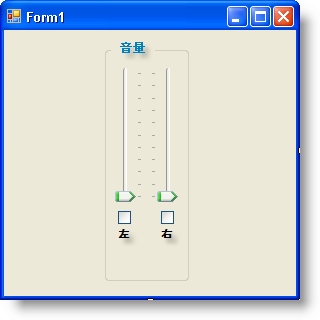
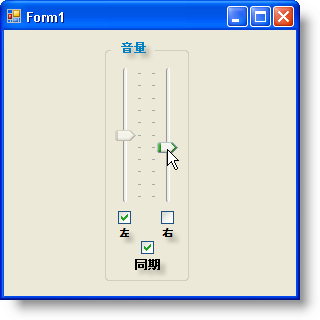

////
|metadata|
{
    "name": "wintrackbar-synchronizing-two-wintrackbar-controls",
    "controlName": ["WinTrackBar"],
    "tags": ["How Do I","Navigation"],
    "guid": "{00EB8C50-2187-43E6-A57C-F89E4C99F250}",
    "buildFlags": [],
    "createdOn": "2008-10-01T17:11:39Z"
}
|metadata|
////

= 2 つの WinTrackBar コントロールを同期

== 始める前に

WinTrackBar は多様な役割をアプリケーションで果たすことができるので、エンド ユーザーが増分値を設定することが求められるほとんどすべての状況で使用することができます。TrackBar コントロールが一般的に果たすひとつの非常に馴染みのある役割はボリューム制御です。2 つの WinTrackBar コントロールを並列して使用すると、マルチメディア アプリケーションのボリュームを制御するためのユーザー独自のステレオ フェーダを作成することができます。通常、このタイプのボリューム制御には、ステレオの両チャネルをミュートする機能、そして 2 つのフェーダを同期する機能も含まれます。

== 達成すること

フェーダとしての 2 つの WinTrackBar コントロール、ミュート チェックボックスとしての 2 つの WinCheckEditor コントロール、そして同期チェックボックスとしてのひとつの WinCheckEditor コントロールで構成されるステレオ ボリューム制御を作成します。コンピュータのボリュームの操作では相互運用可能なコードを書く必要があるので、このトピックの範囲を超えています。ユーザー インターフェイスに関係することだけを考慮します。

== 次の手順を実行します

[start=1]
. *フェーダとして動作するように WinTrackBar コントロールを設定します。*

.. WinGroupBox コントロールをフォームにドラッグし、[プロパティ] ウィンドウで Text プロパティを "Volume" に設定します。
.. 2 つの WinTrackBar コントロールを WinGroupBox にドラッグし、その link:{ApiPlatform}win.ultrawineditors{ApiVersion}~infragistics.win.ultrawineditors.ultratrackbar~orientation.html[Orientation] プロパティを Vertical に設定します。
.. 右の WinTrackBar の link:{ApiPlatform}win{ApiVersion}~infragistics.win.ultrawineditors.tickmarksettingsbase~location.html[TickmarkSettingsMinor.Location] プロパティを TopOrLeft に設定します。フォームは以下のスクリーンショットのようになります。

[start=2]
. *フェーダのミュートとして動作するように 2 つの WinCheckEditor コントロールを設定します。*

.. 2 つの WinCheckEditor コントロールを WinGroupBox にドラッグし、ひとつは各 WinTrackBar の真下にドラッグします。
.. 各 WinCheckEditor の Text プロパティからテキストを削除します。
.. 2 つの WinLabel コントロールを WinGroupBox にドラッグし、ひとつは各 WinCheckEditor の真下にドラッグします。
.. 左の WinLabel の Text プロパティを 'L' そして右の WinLabel を 'R' に設定します。フォームは以下のスクリーンショットのようになります。

[start=3]
. *2 つのフェーダを同期するために WinCheckEditor コントロールをもうひとつ設定します。*

.. WinCheckEditor コントロールをもうひとつ WinGroupBox にドラッグし、フォームに既に配置されている 2 つの WinCheckEditors の下に配置します。
.. 3 番目の WinCheckEditor の Text プロパティからテキストを削除します。
.. もうひとつの WinLabel を WinGroupBox にドラッグし、3 番目の WinCheckEditor コントロールの真下に配置します。
.. 3 番目の WinLabel コントロールの Text プロパティを 'Sync' に設定します。フォームは以下のスクリーンショットのようになります。

image::images/WinTrackBar_Synchronizing_Two_WinTrackBar_Controls_03.png[]

[start=4]
. *2 つの WinTrackBar コントロールを有効/無効にすることでフェーダをミュートします。*

エンド ユーザーがチェックボックスを選択すると、基本的に特定のステレオ チャネルがミュートされます。したがって、TrackBar を無効にしてこの機能をエミュレートできるので、エンド ユーザーはミュートされたことを確認できます。Enabled プロパティを False に設定することで、これを行うことができます。それぞれの WinCheckEditor の pick:[win-forms="link:{ApiPlatform}win.ultrawineditors{ApiVersion}~infragistics.win.ultrawineditors.ultratoggleeditorbase~checkedchanged_ev.html[CheckedChanged]"]  イベント（デザイナでチェックボックスをダブルクリックして簡単に設定）では、 対応する WinTrackBar Enabled プロパティを切り替えます。

*Visual Basic の場合：*

----
Private Sub UltraCheckEditor1_CheckedChanged(ByVal sender As System.Object, _
  ByVal e As System.EventArgs) Handles UltraCheckEditor1.CheckedChanged
    ' 左の WinTrackBar の Enabled プロパティを切り替えます。 
    Me.UltraTrackBar1.Enabled = Not Me.UltraTrackBar1.Enabled
End Sub
Private Sub UltraCheckEditor2_CheckedChanged(ByVal sender As System.Object, _
  ByVal e As System.EventArgs) Handles UltraCheckEditor2.CheckedChanged
    ' 右の WinTrackBar の Enabled プロパティを切り替えます。
    Me.UltraTrackBar2.Enabled = Not Me.UltraTrackBar2.Enabled
End Sub
----

*C# の場合：*

----
private void ultraCheckEditor1_CheckedChanged(object sender, EventArgs e)
{
	// 左の WinTrackBar の Enabled プロパティを切り替えます。 
	this.ultraTrackBar1.Enabled = !this.ultraTrackBar1.Enabled;
}
private void ultraCheckEditor2_CheckedChanged(object sender, EventArgs e)
{
	// 右の WinTrackBar の Enabled プロパティを切り替えます。
	this.ultraTrackBar2.Enabled = !this.ultraTrackBar2.Enabled;
}
----

[start=5]
. *エンド ユーザーは 2 つの WinTrackBar コントロールを同期できます。*

ほとんどのオーディオ アプリケーションでは、ミキサーでステレオ トラックを使用する場合、アプリケーションには通常、イコーライズされるように 2 つのフェーダを同期するためのオプションがあります。フォームに追加した 3 番目のチェックボックスは、同期のオン/オフの切り替えを処理します。最初に、2 つのフェーダを同期するかどうかの状態を保持するブール値が必要になります。次に、エンド ユーザーがチェックボックスを選択または選択解除する時にブール値を切り替える必要があります。2 つのフェーダの実際の同期は次の手順で行われます。

*Visual Basic の場合：*

----
Dim synced As Boolean = False
Private Sub UltraCheckEditor3_CheckedChanged(ByVal sender As System.Object, _
  ByVal e As System.EventArgs) Handles UltraCheckEditor3.CheckedChanged
    Me.synced = Not Me.synced
End Sub
----

*C# の場合：*

----
bool synced = false;
private void ultraCheckEditor3_CheckedChanged(object sender, EventArgs e)
{
	this.synced = !this.synced;
}
----

[start=6]
. *2 つの WinTrackBar コントロールを同期します。*

WinTrackBar コントロールを同期するために、他の WinTrackBar コントロールの link:{ApiPlatform}win.ultrawineditors{ApiVersion}~infragistics.win.ultrawineditors.ultratrackbar~valuechanged_ev.html[ValueChanged] イベントでひとつの WinTrackBar コントロールの link:{ApiPlatform}win.ultrawineditors{ApiVersion}~infragistics.win.ultrawineditors.ultratrackbar~value.html[Value] を設定します。Value を設定する前に、以下の 2 つの条件をテストする必要があります。

** 2 つの WinTrackBar が同期されているか？
** 他の WinTrackBar が Enabled か？

これらの条件の両方が満たされていれば、他の WinTrackBar コントロールの値を現在変更しようとしている WinTrackBar コントロールの Value に設定します。

*Visual Basic の場合：*

----
Private Sub UltraTrackBar1_ValueChanged(ByVal sender As System.Object, _
  ByVal e As System.EventArgs) Handles UltraTrackBar1.ValueChanged
    If Me.synced AndAlso Me.UltraTrackBar2.Enabled Then
        Me.UltraTrackBar2.Value = Me.UltraTrackBar1.Value
    End If
End Sub
Private Sub UltraTrackBar2_ValueChanged(ByVal sender As System.Object, _
  ByVal e As System.EventArgs) Handles UltraTrackBar2.ValueChanged
    If Me.synced AndAlso Me.UltraTrackBar1.Enabled Then
        Me.UltraTrackBar1.Value = Me.UltraTrackBar2.Value
    End If
End Sub
----

*C# の場合：*

----
private void ultraTrackBar1_ValueChanged(object sender, EventArgs e)
{
	if (synced && this.ultraTrackBar2.Enabled) 
		this.ultraTrackBar2.Value = this.ultraTrackBar1.Value;
}
private void ultraTrackBar2_ValueChanged(object sender, EventArgs e)
{
	if (synced && this.ultraTrackBar1.Enabled) 
		this.ultraTrackBar1.Value = this.ultraTrackBar2.Value;
}
----

[start=7]
. *アプリケーションを実行します。*

アプリケーションを実行し、フェーダを上下に移動すると、互いに独立して移動します。[同期] チェックボックスを選択してフェーダを再び移動します。フェーダは今度は相互に移動します。左のミュート チェックボックスを選択し、右のフェーダを移動します。左のフェーダは移動しません。

