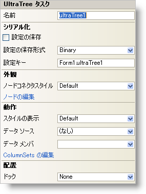

////

|metadata|
{
    "name": "wintree-smart-tag",
    "controlName": ["WinTree"],
    "tags": [],
    "guid": "{F8780BC6-F872-40A8-9C2A-3FE00EB3932C}",  
    "buildFlags": [],
    "createdOn": "0001-01-01T00:00:00Z"
}
|metadata|
////

= WinTree スマート タグ

Visual Studio 2005（.NET Framework 2.0）では、それぞれの {ProductName} コントロール/コンポーネントが固有のスマート タグを備えています。コントロール/コンポーネントを単に選択すると、Smart Tag のアンカーが表示されます。このアンカーをクリックするとポップアップ パネルが表示され、そこからコントロール/コンポーネントの最もよく使用するプロパティや設定にすばやく簡単にアクセスできます。

WinTree スマート タグには、以下のセクションと共にコントロールの名前が含まれます。

* 外観 -- コントロールの外観やルック アンド フィールに関連する一般的なタスクがあります。
* 動作 -- フォーム上でのコントロールの動作を制御するプロパティに簡単にアクセスできます。
* 配置 -- コントロールをフォームのどこに、どのように配置するかを指定するプロパティがあります。
* シリアライズ -- IPersistComponentSettings インタフェースで使用されるプロパティにすばやくアクセスできます。

各セクションの項目（たとえば、フィールド、ドロップダウン リスト、チェックボックス）およびプロパティ グリッドの項目の対応するプロパティの説明については以下を参照してください。

[options="header", cols="a,a,a"]
|====
|外観|説明|対応するプロパティ

|NodeConnectorStyle
|親ノード、子ノード、および兄弟ノードはそれぞれ、点線、破線、実線などのノード接続線で接続されます。接続線に使用するスタイルをドロップダウンから選択します。
| link:{ApiPlatform}win.ultrawintree{ApiVersion}~infragistics.win.ultrawintree.ultratree~nodeconnectorstyle.html[NodeConnectorStyle]

|ノードの編集
|［ノードの編集］ をクリックすると、UltraWinTree ノード エディタが開きます。ここで、ルート ノード、子ノード、および兄弟ノードを追加、削除、編集できます。
| link:{ApiPlatform}win.ultrawintree{ApiVersion}~infragistics.win.ultrawintree.ultratree~nodes.html[Nodes]

|====

[options="header", cols="a,a,a"]
|====
|動作|説明|対応するプロパティ

|DataMember
|有効なデータ ソースを選択した後、このドロップダウンから使用可能なすべてのデータ メンバを選択できます。
| link:{ApiPlatform}win.ultrawintree{ApiVersion}~infragistics.win.ultrawintree.ultratree~datamember.html[DataMember]

|データ ソース
|ドロップダウンをクリックすると、プロジェクトで使用可能なすべてのデータ ソースが表示されます。データソースがまだ設定されていない場合は、［プロジェクトデータソースの追加...］ を選択してデータソースを作成できます。
| link:{ApiPlatform}win.ultrawintree{ApiVersion}~infragistics.win.ultrawintree.ultratree~datasource.html[DataSource]

|ViewStyle
|WinTree の外観を、Outlook Express、グリッド、フリーフォームなどに似たスタイルに変更します。
| link:{ApiPlatform}win.ultrawintree{ApiVersion}~infragistics.win.ultrawintree.ultratree~viewstyle.html[ViewStyle]

|ColumnSets の編集
|［ColumnSets の編集］ をクリックすると、UltraTreeColumnSet コレクション エディタが開きます。
| link:{ApiPlatform}win.ultrawintree{ApiVersion}~infragistics.win.ultrawintree.ultratreecolumnsettings~columnsets.html[ColumnSets]

|====

[options="header", cols="a,a,a"]
|====
|レイアウト|説明|対応するプロパティ

|ドック
|コントロールを上、右、下、左、全体のどこにドッキングするか、またはどこにもドッキングしないかを選択します。
|Dock

|====

[options="header", cols="a,a,a"]
|====
|シリアライズ|説明|対応するプロパティ

|設定の保存
|このチェックボックスをオンにすると、コンポーネントのプロパティ設定がアプリケーションの設定と共に自動的にロード/保存されます。
| link:{ApiPlatform}win.ultrawintree{ApiVersion}~infragistics.win.ultrawintree.ultratree~savesettings.html[SaveSettings]

|設定の保存形式
|コンポーネントの設定をバイナリ形式と XML 形式のどちらで保存するかを選択します。
| link:{ApiPlatform}win.ultrawintree{ApiVersion}~infragistics.win.ultrawintree.ultratree~savesettingsformat.html[SaveSettingsFormat]

|設定のキー
|ロード/保存する設定値を一意に識別するための設定キーを指定できます。デフォルトでは、格納側のフォーム/コントロールの名前とコンポーネントの名前に基づいて設定キーの値が設定されます。
| link:{ApiPlatform}win.ultrawintree{ApiVersion}~infragistics.win.ultrawintree.ultratree~settingskey.html[SettingsKey]

|====