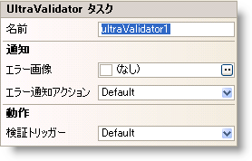

////

|metadata|
{
    "name": "winvalidator-smart-tag",
    "controlName": ["WinValidator"],
    "tags": [],
    "guid": "{94432E10-F125-4C2D-A172-3756920EEDB0}",  
    "buildFlags": [],
    "createdOn": "0001-01-01T00:00:00Z"
}
|metadata|
////

= WinValidator スマート タグ

Visual Studio 2005（.NET Framework 2.0）では、{ProductName} コントロール/コンポーネントがそれぞれ固有のスマート タグを備えています。コントロールやコンポーネントを選択するだけで、スマート タグのアンカーが表示されます。このアンカーをクリックするとポップアップ パネルが表示され、そこからコントロール/コンポーネントの最もよく使うプロパティや設定にすばやく簡単にアクセスできます。

WinValidator™ スマート タグには、以下のセクションと共にコントロールの名前が含まれます。

* 動作 -- フォーム上でのコントロールの動作を制御するプロパティに簡単にアクセスできます。
* 通知 -- 失敗した検証をエンド ユーザーに通知する手助けをするプロパティへのアクセスを提供します。

各セクションの項目（フィールド、ドロップダウン リスト、チェックボックスなど）の説明と、各項目が対応するプロパティ グリッドのプロパティについては、以下の表を参照してください。

[options="header", cols="a,a,a"]
|====
|動作|説明|対応するプロパティ

|検証トリガー
|拡張コントロールでのどのイベントによって WinValidator が検証するかを決定します。
| link:{ApiPlatform}win.misc{ApiVersion}~infragistics.win.misc.ultravalidator~validationtrigger.html[ValidationTrigger]

|====

[options="header", cols="a,a,a"]
|====
|通知|説明|対応するプロパティ

|エラー画像
|検証されるコントロールが検証に失敗する時に表示される画像。
| link:{ApiPlatform}win.misc{ApiVersion}~infragistics.win.misc.notificationsettings~image.html[Image]

|エラー通知アクション
|このプロパティは、コントロールが検証に失敗したときにエンド ユーザーにどのように通知するのかを決定します。
| link:{ApiPlatform}win.misc{ApiVersion}~infragistics.win.misc.notificationsettings~action.html[Action]

|====