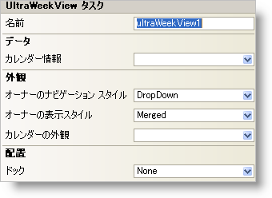

////

|metadata|
{
    "name": "winweekview-smart-tag",
    "controlName": ["WinWeekView"],
    "tags": ["Design Environment"],
    "guid": "{AC37C3D4-7B88-4DC1-BD6F-7433E0CC16EF}",  
    "buildFlags": [],
    "createdOn": "0001-01-01T00:00:00Z"
}
|metadata|
////

= WinWeekView スマート タグ

Visual Studio 2005（.NET Framework 2.0）では、それぞれの {ProductName} コントロール/コンポーネントが固有のスマート タグを備えています。コントロール/コンポーネントを単に選択すると、Smart Tag のアンカーが表示されます。このアンカーをクリックするとポップアップ パネルが表示され、そこからコントロール/コンポーネントの最もよく使用するプロパティや設定にすばやく簡単にアクセスできます。

WinWeekView スマート タグには、以下のセクションと共にコントロールの名前が含まれます。

* 外観 -- コントロールの外観やルック アンド フィールに関連する一般的なタスクがあります。
* データ -- コントロールの基になるデータ（データソースやデータメンバなど）を参照します。
* 配置 -- コントロールをフォームのどこに、どのように配置するかを指定するプロパティがあります。

各セクションの項目（たとえば、フィールド、ドロップダウン リスト、チェックボックス）およびプロパティ グリッドの項目の対応するプロパティの説明については以下を参照してください。

[options="header", cols="a,a,a"]
|====
|外観|説明|対応するプロパティ

|OwnerDisplayStyle
|Merged を選択するとすべてのオーナーがまとめて表示され、Separate を選択すると各オーナーが個別に表示されます。
| link:{ApiPlatform}win.ultrawinschedule{ApiVersion}~infragistics.win.ultrawinschedule.ultramonthviewsinglebase~ownerdisplaystyle.html[OwnerDisplayStyle]

|OwnerNavigationStyle
|ユーザーが別のオーナーに移動するための手段をドロップダウン、スクロールバー、ドロップダウンとスクロールバー、スクロールボタンの中から選択するか、または別のオーナーに移動できないようにするかを指定します。
| link:{ApiPlatform}win.ultrawinschedule{ApiVersion}~infragistics.win.ultrawinschedule.ultramonthviewsinglebase~ownernavigationstyle.html[OwnerNavigationStyle]

|CalendarLook
|ドロップダウンをクリックすると、フォーム上にある使用可能なすべての WinCalendarLook コントロールが表示されます。
| link:{ApiPlatform}win.ultrawinschedule{ApiVersion}~infragistics.win.ultrawinschedule.ultraschedulecontrolbase~calendarlook.html[CalendarLook]

|====

[options="header", cols="a,a,a"]
|====
|データ|説明|対応するプロパティ

|CalendarInfo
|ドロップダウンをクリックすると、フォーム上にある使用可能なすべての WinCalendarInfo コントロールが表示されます。
| link:{ApiPlatform}win.ultrawinschedule{ApiVersion}~infragistics.win.ultrawinschedule.ultraschedulecontrolbase~calendarinfo.html[CalendarInfo]

|====

[options="header", cols="a,a,a"]
|====
|レイアウト|説明|対応するプロパティ

|ドック
|WinWeekView を上、右、下、左、全体のどこにドッキングするか、またはどこにもドッキングしないかを選択します。
|Dock

|====