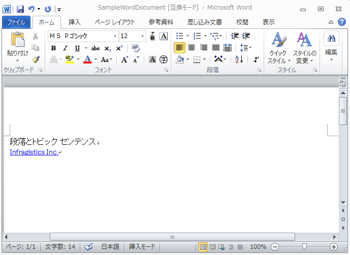

////

|metadata|
{
    "name": "word-create-a-word-document",
    "controlName": ["Infragistics Word Library"],
    "tags": ["Exporting","Getting Started","How Do I"],
    "guid": "9d31e13c-baee-4688-924f-5fa1f2aa2b0f",  
    "buildFlags": [],
    "createdOn": "2011-03-18T14:01:13.481061Z"
}
|metadata|
////

= Word ドキュメントの作成

このトピックは、forward-only の link:{ApiPlatform}documents.io{ApiVersion}~infragistics.documents.word.worddocumentwriter.html[WordDocumentWriter] ストリーマー オブジェクトを使用して、Word ドキュメントを作成する方法を示します。WordDocumentWriter オブジェクトの静的な Create メソッドは、新しい Word ドキュメントを作成します。

以下のスクリーンショットは、テキストとハイパーリンクで作成された Word ドキュメントを表示します。

Author、Title、Subject などのドキュメントのさまざまなプロパティは、WordDocumentWriter オブジェクトの link:{ApiPlatform}documents.io{ApiVersion}~infragistics.documents.word.worddocumentwriter~documentproperties.html[DocumentProperties] プロパティを使用して設定できます。Office ボタンをクリックして、[準備] > [プロパティ] セクションを指定することによって、Word 2007 でこれらの情報にアクセスできます。Word 2010 で同様に、[ファイル] タブをクリックすることによって、Backstage ビューの右側からドキュメント プロパティにアクセスできます。

Word ドキュメントへの書き出しを開始するには、 link:{ApiPlatform}documents.io{ApiVersion}~infragistics.documents.word.worddocumentwriter~startdocument.html[StartDocument] メソッドを使用し、これは link:{ApiPlatform}documents.io{ApiVersion}~infragistics.documents.word.worddocumentwriter~enddocument.html[EndDocument] メソッドへの対応する呼び出しとバランスを取らなければなりません。

Paragraph は揃えて配置またはインデントが可能なテキスト ブロックを表示する機能を提供します。段落を開始するには link:{ApiPlatform}documents.io{ApiVersion}~infragistics.documents.word.worddocumentwriter~startparagraph.html[StartParagraph] メソッドを使用します。 link:{ApiPlatform}documents.io{ApiVersion}~infragistics.documents.word.worddocumentwriter~addtextrun.html[AddTextRun] メソッドはコンテンツを段落に追加する方法を提供します。コンテンツが追加されたら、段落は link:{ApiPlatform}documents.io{ApiVersion}~infragistics.documents.word.worddocumentwriter~endparagraph.html[EndParagraph] メソッドを使用して閉じなければなりません。

[NOTE]
====
*注:* Infragistics3.Documents.IO アセンブリへの参照が以下のコードに必要とされます。
====

[NOTE]
====
*注:* Word ドキュメントを作成するために WordDocumentWriter オブジェクトを使用する時には、Dispose メソッドまたは Close メソッドのいずれかを使用してストリーマー オブジェクトを破棄または閉じなければなりません。
====

*C# の場合:*

----
using Infragistics.Documents.Word;
// 静的な 'Create' メソッドを使用して、WordDocumentWriter クラスの
// 新しいインスタンスを作成します
WordDocumentWriter docWriter = WordDocumentWriter.Create(@"C:\TestWordDoc.docx");
// 単位としてインチを使用します
docWriter.Unit = UnitOfMeasurement.Inch;
// タイトル、著者などのドキュメント プロパティを設定します
docWriter.DocumentProperties.Title = "Sample Document";
docWriter.DocumentProperties.Author = string.Format("Infragistics.{0}", SystemInformation.UserName);
// ドキュメントを開始します。StartDocument への各呼び出しは
// EndDocument への対応する呼び出しとバランスを取らなければならないことに留意します
docWriter.StartDocument();
// 段落を開始します
docWriter.StartParagraph();
// タイトルのテキスト ランを追加します
docWriter.AddTextRun("Paragraphs and Topic Sentences");
// 新しい行を追加します
docWriter.AddNewLine();
// ハイパーリンクを追加します
docWriter.AddHyperlink("http://www.infragistics.com", "Infragistics Inc.");
// 段落を終わります
docWriter.EndParagraph();
// ドキュメントを終了します
docWriter.EndDocument();
// ライターを閉じます
docWriter.Close();
----

*Visual Basic の場合:*

----
Imports Infragistics.Documents.Word
'  静的な 'Create' メソッドを使用して、WordDocumentWriter クラスの
' 新しいインスタンスを作成します
Dim docWriter As WordDocumentWriter = WordDocumentWriter.Create("C:\TestWordDoc.docx")
'  単位としてインチを使用します
docWriter.Unit = UnitOfMeasurement.Inch
'   タイトル、著者などのドキュメント プロパティを設定します
docWriter.DocumentProperties.Title = "Sample Document"
docWriter.DocumentProperties.Author = String.Format("Infragistics.{0}", SystemInformation.UserName)
'   ドキュメントを開始します。StartDocument への各呼び出しは
'  EndDocument への対応する呼び出しとバランスを取らなければならないことに留意します
docWriter.StartDocument()
'  段落を開始します
docWriter.StartParagraph()
'  タイトルのテキスト ランを追加します
docWriter.AddTextRun("Paragraphs and Topic Sentences")
'  新しい行を追加します
docWriter.AddNewLine()
'   ハイパーリンクを追加します
docWriter.AddHyperlink("http://www.infragistics.com", "Infragistics Inc.")
'段落を終わります
docWriter.EndParagraph()
docWriter.EndDocument()
' ライターを閉じます
docWriter.Close()
----

== 関連トピック

* link:word-apply-formatting-to-word-document.html[書式設定を Word ドキュメントに適用]
* link:word-add-table-to-word-document.html[テーブルを Word ドキュメントに適用]
* link:word-add-images-to-word-document.html[画像を Word ドキュメントに追加]
* link:word-headers-footers-and-page-numbers.html[ヘッダー、フッター、ページ番号]
* link:word-understanding-infragistics-word-library.html[Infragistics Word ライブラリの理解]